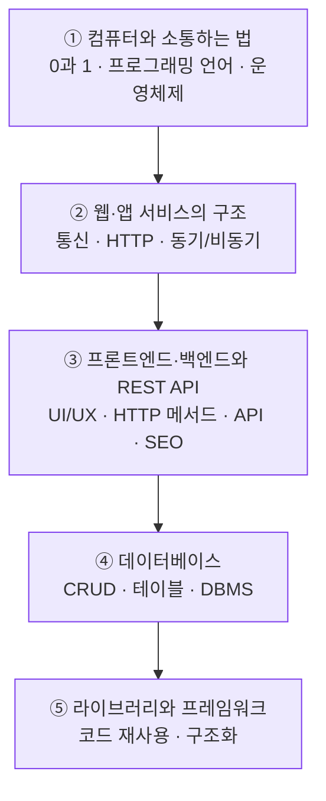

# IT 리터러시 — 개발자가 알려주는 IT의 A to Z

> "앱 하나를 켜서 로그인하고, 글을 올리고, 상품을 결제하기까지" 그 사이에서 컴퓨터들이 어떤 대화를 주고받는지 한 번에 꿰어보는 입문 정리입니다. 코드를 직접 짜기 전에, **전체 그림**부터 그려봅니다.

비전공자도 따라올 수 있게 "왜 이런 게 필요한가 / 무엇을 처리하는 과정인가 / 결과를 어떻게 해석하는가"를 중심으로 정리했습니다.

---

## 이 강의를 한 문장으로

컴퓨터가 0과 1로 일한다는 사실에서 출발해서, 여러 컴퓨터가 인터넷으로 **요청과 응답**을 주고받고, 그 데이터를 **데이터베이스**에 쌓고 꺼내며, 개발자는 **라이브러리·프레임워크**로 이 모든 걸 빠르게 만든다 — 이 흐름을 이해하는 것이 목표입니다.

## 학습 로드맵

## 목차

| 글 | 한 줄 소개 | 활용도 |
| --- | --- | --- |
| [① 컴퓨터와 소통하는 법 — 0과 1에서 운영체제까지](posts/01-how-computers-communicate.md) | 기계어·프로그래밍 언어·컴파일러·운영체제로 컴퓨터의 기본 동작 이해 | ★★★☆☆ 기초 개념 |
| [② 웹·앱 서비스의 구조와 통신](posts/02-web-app-architecture-and-http.md) | 통신의 원리, HTTP의 정체, WAS 구조, 동기/비동기 | ★★★★☆ 전 직무 공통 |
| [③ 프론트엔드·백엔드와 REST API](posts/03-frontend-backend-rest-api.md) | UI/UX, HTTP 메서드(CRUD), API, REST API, 분석/SEO | ★★★★★ 기획·개발·분석 |
| [④ 데이터베이스의 모든 것](posts/04-database-basics.md) | DB의 기본 기능(CRUD), 테이블, Query, DBMS, RDB vs NoSQL | ★★★★★ 데이터 직무 필수 |
| [⑤ 라이브러리와 프레임워크](posts/05-library-and-framework.md) | 웹의 역사, 코드 재사용, 붕어빵 틀로 이해하는 프레임워크 | ★★★★☆ 개발 생산성 |

## 다루는 핵심 개념

- **컴퓨터의 언어**: 0과 1(기계어), 프로그래밍 언어, 고급/저급 언어, 컴파일러·인터프리터, 운영체제(OS)
- **통신**: 클라이언트-서버, 요청/응답(1요청 1응답), HTTP, JSON/XML, 동기·비동기
- **웹 서비스 구조**: 프론트엔드/백엔드, WAS, API, REST API, Endpoint
- **HTTP 메서드와 CRUD**: GET · POST · PUT/PATCH · DELETE
- **데이터베이스**: 테이블, Query, 데이터 타입, 논리삭제, DBMS, 관계형 vs NoSQL
- **개발 도구**: 라이브러리, 패키지, 프레임워크, 버전 관리
- **분석·노출**: Analytics(사용자 행동 분석), SEO(검색엔진 최적화)

---

> 정리 순서대로 읽으면 "컴퓨터 한 대 → 컴퓨터들의 대화 → 화면과 서버 → 데이터 저장소 → 개발 생산성"으로 자연스럽게 확장됩니다. 용어가 헷갈릴 땐 [GLOSSARY](GLOSSARY.md)를 함께 펼쳐 두세요.
