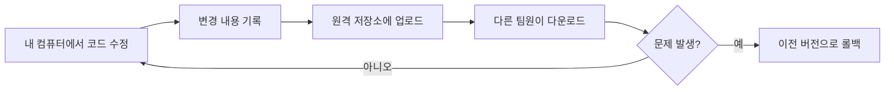

# 버전 관리와 Git — 코드의 '되돌리기' 버튼

> 게임이 업데이트되면 패치 노트가 올라오죠. 코드에도 똑같은 게 필요합니다. 누가, 언제, 무엇을 바꿨는지 기록하고 언제든 되돌릴 수 있는 장치, 그게 버전 관리입니다.

`버전관리` `Git` `GitHub` `협업` `롤백` `원격저장소`

## 핵심요약

- 소스코드는 매일 바뀐다. 그래서 **변경 이력을 기록·관리**하는 일이 개발의 기본기다.
- 버전 관리는 어떤 변경을 했는지, 어떤 코드가 추가·수정됐는지, 오류가 어떻게 대응됐는지를 남긴다.
- 문제가 생겼을 때 **이전 버전으로 되돌릴(롤백)** 수 있어야 하므로 필수다.
- 과거엔 여러 버전 관리 프로그램이 있었지만, 지금은 **Git**이 사실상 표준이다.
- Git을 서버 입장에서 편하게 쓰도록 도와주는 대표 서비스가 **GitHub**, **Bitbucket** 등이다.
- 보안에 민감한 일부 기업(방산·은행 등)은 외부 서비스 대신 자체 버전 관리 시스템을 쓰기도 한다.
- 협업과 면접·취업 모두에서 기본 명령어 숙지와 에러 대응력이 중요하다.

## 개념별 정리

### 버전 관리(Version Control)

**1. 정의**
프로그램의 변경 사항을 시간 순서대로 기록하고, 필요하면 특정 시점으로 되돌릴 수 있게 해주는 관리 방법입니다.

**2. 왜 필요한가?**
코드는 한 번 짜고 끝나는 게 아니라 매일 고쳐집니다. 어제 잘 돌던 기능이 오늘 갑자기 망가졌다면, "언제부터 망가졌지?"를 추적하고 그 직전으로 되돌려야 합니다. 변경 기록이 없으면 이 추적이 불가능합니다. 실무에서는 출시 전후로 어떤 기능이 들어갔는지 관리하는 용도로도 쓰입니다.

**3. 예시**
게임이나 메신저 앱의 "공개 업데이트 노트(패치 노트)"가 좋은 비유입니다. 버전마다 "무엇이 추가됐고, 어떤 버그가 고쳐졌는지"를 적어두는 것과 버전 관리는 성격이 같습니다.

**4. 헷갈리기 쉬운 점**
"백업"과 헷갈리기 쉽습니다. 백업은 그냥 통째로 복사해 두는 것이고, 버전 관리는 **변경된 부분만 추적하고 시점별로 오갈 수 있게** 한다는 점이 다릅니다.

**5. 한 줄 정리**
버전 관리는 코드의 '실행 취소(Ctrl+Z)'를 시간 단위로 가능하게 만드는 장치입니다.

### Git

**1. 정의**
가장 널리 쓰이는 분산형 버전 관리 시스템입니다. 작은 프로젝트부터 매우 큰 프로젝트까지 빠르고 효율적으로 다룰 수 있도록 설계됐습니다.

**2. 왜 필요한가?**
버전을 나눠 테스트 버전·출시 버전·제작 버전 등으로 편리하게 관리할 수 있고, 누가 어떤 코드를 작성했는지 확인할 수 있어 협업에 매우 유리합니다. 참고로 Git은 리눅스 운영체제를 만든 개발자가 만들었습니다.

**3. 예시**
집과 수업 환경처럼 여러 곳에서 같은 코드를 작업할 때, 원격 저장소에 올리고(업로드) 내려받는(다운로드) 식으로 환경을 연동하는 습관이 중요합니다.

**4. 헷갈리기 쉬운 점**
`Git`과 `GitHub`는 다릅니다. Git은 버전 관리 도구(프로그램) 자체이고, GitHub는 그 Git을 인터넷 서버에서 편하게 쓰도록 해주는 서비스입니다.

**5. 한 줄 정리**
"다양한 버전 관리 도구가 있었지만, 지금은 Git이 천하통일했다"고 해도 무방합니다.

### GitHub와 Bitbucket

**1. 정의**
Git 저장소를 인터넷 서버에 두고 협업할 수 있게 해주는 대표적인 호스팅 서비스입니다.

**2. 왜 필요한가?**
Git 자체는 내 컴퓨터 안에서도 돌아가지만, 여러 사람이 같은 코드를 함께 다루려면 코드를 모아둘 공용 공간이 필요합니다. GitHub·Bitbucket이 그 역할을 합니다.

**3. 예시**
GitHub는 마이크로소프트가 인수한 서비스로 가장 대중적으로 쓰입니다. Bitbucket은 Atlassian이라는 회사의 서비스입니다.

**4. 헷갈리기 쉬운 점**
모든 회사가 GitHub를 쓰는 건 아닙니다. 소스가 외부로 유출되면 안 되는 방산·은행 같은 곳은 외부 서비스를 제한하고 사내 전용 버전 관리 시스템을 두기도 합니다.

**5. 한 줄 정리**
GitHub는 "Git을 위한 클라우드 협업 공간"입니다.

## 코드로 보기 — 버전 관리의 흐름

이 주제는 코드보다 흐름으로 이해하는 게 빠릅니다.

**코드목적**
코드를 고치고 → 그 변경을 기록하고 → 공용 저장소에 올려 공유하고 → 문제가 생기면 과거로 되돌리는, 버전 관리의 한 사이클을 보여줍니다.

**해석**
핵심은 마지막 분기점입니다. 어디서 문제가 생겨도 기록이 남아 있으면 "되돌릴 수 있다"는 안전망이 생깁니다. 이 안전망이 있어야 개발자가 과감하게 코드를 바꿀 수 있습니다.

**실무 연결**
팀 프로젝트에서 두 사람이 같은 파일을 동시에 고치면 충돌이 납니다. 버전 관리는 이 충돌을 감지하고 조정하는 출발점이 됩니다. 협업 도구로서 기본 명령어와 에러 대응력은 면접에서도 자주 확인하는 역량입니다.

## 직접 해보기

1. 내가 평소 쓰는 앱(게임, 메신저 등)의 업데이트 노트를 하나 찾아, "버전 관리가 기록하는 것"과 어떤 점이 닮았는지 두세 줄로 적어 보세요.
2. Git과 GitHub의 차이를 "도구 vs 서비스" 관점에서 한 문장으로 설명해 보세요.
3. 어떤 회사가 GitHub 대신 자체 버전 관리 시스템을 쓰는 이유를 추측해 적어 보세요.

예시 답안 보기

1. 업데이트 노트는 "무엇이 추가/수정됐는지"를 버전 단위로 적는데, 버전 관리도 코드의 변경을 시점별로 기록한다는 점이 같다.
2. Git은 코드를 관리하는 도구이고, GitHub는 그 Git을 인터넷에서 함께 쓰게 해주는 서비스다.
3. 소스코드가 외부로 유출되면 보안 문제가 크기 때문에, 외부 서비스를 제한하고 내부망에서만 관리하려고.

## 헷갈리기 쉬운 포인트

- **Git vs GitHub**: Git은 버전 관리 '도구', GitHub는 Git을 호스팅하는 '서비스'.
- **버전 관리 vs 백업**: 백업은 통째 복사, 버전 관리는 변경 추적 + 시점 이동.
- **로컬 vs 원격**: 내 컴퓨터의 저장소(로컬)와 서버의 저장소(원격)는 별개이며, 둘을 동기화하는 것이 협업의 핵심이다.

## 연결되는 개념

- 다음에 이어지는 글: [기획과 플로우차트](02-planning-and-flowchart.md) — 코드를 짜기 전, 무엇을 만들지 설계하는 단계.
- 함께 보면 좋은 글: [오픈소스](03-open-source.md) — 공개된 코드 저장소에 직접 기여하는 문화.
- 더 찾아볼 키워드: `commit`, `branch`, `merge`, `pull request`, `분산 버전 관리`

## 셀프 체크

- [ ] 버전 관리가 왜 필요한지 '롤백' 개념으로 설명할 수 있다.
- [ ] Git과 GitHub의 차이를 구분할 수 있다.
- [ ] 모든 회사가 외부 호스팅 서비스를 쓰지는 않는 이유를 안다.
- [ ] 원격 저장소를 통해 여러 환경을 연동하는 흐름을 그릴 수 있다.

**복습 질문 및 답변**

- (기본) 버전 관리의 가장 큰 목적 하나를 꼽는다면?
  → 문제가 생겼을 때 이전 버전으로 되돌릴 수 있게 하는 것.
- (이해 확인) Git이 "천하통일했다"는 말의 의미는?
  → 과거엔 여러 버전 관리 도구가 경쟁했지만, 지금은 Git이 사실상 표준으로 자리 잡았다는 뜻.
- (응용) 팀원 두 명이 같은 파일을 동시에 수정하면 왜 문제가 되고, 버전 관리는 이를 어떻게 돕는가?
  → 같은 부분을 서로 다르게 고치면 충돌이 난다. 버전 관리는 변경 내역을 비교해 충돌 지점을 알려주고 조정할 수 있게 한다.

## 한 줄 정리

> 버전 관리는 코드에 '시간 여행'과 '되돌리기'를 더해 주는 안전장치이고, Git은 그 표준 도구다.
