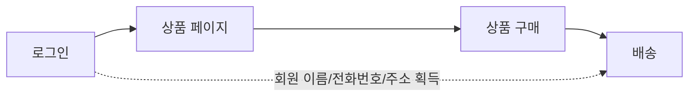

# 기획과 플로우차트 — "사용자가 귀찮으면 안 쓴다"

> 멋진 기술보다 중요한 건, 사용자가 한 번이라도 더 편하게 쓰게 만드는 것. 서비스의 승패는 바로 그 지점에서 갈립니다.

`기획` `플로우차트` `핵심로직` `UX` `사용자편의성` `프로토타입` `API설계`

## 핵심요약

- 기획의 본질은 "어떤 서비스를 만들 것인지, 핵심적인 흐름을 데이터와 함께 보여주는 것"이다.
- 플로우차트는 서비스의 핵심 로직(흐름)을 그림으로 그려 빠진 부분을 찾아내는 도구다.
- 흐름을 그리다 보면 "이 데이터는 어디서 얻지?" 같은 질문이 생기고, 그 답이 설계를 완성시킨다.
- UX 관점의 핵심 메시지: **사용자가 귀찮으면 서비스는 안 쓴다.** 입력·중복을 최소화해야 한다.
- 보안 요구와 사용자 편의가 충돌하는 지점에서 서비스의 경쟁력이 결정된다.
- 제작 흐름은 보통 플로우차트 → 화면 설계 → API 설계서 → 개발의 반복이다.

## 개념별 정리

### 플로우차트(Flow Chart)

**1. 정의**
서비스가 어떻게 작동하는지, 단계와 분기를 도형과 화살표로 그려 핵심 흐름을 한눈에 보여주는 그림입니다.

**2. 왜 필요한가?**
머릿속으로만 "이렇게 되겠지" 하면 꼭 빠지는 단계가 생깁니다. 흐름을 직접 그려 보면 어디서 정보가 부족한지, 어떤 단계가 빠졌는지가 드러납니다.

**3. 예시**
쇼핑몰의 가장 핵심이 될 만한 프로세스는 "상품 페이지 접속 → 상품 구매 → 상품 배송"입니다. 그런데 이 3단계만으로는 **배송 정보를 어디서 얻을지**가 빠져 있습니다. 그래서 앞에 "로그인" 단계를 추가해, 회원 정보로 배송에 필요한 정보를 자연스럽게 얻도록 설계를 보강합니다.

**4. 헷갈리기 쉬운 점**
플로우차트는 "예쁘게 그리는 그림"이 아니라 "빠진 단계를 찾는 도구"입니다. 화살표 하나를 추가하는 과정에서 설계가 완성된다는 점이 핵심입니다.

**5. 한 줄 정리**
플로우차트는 서비스의 빈틈을 미리 찾아내는 설계 지도입니다.

### 핵심 로직 설계

**1. 정의**
서비스에서 가장 중요한 흐름(예: 쇼핑몰이라면 구매·배송)을 먼저 잡고, 그 흐름에 필요한 데이터를 채워 나가는 설계입니다.

**2. 왜 필요한가?**
모든 기능을 한꺼번에 설계하면 길을 잃습니다. "이 서비스의 심장은 무엇인가"를 먼저 정해야 나머지가 따라옵니다.

**3. 예시**
구매 단계를 더 풀어 보면 간편결제(여러 결제 수단), 카드결제, 무통장 입금 등이 붙고, 배송 단계에는 배송사 선정과 배송 과정을 제공하는 API 레퍼런스 확인이 붙습니다.

**4. 헷갈리기 쉬운 점**
"기능이 많을수록 좋은 설계"가 아닙니다. 핵심 흐름을 매끄럽게 만드는 게 먼저고, 부가 기능은 그 위에 얹는 것입니다.

**5. 한 줄 정리**
서비스의 심장(핵심 로직)을 먼저 정하고, 거기에 필요한 데이터를 붙여 나갑니다.

### UX(사용자 편의성)

**1. 정의**
사용자가 서비스를 쓰면서 느끼는 편함·불편함의 총체적 경험입니다.

**2. 왜 필요한가?**
기술이 아무리 좋아도 사용자가 귀찮으면 떠납니다. 입력 횟수와 중복 입력을 줄이는 것이 곧 경쟁력입니다. 보안을 강화하면 보통 입력이 늘어나는데(편의↓), 이 충돌을 잘 푸는 서비스가 살아남습니다.

**3. 예시**
송금 서비스에서 복잡한 절차를 줄여 "간편 송금"을 만든 사례처럼, 입력 단계를 줄여 편의성을 끌어올린 것이 성공 포인트가 됩니다.

**4. 헷갈리기 쉬운 점**
취업·면접에서 "잘 돌아간다"는 기본값입니다. 정말 중요한 건 **사용자 편의성이 얼마나 개선됐는지, 업무 효율이 얼마나 향상됐는지**입니다. 기술 스택 나열은 면접관의 주된 관심사가 아닐 수 있습니다.

**5. 한 줄 정리**
"사용자가 귀찮으면 안 쓴다" — UX는 곧 서비스의 생존 조건입니다.

## 코드로 보기 — 단계 추가가 만든 차이

아래는 "배송 정보 누락" 문제를 로그인 단계로 푸는 설계 보강을 비교한 표입니다.

| 구분 | 보강 전 (3단계) | 보강 후 (4단계) |
| --- | --- | --- |
| 흐름 | 상품 페이지 → 구매 → 배송 | 로그인 → 상품 페이지 → 구매 → 배송 |
| 문제점 | 배송 정보를 얻을 방법이 없음 | 회원 정보로 배송 정보 자동 확보 |
| 사용자 입력 | 배송 때마다 주소 직접 입력 | 한 번 가입하면 자동 채움 |

**코드목적**
같은 서비스라도 단계 하나(로그인)를 어디에 넣느냐에 따라 정보 흐름과 사용자 편의가 달라진다는 걸 보여줍니다.

**해석**
"보강 후"가 더 나은 이유는 기능이 많아서가 아니라, **사용자가 같은 정보를 반복 입력하지 않아도 되기 때문**입니다. 편의성이 곧 설계의 품질입니다.

**실무 연결**
서비스 기획·분석 직무에서는 이런 흐름 설계와 화면 설계 문서(예: Figma) 역량이 중요합니다. 개발자라면 흐름 설계는 기본으로 이해하되, 구현 역량에 더 무게를 둡니다.

## 직접 해보기

1. 좋아하는 앱 하나를 골라, 핵심 로직 3단계를 플로우차트로 그려 보세요.
2. 그 흐름에서 "데이터가 어디서 오는지" 빠진 부분을 한 군데 찾아 단계를 추가해 보세요.
3. 그 앱에서 "입력을 한 번이라도 줄일 수 있는 지점"을 찾아 적어 보세요.

예시 답안 보기

1. 음식 배달 앱: 가게 선택 → 메뉴 담기 → 결제.
2. "배달 주소"가 빠짐 → 앞에 로그인/주소 등록 단계를 추가하면 자동으로 채워짐.
3. 결제 단계에서 카드 정보를 매번 입력하지 않도록 간편결제를 등록해 두면 입력이 준다.

## 헷갈리기 쉬운 포인트

- **편의성 vs 보안**: 보안을 높이면 입력이 늘어 편의가 줄기 쉽다. 둘의 균형점이 경쟁력이다.
- **"잘 돌아간다" vs "사용자 경험 개선"**: 작동은 기본값, 면접에서 통하는 건 개선 효과다.
- **기능 개수 vs 흐름 품질**: 기능이 많다고 좋은 설계가 아니다. 핵심 흐름이 매끄러운가가 먼저다.

## 연결되는 개념

- 이전에 알면 좋은 글: [버전 관리와 Git](01-version-control-and-git.md) — 설계 후 코드를 관리하는 단계.
- 다음에 이어지는 글: [오픈소스](03-open-source.md) — 설계와 구현 결과를 공개·검증받는 문화.
- 더 찾아볼 키워드: `UX/UI`, `와이어프레임`, `프로토타입`, `API 설계서`, `Figma`

## 셀프 체크

- [ ] 플로우차트가 "그림"이 아니라 "빠진 단계를 찾는 도구"임을 이해했다.
- [ ] 핵심 로직을 먼저 잡고 데이터를 붙이는 순서를 설명할 수 있다.
- [ ] "사용자가 귀찮으면 안 쓴다"는 말의 의미를 안다.
- [ ] 편의성과 보안이 충돌하는 지점을 예로 들 수 있다.

**복습 질문 및 답변**

- (기본) 기획의 본질을 한 문장으로?
  → 어떤 서비스를 만들지, 핵심 흐름을 데이터와 함께 보여주는 것.
- (이해 확인) 쇼핑몰 3단계 흐름에 로그인을 추가한 이유는?
  → 배송에 필요한 회원 정보를 자연스럽게 얻기 위해.
- (응용) 보안을 강화하면서도 편의성을 지키려면 어떤 방법이 있을까?
  → 한 번 등록하면 자동으로 채워지는 방식(간편결제·자동 로그인 등)으로 반복 입력을 줄인다.

## 한 줄 정리

> 좋은 기획은 화려한 기술이 아니라, 사용자가 한 번이라도 덜 귀찮게 만드는 흐름 설계에서 나온다.
