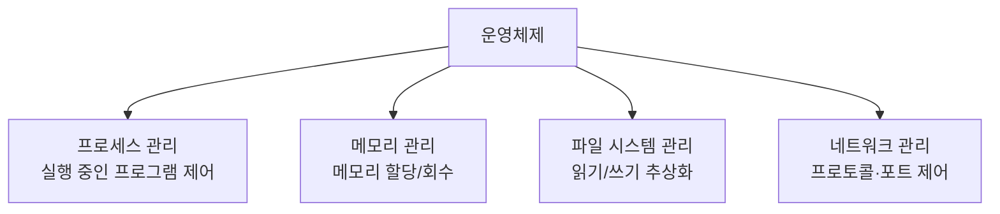

# 운영체제의 개념과 기능 — 컴퓨터를 지휘하는 시스템 소프트웨어

> 사장이 직원 한 명을 직접 챙기는 작은 가게와, 수백 명을 혼자 통제할 수 없는 대기업. 컴퓨터의 자원이 복잡해질수록, 이를 대신 관리해 줄 '관리자'가 필요해집니다. 그게 운영체제입니다.

`운영체제` `OS` `리소스` `프로세스관리` `메모리관리` `파일시스템` `네트워크관리` `컨테이너`

## 핵심요약

- 운영체제(OS)는 "하드웨어를 포함한 리소스를 제어하고, 프로그램을 실행해 주는 시스템 소프트웨어"다.
- 리소스(자원)는 어떤 목적에 이용할 수 있는 하드웨어를 포함한 모든 것이며, 대표적으로 메모리가 있다.
- OS의 4대 핵심 기능은 **프로세스 관리 · 메모리 관리 · 파일 시스템 관리 · 네트워크 관리**다.
- 응용프로그램마다 할당된 리소스가 있고, 다른 프로그램의 리소스를 강제로 쓸 수 없다.
- OS 종류: 윈도우(일반 사용자 중심), macOS(유닉스 기반, 개발 환경에 적합), 리눅스(무료·안정적, 서버에 적합).
- 컨테이너화는 실행에 필요한 환경·패키지를 하나로 묶어, OS와 무관하게 동일한 개발 환경을 만드는 기술이다.
- AI·LLM 시대엔 CPU·GPU·메모리 수요가 커져, 하드웨어와 OS 원리를 이해하는 것이 점점 중요해진다.

## 개념별 정리

### 컴퓨터 하드웨어 복습 (CPU·메모리·주변장치)

**1. 정의**
- **CPU(Central Processing Unit, 중앙 처리 장치)**: 데이터와 명령어를 처리하는 제어 장치. 처리할 정보는 주로 주 기억장치인 메모리에 위치합니다.
- **메모리**: CPU가 처리할 데이터와 명령어를 저장하는 장치. 주소가 붙어 있어 그 주소로 데이터를 찾습니다. 빠르지만 전원이 끊기면 내용이 사라집니다.
- **주변장치**: 입력 장치(마우스·키보드), 출력 장치(모니터·스피커·프린터), 보조 기억 장치(SSD·HDD) 등.

**2. 왜 필요한가?**
운영체제가 무엇을 "관리"하는지 이해하려면, 관리 대상인 하드웨어를 먼저 알아야 합니다. AI 작업은 메모리를 많이 쓰기 때문에 메모리 용량이 특히 중요합니다.

**3. 예시**
메모리는 속도가 빠르지만 휘발성(전원이 꺼지면 사라짐)이고, 보조 기억 장치(SSD·HDD)는 상대적으로 느리지만 전원이 꺼져도 데이터가 남습니다.

**4. 헷갈리기 쉬운 점**
"메모리(RAM)"와 "저장 장치(SSD/HDD)"를 같은 것으로 오해하기 쉽습니다. 메모리는 작업용 임시 공간(빠르고 휘발성), 저장 장치는 보관용 공간(느리지만 비휘발성)입니다.

**5. 한 줄 정리**
CPU가 일하고, 메모리가 일감을 빠르게 대 주고, 저장 장치가 일감을 오래 보관합니다.

### 운영체제(OS)란 무엇인가

**1. 정의**
하드웨어를 포함한 리소스를 제어하고, 프로그램이 잘 실행되도록 도와주는 시스템 소프트웨어입니다.

**2. 왜 필요한가?**
"사장이 모든 직원을 직접 이해하고 통제"할 수 있는 건 직원이 적을 때뿐입니다. 하드웨어 종류가 많고 다양한 용도로 쓰이는 컴퓨터에서는, 사장(사용자/프로그램)이 모든 자원을 직접 통제할 수 없습니다. 그래서 OS라는 관리자가 자원을 대신 제어합니다.

**3. 예시**
"리소스가 부족하여 작업을 완료할 수 없습니다"라는 오류 메시지를 본 적 있을 겁니다. 여기서 리소스는 주로 메모리를 뜻하며, 작업에 필요한 메모리가 부족해 실행할 수 없다는 의미입니다.

**4. 헷갈리기 쉬운 점**
OS는 "프로그램"이 맞지만 일반 응용프로그램과 다른 **시스템 소프트웨어**입니다. 응용프로그램이 무대 위 배우라면, OS는 무대 자체와 조명·음향을 관리하는 운영 담당입니다.

**5. 한 줄 정리**
운영체제는 컴퓨터 자원을 제어하고 프로그램을 돌려주는 '총괄 관리자'입니다.

### 리소스(자원)와 권한

**1. 정의**
어떤 목적에 이용할 수 있는, 하드웨어를 포함한 모든 것을 시스템 리소스(시스템 자원)라 합니다.

**2. 왜 필요한가?**
여러 프로그램이 동시에 돌 때, 각자 쓸 수 있는 자원을 정해 두지 않으면 충돌이 납니다. OS는 응용프로그램마다 리소스를 할당하고, 서로의 영역을 침범하지 못하게 합니다.

**3. 예시**
각 응용프로그램은 자신에게 할당된 리소스만 쓸 수 있고, 다른 응용프로그램의 리소스를 강제로 가져다 쓸 수 없습니다.

**4. 헷갈리기 쉬운 점**
"자원"을 사람의 자원(돈·인재)으로만 생각하기 쉬운데, 컴퓨터에서는 메모리·CPU 시간·저장 공간 등 하드웨어를 포함한 모든 것이 자원입니다.

**5. 한 줄 정리**
리소스는 프로그램이 일하기 위해 OS에게 배정받는 '몫'입니다.

### 운영체제의 4대 기능

**1. 정의**
OS가 자원을 제어하기 위해 수행하는 네 가지 핵심 관리 기능입니다.

- **프로세스 관리**: 실행 중인 프로그램(프로세스)에게 필요한 리소스를 할당하고, 각 프로세스의 상태를 관리하며, 여러 프로세스를 동시에 실행(멀티 프로세싱)합니다.
- **메모리 관리**: CPU에서 실행될 수 있도록 메모리에 정보를 올리거나 내리고, 프로세스에게 필요한 메모리를 할당합니다(가상 메모리 포함).
- **파일 시스템 관리**: 저장장치에 어떤 방식으로 저장하든, 프로그램이 신경 쓰지 않고 파일을 읽고 쓸 수 있게 해 줍니다.
- **네트워크 관리**: 다양한 프로토콜을 지원해 프로그램이 네트워크를 쓸 수 있게 하고, 포트를 관리해 이미 사용 중인 포트는 못 쓰게 제어합니다.

**2. 왜 필요한가?**
LLM·AI 서비스를 구동하거나 배포할 때 이 네 가지 키워드(프로세스·메모리·파일·네트워크)가 실제로 자주 등장합니다. 명령어를 외우기보다 이 원리를 이해해야 응용이 됩니다.

**3. 예시**
포트(Port)는 한 컴퓨터 안에서 프로그램들이 통신할 때 쓰는 '문 번호'입니다. 예를 들어 주피터 노트북은 기본 포트 8888을 쓰는데, 이미 그 포트가 사용 중이면 충돌이 납니다. 일부 프로그램은 충돌 시 새 포트를 자동 할당합니다.

**4. 헷갈리기 쉬운 점**
네 기능은 따로 노는 게 아니라 서로 맞물립니다. 예를 들어 메모리 관리는 프로세스 관리와 떼어 생각할 수 없습니다(프로세스를 실행하려면 메모리를 줘야 하니까요).

**5. 한 줄 정리**
프로세스·메모리·파일·네트워크 — 이 네 가지가 OS가 챙기는 핵심 살림입니다.

### 운영체제의 종류와 컨테이너

**1. 정의**
- **윈도우(Windows)**: 마이크로소프트가 만든 데스크톱 OS. 일반 사용자에게 적합하고 가장 점유율이 높습니다.
- **macOS**: 유닉스를 기반으로 Apple이 만든 OS. 유닉스 계열 터미널 명령어를 쓸 수 있어 개발 환경에 적합하지만, 유료 상용 소프트웨어입니다.
- **리눅스(Linux)**: 무료이고 안정적이며 개발·서버에 적합. 오픈소스라 수정·배포가 자유롭고, 우분투·데비안 등 다양한 배포판이 있습니다. 안드로이드도 리눅스 기반입니다.
- **컨테이너화(Docker 등)**: 실행에 필요한 모든 환경과 패키지를 하나로 묶어 두는 기술. OS와 무관하게 동일한 개발 환경을 구성할 수 있습니다.

**2. 왜 필요한가?**
"내 컴퓨터에선 되는데 서버에선 안 된다"는 문제를 줄이려면, 환경을 통째로 묶어 옮길 수 있어야 합니다. 컨테이너가 그 역할을 합니다. 컨테이너가 많아지면 통합 관리가 필요해지고, 그 관리 도구로 이어지는 것이 쿠버네티스입니다.

**3. 예시**
보안·운영상의 이유로 서비스를 여러 컨테이너로 나눠 배포하는 것이 일반적입니다.

**4. 헷갈리기 쉬운 점**
명령어(특히 컨테이너 오케스트레이션 도구)만 외우는 학습은 한계가 있습니다. 그보다 리눅스/OS 원리(프로세스·포트 등)를 이해하는 것이 우선입니다.

**5. 한 줄 정리**
컨테이너는 "개발 환경을 통째로 담아 어디서든 똑같이 실행"하게 해 주는 도시락 같은 기술입니다.

## 코드로 보기 — OS의 4대 기능 한눈에

**코드목적**
운영체제가 맡는 네 가지 핵심 살림을 한 장으로 정리합니다.

**해석**
이 네 갈래가 이후 글들의 목차이기도 합니다. 프로세스(06·07), 메모리(08·09), 파일 시스템(10·11)이 각각 깊이 다뤄집니다.

**실무 연결**
서버에 AI 서비스를 올릴 때 "프로세스가 메모리를 얼마나 먹는지", "어떤 포트로 통신하는지", "데이터를 어디에 저장하는지"를 점검하게 됩니다. 모두 이 네 기능과 직결됩니다.

## 직접 해보기

1. "리소스가 부족하다"는 오류에서 리소스가 주로 무엇을 가리키는지 적어 보세요.
2. 윈도우·macOS·리눅스를 "일반 사용자 / 개발·서버"라는 기준으로 분류해 보세요.
3. 같은 코드가 "내 PC에선 되는데 서버에선 안 되는" 문제를 컨테이너가 어떻게 줄여 주는지 설명해 보세요.

예시 답안 보기

1. 주로 메모리(RAM)를 가리킨다.
2. 일반 사용자 중심: 윈도우 / 개발·서버에 적합: macOS(개발), 리눅스(서버).
3. 실행 환경과 패키지를 통째로 묶어 두므로, OS가 달라도 동일한 환경에서 실행돼 차이가 줄어든다.

## 헷갈리기 쉬운 포인트

- **메모리(RAM) vs 저장 장치(SSD/HDD)**: 작업용 임시·휘발성 vs 보관용·비휘발성.
- **시스템 소프트웨어(OS) vs 응용프로그램**: 무대 관리자 vs 무대 위 배우.
- **컨테이너 vs 가상머신**: 컨테이너는 환경·패키지를 가볍게 묶는 쪽에 가깝다(전체 OS를 통째로 띄우는 방식과 구분).
- **명령어 암기 vs 원리 이해**: 도구 명령어보다 OS 원리(프로세스·포트)가 먼저다.

## 연결되는 개념

- 이전에 알면 좋은 글: [클라우드와 SaaS](04-cloud-and-saas.md) — 컨테이너는 클라우드 배포의 핵심 기술이다.
- 다음에 이어지는 글: [프로세스와 스레드](06-process-and-thread.md) — OS의 첫 번째 기능을 깊이 파고든다.
- 더 찾아볼 키워드: `커널`, `시스템 콜`, `포트(Port)`, `프로토콜`, `쿠버네티스`

## 셀프 체크

- [ ] 운영체제를 "자원 제어 + 프로그램 실행 지원"으로 정의할 수 있다.
- [ ] OS의 4대 기능을 나열할 수 있다.
- [ ] 메모리와 저장 장치를 구분할 수 있다.
- [ ] 윈도우·macOS·리눅스의 특성을 한 줄씩 설명할 수 있다.
- [ ] 컨테이너가 해결하는 문제를 설명할 수 있다.

**복습 질문 및 답변**

- (기본) 운영체제란 무엇인가?
  → 하드웨어를 포함한 리소스를 제어하고 프로그램을 실행해 주는 시스템 소프트웨어.
- (이해 확인) OS의 4대 기능은?
  → 프로세스 관리, 메모리 관리, 파일 시스템 관리, 네트워크 관리.
- (응용) 주피터 노트북을 실행했더니 "포트가 이미 사용 중"이라는 메시지가 떴다. 무슨 일이 일어난 걸까?
  → 기본 포트(8888)를 다른 프로그램이 이미 쓰고 있어 충돌이 난 것. 다른 포트를 쓰거나 자동 할당으로 해결한다.

## 한 줄 정리

> 운영체제는 컴퓨터의 자원을 대신 관리하는 총괄 관리자이며, 프로세스·메모리·파일·네트워크라는 네 가지 살림을 책임진다.
