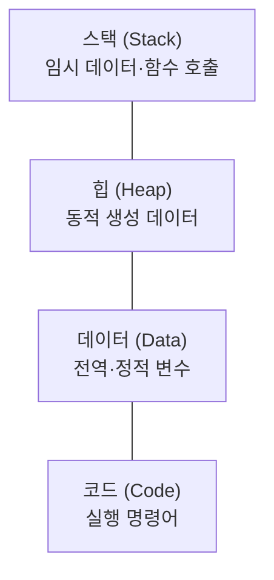

# 프로세스와 스레드 — 실행 중인 프로그램의 정체

> 똑같은 메모장 프로그램이라도, 그냥 설치돼 있을 때와 실제로 켜져서 글을 쓰고 있을 때는 다릅니다. 그 '켜진 상태'를 부르는 이름이 프로세스입니다.

`프로세스` `스레드` `프로그램` `스택` `힙` `정적할당` `동적할당` `메모리구조`

## 핵심요약

- **프로그램**은 "특정 작업을 수행하는 명령어들의 모음"이고, 이 프로그램이 실행되면 **프로세스**가 된다.
- **스레드**는 "프로세스 안에서 실행되는 흐름 단위"이며, 한 프로세스에는 하나 이상의 스레드가 있다.
- 프로세스는 **독립적인 메모리**를 할당받고, 스레드는 그 프로세스의 메모리를 **공유**한다.
- 프로세스의 메모리는 **스택 / 힙 / 데이터 / 코드** 네 영역으로 나뉜다.
- 메모리 할당에는 실행 전에 미리 정하는 **정적 할당**과 실행 도중 정하는 **동적 할당**이 있다.
- 정적은 빠르지만 낭비가 생길 수 있고, 동적은 필요한 만큼 쓰지만 처리가 지연되거나 메모리 부족 위험이 있다.

## 개념별 정리

### 프로그램 vs 프로세스 vs 스레드

**1. 정의**
- **프로그램**: 특정 작업을 수행하는 명령어들의 모음(아직 실행 전).
- **프로세스**: 실행 중인 프로그램.
- **스레드**: 프로세스 안에서 실행되는 흐름 단위.

**2. 왜 필요한가?**
운영체제가 자원을 관리하는 기본 단위가 프로세스이기 때문입니다. "무엇이 지금 돌고 있고, 얼마나 자원을 쓰는가"를 따지려면 프로세스 개념이 출발점입니다.

**3. 예시**
작업 관리자(Task Manager)를 열면 지금 실행 중인 프로그램 목록이 뜹니다. 그 하나하나가 프로세스입니다. 한 프로세스 안에서는 여러 흐름(스레드)이 동시에 돌 수 있습니다.

**4. 헷갈리기 쉬운 점**
프로세스는 **독립적인 메모리를 할당받지만**, 스레드는 프로세스 속에 있는 것이라 **프로세스가 받은 메모리를 공유**합니다. 이 차이가 뒤에 나올 멀티프로세스/멀티스레드의 성격을 가릅니다.

**5. 한 줄 정리**
프로그램이 '켜지면' 프로세스, 그 안의 '작업 흐름 하나하나'가 스레드입니다.

### 프로세스의 메모리 구조 (스택·힙·데이터·코드)

**1. 정의**
한 프로세스가 할당받는 메모리는 역할별로 네 영역으로 나뉩니다.

| 영역 | 설명 |
| --- | --- |
| 스택(Stack) | 임시 데이터(함수 호출, 지역 변수 등)가 저장되는 영역 |
| 힙(Heap) | 코드에서 동적으로 생성되는 데이터가 저장되는 영역 |
| 데이터(Data) | 전역 변수, 정적 변수, 배열·구조체 등이 저장되는 영역 |
| 코드(Code) | CPU에서 실행할 명령어를 저장하는 영역 |

**2. 왜 필요한가?**
모든 데이터를 한곳에 뒤섞으면 관리가 불가능합니다. 역할에 따라 영역을 나눠야 "임시로 쓰고 버릴 것", "프로그램 내내 살아 있을 것", "실행 명령어" 등을 효율적으로 다룰 수 있습니다.

**3. 예시 (영역별 특징)**
- **코드 영역**: Text 영역이라고도 하며, 컴파일된 코드가 들어가는 읽기 전용 영역입니다. CPU가 실행할 명령어가 저장됩니다.
- **데이터 영역**: 전역 변수와 정적 변수를 위한 공간. 프로그램 시작과 함께 할당되고 종료되면 사라지며, 시작부터 종료까지 추가되거나 사라지지 않는 공간입니다.
- **힙 영역**: 동적 메모리 할당에 쓰이는, 사용자가 직접 관리할 수 있는 영역. 상대적으로 느리고, 관리를 잘못하면 메모리 누수(memory leak)가 발생합니다.
- **스택 영역**: 함수 호출과 관련된 지역 변수·매개변수가 저장됩니다. 함수 호출과 함께 할당되고 호출이 끝나면 소멸하며, 프로세스별로 크기가 제한되어 있습니다. 자료를 넣는 것을 push, 빼는 것을 pop이라 하고, 후입선출(LIFO, Last-In First-Out) 방식으로 동작합니다.



**4. 헷갈리기 쉬운 점**
스택과 힙을 자주 헷갈립니다. 스택은 함수가 호출될 때 자동으로 생기고 끝나면 자동으로 사라지는 임시 공간, 힙은 프로그래머가 직접 만들고 관리하는(그래서 관리 실패 시 누수가 생기는) 공간입니다.

**5. 한 줄 정리**
스택은 자동 임시 공간, 힙은 직접 관리 공간, 데이터는 처음부터 끝까지 유지, 코드는 실행 명령 보관입니다.

### 정적 할당 vs 동적 할당

**1. 정의**
- **정적(static) 할당**: 실행 전에 미리 메모리를 할당. 할당받을 크기가 미리 정해져 있고, 실행 중에 변하지 않습니다.
- **동적(dynamic) 할당**: 실행 도중에 메모리를 할당. 실행 중에 받을 크기가 변할 수 있습니다.

**2. 왜 필요한가?**
필요한 양을 미리 알 수 있는 경우와, 실행해 봐야 아는 경우가 다르기 때문입니다. 상황에 맞는 방식을 골라야 메모리를 효율적으로 씁니다.

**3. 예시 (학생 수로 보는 비교)**
- **정적 할당의 예**: 미리 "최대 학생 수(MAX_STUDENT)"를 정하고 그만큼 메모리를 받습니다. 실제 학생이 적으면 할당받고도 안 쓰는 메모리가 생기고, 예상보다 학생이 많으면 코드를 수정해야 합니다. 대신 실행 중 할당 과정이 없어 속도가 빠릅니다.
- **동적 할당의 예**: 실행 도중 학생 수에 맞춰 딱 필요한 만큼 메모리를 받습니다. 학생이 늘어도 추가로 받을 수 있지만, 추가 할당 과정에서 처리가 지연될 수 있고 메모리가 부족하면 프로그램이 멈출 수 있습니다.

**4. 헷갈리기 쉬운 점**
"동적이 무조건 좋다"가 아닙니다. 동적은 유연하지만 실행 중 할당 비용(지연)과 부족 위험이 있고, 정적은 경직되지만 빠릅니다. 트레이드오프입니다.

**5. 한 줄 정리**
정적은 "미리 넉넉히, 대신 빠르게", 동적은 "필요한 만큼, 대신 약간 느리게"입니다.

## 코드로 보기 — 후입선출(LIFO)인 스택

스택의 push/pop 동작을 의사코드로 보면 흐름이 분명해집니다.

```text
push 01   -> [01]
push 02   -> [01, 02]
push 03   -> [01, 02, 03]
pop       -> 03 반환,  스택: [01, 02]   (가장 마지막에 넣은 것이 먼저 나옴)
pop       -> 02 반환,  스택: [01]
```

**코드목적**
스택이 "나중에 넣은 것이 먼저 나오는(LIFO)" 구조임을 단계로 보여줍니다.

**해석**
함수 호출이 스택을 쓰는 이유가 여기 있습니다. A 함수가 B를 부르고 B가 C를 부르면, 가장 나중에 불린 C가 먼저 끝나고 빠져나옵니다. 호출의 역순으로 정리되는 것이 자연스럽기 때문입니다.

**실무 연결**
"스택 오버플로(stack overflow)"는 스택이 정해진 크기를 넘어설 때 생깁니다. 재귀 함수가 끝없이 자기 자신을 부르면 스택이 가득 차서 프로그램이 멈추는데, 이 구조를 알면 원인을 이해하기 쉽습니다.

## 직접 해보기

1. 작업 관리자(또는 활성 상태 보기)를 열어, 지금 실행 중인 프로세스를 3개 적어 보세요.
2. 스택·힙·데이터·코드 중에서 "전원이 켜진 뒤 프로그램 내내 유지되는 전역 변수"가 들어가는 영역을 고르세요.
3. 학생 수가 매번 달라지는 프로그램이라면 정적·동적 중 무엇이 더 적합할지 이유와 함께 적어 보세요.

<details>
<summary>예시 답안 보기</summary>

1. (예) 브라우저, 메모장, 음악 플레이어 등 현재 켜진 프로그램들.
2. 데이터(Data) 영역.
3. 동적 할당. 실행해 봐야 학생 수를 알 수 있으므로, 그때그때 필요한 만큼 받는 편이 낭비가 적다.

</details>

## 헷갈리기 쉬운 포인트

- **프로그램 vs 프로세스**: 실행 전(명령어 모음) vs 실행 중.
- **프로세스 vs 스레드**: 독립 메모리 할당 vs 프로세스 메모리 공유.
- **스택 vs 힙**: 자동 생성·소멸하는 임시 공간 vs 직접 관리하는 공간(누수 위험).
- **정적 vs 동적 할당**: 미리 고정·빠름 vs 실행 중 가변·유연하지만 지연/부족 위험.

## 연결되는 개념

- 이전에 알면 좋은 글: [운영체제의 개념과 기능](05-operating-system-basics.md) — 프로세스 관리는 OS의 첫째 기능.
- 다음에 이어지는 글: [프로세스 상태와 스케줄링](07-process-state-and-scheduling.md) — 프로세스가 어떻게 실행 순서를 받는가.
- 함께 보면 좋은 글: [메모리 관리와 단편화](08-memory-management.md) — 프로세스에게 메모리를 어떻게 나눠 주는가.
- 더 찾아볼 키워드: `스택 오버플로`, `메모리 누수`, `LIFO`, `전역 변수`, `재귀`

## 셀프 체크

- [ ] 프로그램·프로세스·스레드를 구분할 수 있다.
- [ ] 프로세스 메모리의 네 영역과 각 역할을 말할 수 있다.
- [ ] 스택과 힙의 차이를 설명할 수 있다.
- [ ] 정적 할당과 동적 할당의 장단점을 비교할 수 있다.

**복습 질문 및 답변**

- (기본) 프로세스란 무엇인가?
  → 실행 중인 프로그램.
- (이해 확인) 프로세스와 스레드의 메모리 사용 차이는?
  → 프로세스는 독립적인 메모리를 할당받고, 스레드는 프로세스가 받은 메모리를 공유한다.
- (응용) 재귀 함수가 끝없이 호출되면 왜 프로그램이 멈출까?
  → 함수 호출마다 스택에 데이터가 쌓이는데, 스택 크기는 제한돼 있어 가득 차면(스택 오버플로) 멈춘다.

## 한 줄 정리

> 프로그램이 실행되면 프로세스가 되고, 그 안의 작업 흐름이 스레드다. 프로세스의 메모리는 스택·힙·데이터·코드로 나뉘어 역할별로 관리된다.
