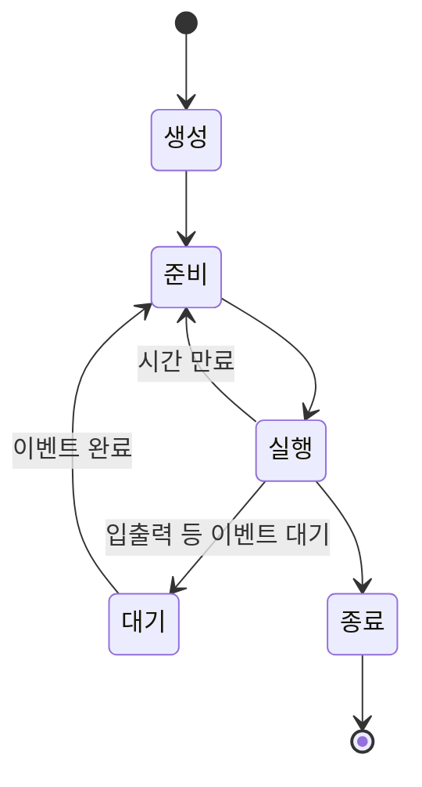

# 프로세스 상태와 스케줄링 — 운영체제의 교통정리

> 식당에 손님이 몰리면, 누구를 먼저 앉히고 누구의 음식을 먼저 내줄지 정해야 합니다. 운영체제도 똑같습니다. 여러 프로세스를 공평하고 효율적으로 돌리는 규칙, 그게 스케줄링입니다.

`프로세스상태` `스케줄링` `멀티프로세싱` `멀티스레딩` `IPC` `교착상태` `기아상태`

## 핵심요약

- 프로세스는 생성 → 준비 → 실행 → (대기) → 종료의 상태를 오가며 살아간다.
- **멀티 프로세싱/멀티 스레딩**은 여러 작업을 번갈아 처리해 속도와 효율을 높인다.
- 프로세스끼리 데이터를 주고받는 방법을 **IPC(프로세스 간 통신)**라 한다(메시지 큐·공유 메모리·소켓).
- **스케줄링**은 "어떤 프로세스부터 CPU를 줄 것인가"를 정하는 일이다. 대기 시간을 줄이고 공평하게 처리하는 것이 목적.
- 대표 스케줄링: 선입선처리(FCFS), 최단작업 우선(SJF), 라운드 로빈(RR).
- **교착상태(Deadlock)**는 서로 상대의 작업이 끝나길 기다리며 아무것도 못 끝내는 상태.
- **기아상태(Starvation)**는 우선순위가 낮아 계속 자원을 못 받는 상태.

## 개념별 정리

### 프로세스의 상태 (식당 비유)

**1. 정의**
프로세스가 거치는 다섯 가지 상태입니다.

- **생성(New/Created)**: 준비 상태로의 승인을 기다리는 단계. 아직 메모리에 로드되지 않은 상태. → *번호표를 들고 식당 밖에서 대기*
- **준비(Ready)**: CPU를 쓰고 있진 않지만 언제든 실행될 수 있도록 대기하는 상태. OS는 우선순위가 높은 순서대로 CPU를 할당해 실행 상태로 보냄. → *식당에 들어가 앉아 있는 상태*
- **실행(Running)**: CPU가 할당되어 프로세스의 명령어를 처리하는 단계. 다른 프로세스도 처리해야 하므로 일정 시간 후 다시 준비 상태로 돌아감. → *나온 요리를 먹는 단계*
- **대기(Blocked/Waiting)**: 특정 자원이나 이벤트(입출력 완료 등)를 기다리는 상태. 이벤트가 끝나면 준비 상태로 돌아와 계속 실행. → *화장실 다녀오는 상태*
- **종료(Terminated)**: 모든 명령어가 완료된 상태. 부모 프로세스가 상태를 확인할 때까지 바로 삭제되지 않고 대기하다 메모리에서 삭제됨. → *일어나서 나갈 준비를 하는 단계*

**2. 왜 필요한가?**
한 컴퓨터에서 수십 개의 프로세스가 동시에 살아갑니다. 각 프로세스가 지금 어떤 상태인지 추적해야, OS가 누구에게 CPU를 줄지 결정할 수 있습니다.

**3. 예시 (상태 전이도)**

**4. 헷갈리기 쉬운 점**
"준비"와 "대기"를 헷갈립니다. 준비는 CPU만 받으면 바로 뛸 수 있는 상태(앉아서 차례 기다림)이고, 대기는 다른 이벤트가 끝나야 다시 줄을 설 수 있는 상태(화장실)입니다.

**5. 한 줄 정리**
프로세스는 생성→준비→실행을 오가고, 중간에 대기로 빠졌다가, 끝나면 종료됩니다.

### 멀티 프로세싱과 멀티 스레딩

**1. 정의**
- **멀티 프로세싱**: 여러 개의 프로세스를 돌아가면서 조금씩 처리하는 것. *여러 집에서 동시에 여러 집안일 하기.*
- **멀티 스레딩**: 한 프로세스 안에서 자원을 공유하며 여러 작업을 처리하는 것. *한 집 안에서 동시에 여러 집안일 하기.*

**2. 왜 필요한가?**
하나씩 순서대로 처리하면 느립니다. 여러 작업을 병렬로 처리하면 반복 작업이나 크롤링 같은 일의 속도를 끌어올릴 수 있습니다.

**3. 예시**
- 멀티 스레드: 한 프로세스 내에서 자원을 공유하며 여러 작업을 처리하고, 새 프로세스를 만들어 리소스를 할당받는 과정이 없어 더 빠르게 처리할 수 있습니다. 단, 하나의 스레드에 문제가 생기면 프로세스 전체가 종료될 수 있습니다.
- 멀티 프로세스: 프로세스마다 독립 메모리를 쓰므로 한쪽이 죽어도 다른 쪽은 비교적 안전하지만, 새 프로세스 생성·자원 할당 비용이 듭니다.

**4. 헷갈리기 쉬운 점**
스레드는 빠르지만 자원을 공유하기에 한 스레드의 오류가 전체로 번질 수 있고, 프로세스는 안전하지만 생성 비용이 큽니다. "빠름 vs 안전"의 트레이드오프입니다.

**5. 한 줄 정리**
멀티 스레딩은 한 집 안에서, 멀티 프로세싱은 여러 집에서 동시에 일하는 방식입니다.

### 프로세스 간 통신 (IPC, Inter Process Communication)

**1. 정의**
서로 다른 프로세스가 데이터를 주고받는 방법입니다. 다른 프로세스의 리소스는 절대 침범하면 안 되므로, OS가 허용하는 방법 안에서 데이터를 교환합니다.

**2. 왜 필요한가?**
프로세스는 독립 메모리를 쓰기 때문에 서로의 데이터를 직접 들여다볼 수 없습니다. 그래서 정해진 통로로 안전하게 주고받아야 합니다.

**3. 예시 (세 가지 방법)**

| 방법 | 비유 | 설명 |
| --- | --- | --- |
| 메시지 큐(Message Queue) | 공용 우편함에 넣어 두기 | 데이터를 큐에 넣어 두면 다른 프로세스가 찾아서 받음 |
| 공유 메모리(Shared Memory) | 현관문 열어 두기 | 프로세스 메모리 일부를 공유 메모리로 만들어 함께 씀. 복사 과정이 없어 상대적으로 빠르지만 충돌 위험 있음 |
| 소켓(Socket) | 택배로 접시 보내기 | 소켓을 생성해 양방향 통신으로 데이터 전달. 다른 네트워크의 프로세스와도 통신 가능 |

**4. 헷갈리기 쉬운 점**
공유 메모리는 빠른 대신, 둘이 동시에 같은 곳을 건드리면 충돌(데이터 깨짐)이 날 수 있습니다. 소켓은 네트워크 너머의 프로세스와도 통신할 수 있다는 점이 특징입니다.

**5. 한 줄 정리**
IPC는 독립된 프로세스들이 안전하게 데이터를 주고받는 '약속된 통로'입니다.

### 프로세스 스케줄링

**1. 정의**
"어떤 손님부터 음식을 해 줄 것인가" — 즉 어떤 프로세스부터 CPU를 줄지 정하는 일입니다. 대기 시간은 가능한 한 최소화하고, 가능한 한 공평하게 처리하는 것이 목적입니다.

**2. 왜 필요한가?**
CPU는 하나(또는 몇 개)인데 처리할 프로세스는 많습니다. 순서를 잘 정해야 전체가 빠르고 공평하게 돌아갑니다.

**3. 예시 (세 가지 방식)**
- **선입선처리(FCFS, 먼저 온 손님부터)**: 가장 먼저 도착한 프로세스부터 순서대로 처리. 구현이 간단하고 일괄 처리에 효과적이지만, 빠른 응답이 필요한 환경에는 부적합.
- **최단작업 우선(SJF, 음식을 가장 적게 먹는 손님부터)**: 평균 대기 시간을 최소로 만드는 알고리즘. 단, 작업이 얼마나 걸릴지 예측하기 어렵고, 오래 걸리는 작업은 계속 밀려 평생 처리되지 않을 수 있음(기아 위험).
- **라운드 로빈(RR, 모두에게 일정 시간씩)**: 일정 시간을 정해 두고 시간이 지나면 대기열 맨 뒤로 보내고 다음 작업 처리. 응답 시간이 짧아져 실시간 시스템에 유리하지만, 프로세스 간 전환이 많아지는 단점.

**4. 헷갈리기 쉬운 점**
"빠른 게 최고"가 아닙니다. SJF는 평균 대기를 줄이지만 긴 작업을 굶기고, RR은 공평하지만 전환 비용이 큽니다. 환경(실시간/일괄)에 따라 적합한 방식이 다릅니다.

**5. 한 줄 정리**
스케줄링은 한정된 CPU를 누구에게 먼저 줄지 정하는 교통정리입니다.

### 교착상태(Deadlock)와 기아상태(Starvation)

**1. 정의**
- **교착상태(Deadlock)**: 프로세스들이 서로 상대방의 작업이 끝나기만 기다려서 결과적으로 아무것도 완료되지 않는 상태.
- **기아상태(Starvation)**: 프로세스의 우선순위가 낮아서 원하는 자원을 계속 받지 못하는 상태.

**2. 왜 필요한가? (왜 문제가 되는가)**
둘 다 시스템이 멈추거나 특정 작업이 영원히 처리되지 않게 만듭니다. OS는 이를 예방·해결할 방법을 마련해야 합니다.

**3. 예시**
- 교착상태 발생 조건(네 가지가 모두 충족돼야 함): **상호배제**(자원을 동시에 둘 이상이 못 씀), **점유대기**(자원을 가진 채 다른 자원을 기다림), **비선점**(다른 프로세스가 자원을 뺏을 방법이 없음), **순환대기**(각 프로세스가 순환적으로 다음 프로세스의 자원을 요구). 이 중 하나라도 막으면 교착상태를 예방할 수 있습니다.
- 교착상태 해결: 은행원 알고리즘(자원 할당 전에 OS가 검사 후 할당), 교착상태 무시(아무것도 하지 않음), 프로세스 종료(발견 시 관련 프로세스를 종료). 다만 아직 완벽하게 막을 방법은 없습니다.
- 기아상태 해결: 우선순위를 수시로 바꿔 낮은 우선순위가 계속 밀리지 않게 하거나, 오래 기다린 프로세스의 우선순위를 높이거나, 우선순위가 아닌 순서대로 처리합니다.

**4. 헷갈리기 쉬운 점**
교착상태와 기아상태를 혼동하기 쉽습니다. 교착상태는 **서로 물고 물려 다 같이 멈춘 것**이고, 기아상태는 **나만 계속 뒤로 밀려 못 받는 것**입니다.

**5. 한 줄 정리**
교착상태는 "다 같이 멈춤", 기아상태는 "나만 계속 굶음"입니다.

## 코드로 보기 — 스케줄링 방식 비교

| 방식 | 처리 기준 | 장점 | 단점 |
| --- | --- | --- | --- |
| 선입선처리(FCFS) | 먼저 온 순서 | 단순·일괄 처리에 효과적 | 빠른 응답 환경엔 부적합 |
| 최단작업 우선(SJF) | 짧은 작업 먼저 | 평균 대기 시간 최소 | 예측 어려움, 긴 작업 기아 위험 |
| 라운드 로빈(RR) | 일정 시간씩 순서대로 | 응답 시간 짧음, 실시간에 유리 | 프로세스 전환 비용 증가 |

**코드목적**
세 가지 스케줄링이 각각 무엇을 우선하고 무엇을 희생하는지 비교합니다.

**해석**
"정답인 방식"은 없습니다. 일괄 처리 서버라면 FCFS, 응답 속도가 중요한 실시간 시스템이라면 RR이 어울립니다. 환경의 요구가 선택을 결정합니다.

**실무 연결**
운영체제뿐 아니라 작업 큐·메시지 처리 시스템 설계에서도 같은 고민이 반복됩니다. "빠른 응답 vs 처리량 vs 공평성" 사이에서 무엇을 택할지가 핵심입니다.

## 직접 해보기

1. "준비" 상태와 "대기" 상태의 차이를 식당 비유로 설명해 보세요.
2. 멀티 스레딩의 장점과 위험을 한 줄씩 적어 보세요.
3. 긴 작업이 계속 밀려 영영 처리되지 않는 문제는 어떤 상태이며, 어떻게 풀 수 있을까요?

예시 답안 보기

1. 준비는 자리에 앉아 음식만 나오면 먹을 수 있는 상태, 대기는 화장실에 가서 잠시 자리를 비운 상태.
2. 장점: 자원을 공유해 빠르게 처리. 위험: 한 스레드 오류가 프로세스 전체를 종료시킬 수 있음.
3. 기아상태. 오래 기다린 프로세스의 우선순위를 높이는 식으로 해결한다.

## 헷갈리기 쉬운 포인트

- **준비 vs 대기**: CPU만 받으면 실행 가능(준비) vs 이벤트가 끝나야 가능(대기).
- **멀티 스레드 vs 멀티 프로세스**: 빠르지만 오류 전파 위험 vs 안전하지만 생성 비용.
- **교착상태 vs 기아상태**: 서로 물려 다 멈춤 vs 우선순위 밀려 나만 못 받음.
- **공유 메모리 vs 메시지 큐**: 빠르지만 충돌 위험 vs 안전하게 넣고 빼기.

## 연결되는 개념

- 이전에 알면 좋은 글: [프로세스와 스레드](06-process-and-thread.md) — 상태와 스케줄링의 대상이 되는 프로세스.
- 다음에 이어지는 글: [메모리 관리와 단편화](08-memory-management.md) — 프로세스에게 메모리를 나눠 주는 또 다른 OS 기능.
- 더 찾아볼 키워드: `컨텍스트 스위칭`, `임계 구역`, `세마포어`, `은행원 알고리즘`

## 셀프 체크

- [ ] 프로세스의 다섯 상태와 전이를 설명할 수 있다.
- [ ] 멀티 프로세싱과 멀티 스레딩을 비교할 수 있다.
- [ ] IPC의 세 방법을 구분할 수 있다.
- [ ] 세 가지 스케줄링 방식의 장단점을 안다.
- [ ] 교착상태와 기아상태를 구분할 수 있다.

**복습 질문 및 답변**

- (기본) 프로세스 스케줄링의 목적은?
  → 대기 시간을 최소화하고 가능한 한 공평하게 프로세스를 처리하는 것.
- (이해 확인) 교착상태가 발생하는 네 조건은?
  → 상호배제, 점유대기, 비선점, 순환대기. 하나라도 막으면 예방 가능.
- (응용) 실시간 응답이 중요한 시스템에는 어떤 스케줄링이 어울리고, 그 이유는?
  → 라운드 로빈. 일정 시간씩 돌아가며 처리해 응답 시간이 짧아지기 때문.

## 한 줄 정리

> 프로세스는 상태를 오가며 살아가고, 운영체제는 스케줄링으로 누구를 먼저 처리할지 정한다. 그 과정에서 다 같이 멈추는 교착상태와 나만 굶는 기아상태를 경계해야 한다.
