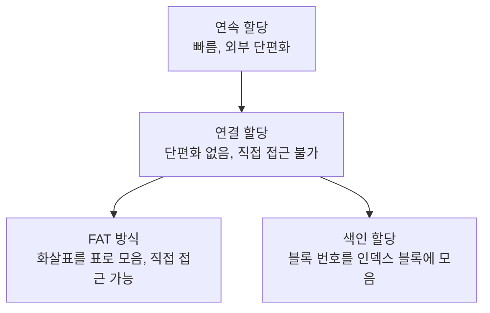

# 파일 시스템과 디스크 할당 — 저장 장치 위에 파일을 배치하는 규칙

> 우리는 그냥 "파일 저장"을 누르지만, 그 파일이 디스크 어느 칸에 어떻게 흩어져 들어가고, 나중에 어떻게 다시 모이는지는 전혀 신경 쓰지 않습니다. 그 신경 쓰지 않아도 되게 해 주는 것이 파일 시스템입니다.

`파일` `파일시스템` `디렉터리` `메타데이터` `디스크할당` `연속할당` `연결할당` `FAT` `색인할당`

## 핵심요약

- **파일**은 "컴퓨터에서 정보를 담는 논리적인 저장 단위"이며, 비휘발성 기억장치에 저장된다.
- **파일 메타데이터**는 파일을 관리하기 위한 정보들(이름·유형·위치·크기·권한·시간 등)이다.
- **디렉터리**는 파일에 대한 여러 정보를 가진 특수한 파일이다(흔히 "폴더"라 부름).
- **파일 시스템**은 파일을 쉽게 접근할 수 있도록 관리하는 체제로, 어떤 방식으로 저장하든 프로그램이 읽고 쓸 수 있게 해 준다.
- 디스크에 파일을 저장하는 방법: 연속 할당, 연결 할당(연결 리스트), FAT 방식, 색인 할당.
- 각 방식은 "직접 접근 가능 여부, 단편화, 손상 시 복구"에서 장단점이 갈린다.

## 개념별 정리

### 파일과 파일 시스템

**1. 정의**
- **파일(file)**: 컴퓨터에서 정보를 담는 논리적인 저장 단위. 비휘발성 기억장치(전원이 꺼져도 남는 장치)에 저장됩니다.
- **파일 시스템(file system)**: 파일들을 쉽게 접근할 수 있도록 관리하는 체제. 크게 디스크·네트워크·특수 용도 파일 시스템으로 나뉘고, 운영체제는 각각의 파일 시스템을 가지고 있습니다.

**2. 왜 필요한가?**
저장 장치마다 데이터를 다루는 방식이 다른데, 프로그램이 그걸 일일이 신경 쓰면 너무 복잡합니다. 파일 시스템은 "어떤 방식으로 저장하든 프로그램은 그냥 읽고 쓰면 되도록" 추상화해 줍니다.

**3. 예시**
우리가 `open()`으로 파일을 열 때, 그 파일이 디스크 어느 칸에 어떻게 흩어져 있는지 몰라도 됩니다. 파일 시스템이 알아서 찾아 줍니다.

**4. 헷갈리기 쉬운 점**
파일과 파일 시스템은 다릅니다. 파일은 "정보 한 덩어리", 파일 시스템은 "그 덩어리들을 정리·관리하는 체계"입니다.

**5. 한 줄 정리**
파일 시스템은 저장 장치의 복잡함을 숨기고 "읽고 쓰기"만 보여 주는 관리 체계입니다.

### 파일 메타데이터와 디렉터리

**1. 정의**
- **파일 메타데이터(file's metadata)**: 파일을 관리하기 위한 정보들. 파일 이름, 유형, 저장된 위치, 크기, 권한, 생성·변경 시간 등.
- **디렉터리(directory)**: 파일에 대한 여러 정보를 가지고 있는 특수한 파일. 그 디렉터리에 속한 파일들의 이름과 속성을 포함하며, 검색·생성·삭제 기능을 제공합니다.

**2. 왜 필요한가?**
파일 내용만으로는 관리할 수 없습니다. "언제 만들어졌고, 누가 접근할 수 있고, 얼마나 큰지" 같은 정보가 있어야 정렬·검색·권한 관리가 됩니다. 디렉터리는 그런 파일들을 묶어 정리합니다.

**3. 예시**
파일 탐색기에서 보이는 "수정한 날짜, 크기, 유형"이 바로 메타데이터입니다. 폴더(디렉터리)를 열면 그 안의 파일 목록과 속성이 보입니다.

**4. 헷갈리기 쉬운 점**
디렉터리(폴더)도 사실 "특수한 파일"입니다. 안에 파일을 담는 상자처럼 보이지만, 내부적으로는 파일 정보를 기록한 파일입니다.

**5. 한 줄 정리**
메타데이터는 파일의 "신상 정보", 디렉터리는 파일들을 정리하는 "특수한 파일"입니다.

### 저장 장치와 접근 방식

**1. 정의**
- **순차 접근 저장장치**: 앞에서부터 순서대로 읽어야 하는 장치. 원하는 지점을 찾기 어려워 빨리 감기·되감기가 필요합니다(예: 카세트테이프).
- **직접 접근 저장장치**: 원하는 부분부터 바로 접근할 수 있는 장치. 모든 데이터를 읽지 않고도 바로 원하는 곳에 접근합니다(예: LP 레코드판).
- **하드 디스크(HDD)**: 플래터(Platter)가 회전하고 헤드(Head)가 정보를 읽어오는 방식. 플래터의 띠 모양 영역을 트랙(Track), 하드 드라이브의 최소 기억 단위를 섹터(Sector)라 합니다.
- **SSD**: 하드 디스크와 달리 물리적인 기계 장치 없이 전기 장치로만 구성되어, 모터 같은 기계 장치가 없어 훨씬 빠릅니다.

**2. 왜 필요한가?**
디스크에 파일을 어떻게 배치할지 정하려면, 그 장치가 어떻게 데이터를 읽는지 알아야 합니다. 헤드 이동이 많을수록 느려지므로, 배치 방식이 속도를 좌우합니다.

**3. 예시**
하드 디스크는 블록이라는 단위로 나눠 번호를 붙입니다. 파일을 이 블록들에 어떻게 배치하느냐에 여러 방법이 있습니다.

**4. 헷갈리기 쉬운 점**
SSD가 빠른 이유는 "기계적으로 헤드를 움직이지 않기" 때문입니다. HDD는 플래터를 돌리고 헤드를 옮기는 물리 동작이 필요해 상대적으로 느립니다.

**5. 한 줄 정리**
HDD는 돌리고 옮겨 읽는 기계식, SSD는 전기식이라 더 빠릅니다.

### 디스크 할당 방식 (연속·연결·FAT·색인)

**1. 정의**
파일을 디스크 블록에 배치하는 네 가지 방식입니다.

**2. 왜 필요한가?**
파일이 커지거나 자주 바뀌는 상황에서, "직접 접근이 되는가, 단편화가 생기는가, 한 칸이 손상돼도 복구되는가"가 방식마다 다릅니다. 상황에 맞는 방식을 골라야 합니다.

**3. 예시 (방식별 비교)**
- **연속 할당(Contiguous Allocation)**: 앞에서부터 차례대로 데이터를 입력. 헤드 이동이 최소라 입출력 속도가 빠르고, 순차·직접 접근이 모두 가능. 하지만 할당·삭제를 반복하면 중간에 구멍이 생겨 외부 단편화가 발생하고, 파일이 계속 커지는 경우엔 매우 부적절.
- **연결 할당(Linked Allocation, 연결 리스트 방식)**: 데이터와 "다음을 가리키는 포인터"로 구성된 한 줄짜리 자료구조. 외부 단편화가 없고 길이가 변하는 데이터에 적합. 하지만 헤드가 여러 번 움직여야 하고, 직접 접근이 불가능하며(처음부터 따라가야 함), 한 칸이 손상되면 그 뒤 모든 데이터를 읽을 수 없음.
- **FAT(File Allocation Table) 방식**: "다음을 가리키는 화살표(포인터)"들을 모아 하나의 표(FAT)로 따로 저장. FAT만 읽으면 원하는 칸부터 접근하는 직접 접근이 가능하고, 한 칸이 손상돼도 FAT를 보면 다음 칸을 알 수 있음. 단, FAT 크기에 따라 최대 파일·파티션 크기가 제한됨(FAT16, FAT32, exFAT 등이 그 예).
- **색인 할당(Indexed Allocation)**: 파일의 블록 번호들을 순서대로 한 칸(인덱스 블록)에 기록. 인덱스 블록만 읽으면 직접 접근이 가능하고 외부 단편화가 없음. 단, 이 표를 저장하려고 파일마다 한 칸을 써야 하고, 한 칸에 다 담을 수 없을 만큼 큰 파일은 저장하기 어려움.

**4. 헷갈리기 쉬운 점**
연결 할당과 FAT는 둘 다 "포인터로 잇는" 점이 비슷하지만, 연결 할당은 포인터가 데이터 칸마다 흩어져 있어 직접 접근이 안 되고, FAT는 포인터를 한 표에 모아 둬서 직접 접근이 됩니다. 이 차이가 핵심입니다.

**5. 한 줄 정리**
연속은 빠르지만 단편화, 연결은 단편화 없지만 직접 접근 불가, FAT는 포인터를 표로 모아 직접 접근 가능, 색인은 블록 번호를 인덱스 블록에 모아 관리합니다.

## 코드로 보기 — 디스크 할당 방식 비교

| 방식 | 직접 접근 | 외부 단편화 | 손상 시 복구 |
| --- | --- | --- | --- |
| 연속 할당 | 가능 | 발생 | 어려움 |
| 연결 할당 | 불가능 | 없음 | 한 칸 손상 시 이후 전부 손실 |
| FAT | 가능 | 없음(블록 단위) | FAT로 다음 칸 추적 가능 |
| 색인 할당 | 가능 | 없음 | 인덱스 블록으로 추적 |

**코드목적**
네 가지 방식이 "접근·단편화·복구"에서 각각 어떤 성격을 갖는지 정리합니다.

**해석**
"연결 할당의 약점(직접 접근 불가, 손상 취약)을 FAT가 보완"하는 흐름이 보입니다. 화살표를 데이터 칸에 흩어 두는 대신 한 표에 모았더니, 직접 접근도 되고 손상에도 강해진 것입니다.

**실무 연결**
USB 메모리·SD카드에서 자주 보는 FAT32, exFAT가 바로 이 FAT 계열입니다. "FAT32는 큰 파일을 저장 못 한다"는 제약도 FAT 크기 한계에서 옵니다.

## 직접 해보기

1. 디렉터리가 "특수한 파일"이라는 말의 의미를 한 문장으로 설명해 보세요.
2. 연결 할당에서 중간 한 칸이 손상되면 왜 이후 데이터를 못 읽는지 설명해 보세요.
3. FAT 방식이 연결 할당의 어떤 단점을 어떻게 보완하는지 적어 보세요.

예시 답안 보기

1. 디렉터리는 그 안의 파일 이름과 속성 정보를 담은 파일이라서, 폴더처럼 보이지만 사실 특수한 파일이다.
2. 각 칸이 다음 칸을 가리키는 화살표로만 이어져 있어서, 화살표가 끊기면 그다음 위치를 알 수 없기 때문.
3. 직접 접근 불가·손상 취약이라는 단점을, 화살표(포인터)를 하나의 표(FAT)에 모아 두어 직접 접근과 다음 칸 추적이 가능하게 보완한다.

## 헷갈리기 쉬운 포인트

- **파일 vs 파일 시스템**: 정보 한 덩어리 vs 그것들을 관리하는 체계.
- **순차 접근 vs 직접 접근**: 앞에서부터(테이프) vs 원하는 곳 바로(LP).
- **HDD vs SSD**: 기계식(느림) vs 전기식(빠름).
- **연결 할당 vs FAT**: 포인터가 칸마다 흩어짐(직접 접근 불가) vs 포인터를 표로 모음(직접 접근 가능).

## 연결되는 개념

- 이전에 알면 좋은 글: [가상 메모리와 페이징](09-virtual-memory-and-paging.md) — 보조 기억 장치(디스크)를 메모리처럼 쓰는 이야기와 이어진다.
- 다음에 이어지는 글: [링크와 마운트](11-link-and-mount.md) — 색인 할당에서 한 걸음 더 나아간 inode와 링크.
- 함께 보면 좋은 글: [메모리 관리와 단편화](08-memory-management.md) — 메모리와 디스크에서 똑같이 등장하는 단편화.
- 더 찾아볼 키워드: `블록(Block)`, `FAT32/exFAT`, `inode`, `연결 리스트`

## 셀프 체크

- [ ] 파일과 파일 시스템을 구분할 수 있다.
- [ ] 메타데이터와 디렉터리를 설명할 수 있다.
- [ ] HDD와 SSD의 속도 차이 원인을 안다.
- [ ] 네 가지 디스크 할당 방식의 장단점을 비교할 수 있다.

**복습 질문 및 답변**

- (기본) 파일 시스템이 하는 일은?
  → 어떤 방식으로 저장하든 프로그램이 신경 쓰지 않고 파일을 읽고 쓸 수 있게 관리하는 것.
- (이해 확인) 연결 할당의 가장 큰 약점 두 가지는?
  → 직접 접근이 불가능하고, 한 칸이 손상되면 이후 모든 데이터를 읽을 수 없다.
- (응용) USB의 FAT32에서 매우 큰 파일을 저장하지 못하는 이유를 방식 특성으로 설명하면?
  → FAT 크기에 따라 최대 파일·파티션 크기가 제한되기 때문.

## 한 줄 정리

> 파일 시스템은 저장 장치의 복잡함을 숨겨 "읽고 쓰기"만 보여 주고, 디스크 할당 방식(연속·연결·FAT·색인)은 파일을 어디에 어떻게 배치할지를 결정한다.
