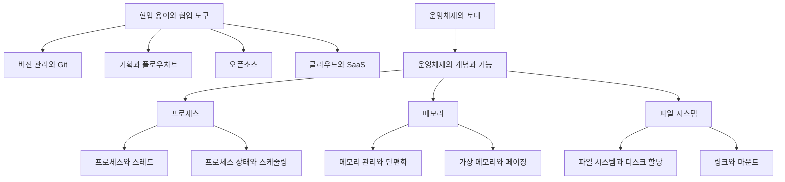

# 컴퓨터는 어떻게 일하는가 — 협업 도구부터 운영체제의 4대 기능까지

> "내 코드가 컴퓨터 안에서 실제로 어떻게 굴러가는지" 한 번도 제대로 들여다본 적 없다면, 이 단원이 그 첫 지도입니다.

코드를 짜는 것과, 그 코드가 돌아가는 무대(컴퓨터·운영체제·협업 환경)를 이해하는 것은 다른 이야기입니다. 이번 단원은 두 가지를 한 번에 다룹니다. 앞부분은 **현업에서 실제로 쓰는 도구와 용어**(버전 관리, 기획, 오픈소스, 클라우드)를, 뒷부분은 그 도구들이 올라타 있는 토대인 **운영체제(OS)의 핵심 원리**(프로세스·메모리·파일 시스템)를 비전공자 눈높이로 풀어냅니다.

특히 운영체제 파트는 AI·LLM 시대에 다시 중요해졌습니다. 모델을 직접 돌리거나 서비스를 배포할 때 "CPU·메모리·프로세스·포트" 같은 단어가 매번 등장하기 때문입니다. 명령어를 외우는 대신 **"왜 이런 구조인가"**를 이해하는 데 초점을 맞췄습니다.

## 학습 로드맵

## 이번 단원에서 다루는 글

| 글 | 한 줄 소개 | 활용도 |
| --- | --- | --- |
| [01. 버전 관리와 Git](posts/01-version-control-and-git.md) | 코드의 변경 이력을 기록하고 되돌리는 협업의 기본기 | ★★★★★ |
| [02. 기획과 플로우차트](posts/02-planning-and-flowchart.md) | "사용자가 귀찮으면 안 쓴다" — 서비스 흐름을 설계하는 법 | ★★★★☆ |
| [03. 오픈소스](posts/03-open-source.md) | 공개된 코드를 쓰고 기여하는 문화와 라이선스 | ★★★☆☆ |
| [04. 클라우드와 SaaS](posts/04-cloud-and-saas.md) | 실물 서버 없이 빌려 쓰는 인프라와 소프트웨어 | ★★★★☆ |
| [05. 운영체제의 개념과 기능](posts/05-operating-system-basics.md) | 자원을 제어하고 프로그램을 돌려주는 시스템 소프트웨어 | ★★★★★ |
| [06. 프로세스와 스레드](posts/06-process-and-thread.md) | 실행 중인 프로그램의 정체와 메모리 구조 | ★★★★★ |
| [07. 프로세스 상태와 스케줄링](posts/07-process-state-and-scheduling.md) | 여러 작업을 공평하게 돌리는 운영체제의 교통정리 | ★★★★☆ |
| [08. 메모리 관리와 단편화](posts/08-memory-management.md) | 한정된 메모리를 나눠 주는 방식과 그 부작용 | ★★★★☆ |
| [09. 가상 메모리와 페이징](posts/09-virtual-memory-and-paging.md) | 실제보다 더 큰 메모리를 쓰는 것처럼 보이게 하는 마법 | ★★★★☆ |
| [10. 파일 시스템과 디스크 할당](posts/10-file-system-and-disk-allocation.md) | 저장 장치 위에 파일을 배치하고 찾아내는 규칙 | ★★★★☆ |
| [11. 링크와 마운트](posts/11-link-and-mount.md) | 바로가기의 원리(inode)와 장치를 연결하는 작업 | ★★★☆☆ |

## 다루는 핵심 개념

- **협업 도구**: 버전 관리(Version Control), Git, 원격 저장소, 오픈소스, 라이선스
- **서비스 설계**: 플로우차트, 핵심 로직, UX(사용자 편의성), 프로토타입
- **인프라**: 클라우드, SaaS, 컨테이너
- **운영체제 4대 기능**: 프로세스 관리, 메모리 관리, 파일 시스템 관리, 네트워크 관리
- **프로세스**: 프로그램·프로세스·스레드, 메모리 구조(스택/힙/데이터/코드), 상태 전이, 멀티프로세싱/스레딩, IPC, 스케줄링, 교착상태·기아상태
- **메모리**: 할당/해제, 연속·불연속 할당, 단편화, 가상 메모리, 페이징, 세그멘테이션, 스와핑, 캐시
- **파일 시스템**: 메타데이터, 디렉터리, 디스크 할당(연속/연결/색인), inode, 링크, 마운트
