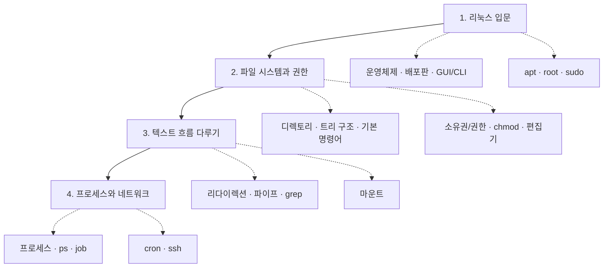

# 리눅스 기초 — 운영체제부터 프로세스·네트워크까지

> 검은 화면에 깜빡이는 커서, 마우스 없이 글자만으로 컴퓨터를 다루는 세계.
> "리눅스를 한 번도 안 써봤다"는 사람이 하루 만에 디렉토리를 탐색하고, 파일 권한을 바꾸고,
> 백그라운드 작업을 관리하고, 원격 서버에 접속하기까지의 과정을 한 흐름으로 정리했습니다.

이 강의는 **왜 개발·데이터·서버 환경이 리눅스를 쓰는가**에서 출발해,
실제 터미널에서 손으로 쳐보는 명령어까지 단계적으로 이어집니다.
GUI(마우스)에 익숙한 사람이 CLI(문자)로 넘어가는 다리를 놓는 것이 목표입니다.

---

## 학습 로드맵

흐름은 **"환경 이해 → 파일 다루기 → 데이터 흐름 제어 → 시스템·원격 관리"** 순서로,
앞 단계에서 배운 명령어가 뒤 단계에서 재료로 쓰이도록 구성되어 있습니다.

---

## 목차

| 글 | 한 줄 소개 | 활용도 |
| --- | --- | --- |
| [01. 리눅스 입문 — 운영체제부터 패키지·권한까지](posts/01-linux-introduction.md) | 리눅스가 무엇이고 왜 쓰는지, 우분투·GUI/CLI·apt·sudo의 기초 | ⭐⭐⭐ 모든 개발/서버 작업의 출발점 |
| [02. 파일 시스템과 권한 — 디렉토리·소유권·편집기](posts/02-filesystem-and-permissions.md) | 디렉토리 트리 구조, 탐색 명령어, 파일 권한과 chmod, 텍스트 편집기 | ⭐⭐⭐ 서버·실습 환경에서 매일 쓰는 기본기 |
| [03. 텍스트 흐름 다루기 — 리다이렉션·파이프·검색](posts/03-redirection-pipe-grep.md) | 표준 입출력, `>`·`\|`·`grep`으로 명령어를 조립하기, 마운트 | ⭐⭐⭐ 로그 분석·자동화의 핵심 무기 |
| [04. 프로세스와 네트워크 — ps·job·cron·ssh](posts/04-process-and-network.md) | 프로세스 개념, 작업 관리, 예약 실행(cron), 원격 접속(ssh) | ⭐⭐ 서버 운영·배포·정기 작업 자동화 |

---

## 이 강의에서 다루는 핵심 개념

- **운영체제와 배포판**: 리눅스 종류(레드햇/데비안 계열), 우분투의 위치
- **인터페이스**: GUI(그래픽) vs CLI(문자)
- **패키지와 권한**: `apt` 패키지 관리자, `root`/`sudo` 권한 모델
- **파일 시스템**: 디렉토리·파일, 트리 구조, 파일 속성과 소유권/권한, `chmod`
- **기본 명령어**: `pwd` `ls` `cd` `whoami` `mkdir` `touch` `cat`
- **데이터 흐름 제어**: 리다이렉션(`>` `>>` `<` `2>`), 파이프(`|`), `grep`/정규표현식, 마운트
- **프로세스·네트워크**: 프로세스/PID, `ps`, job(포그라운드/백그라운드), `crontab`, `ssh`
