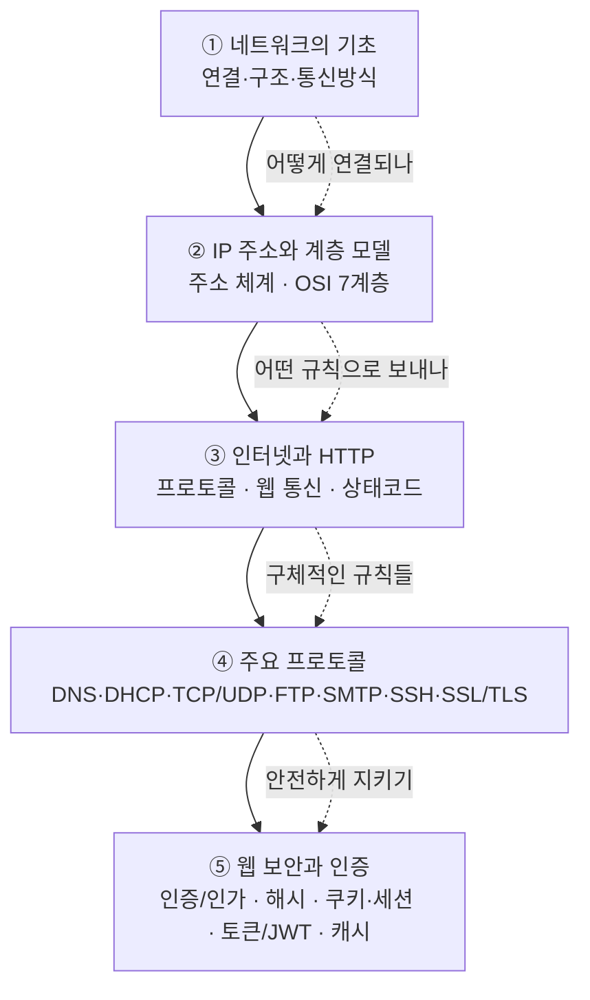

# 핵심 네트워크 — 인터넷이 데이터를 주고받는 원리

> "유튜브 영상을 누르면 화면이 뜨고, 로그인 한 번에 다음부터 자동으로 들어가지고, 주소창에 `https`가 붙어 있으면 안전하다고 한다." — 이 모든 일이 일어나는 무대가 바로 **네트워크**입니다. 이번 정리에서는 컴퓨터들이 어떻게 연결되고, 어떤 규칙으로 대화하며, 그 대화를 어떻게 안전하게 지키는지를 비전공자 눈높이로 풀어봅니다.

이 강의는 "컴퓨터 두 대를 선으로 잇는다"는 가장 기초적인 그림에서 출발해, 전 세계를 잇는 인터넷·웹·보안까지 한 흐름으로 이어집니다. 용어가 많아 보이지만, 결국 **"누가 / 어디로 / 어떤 규칙으로 / 안전하게 데이터를 보내는가"** 라는 하나의 질문을 잘게 나눈 것뿐입니다.

---

## 학습 로드맵

큰 그림은 **연결 → 주소 → 규칙 → 구체적 프로토콜 → 보안** 순서로 좁혀집니다. 앞 글의 개념이 뒤 글의 토대가 되므로, 가능하면 순서대로 읽는 것을 권합니다.

---

## 목차

| 글 | 한 줄 소개 | 활용도 |
| --- | --- | --- |
| [① 네트워크의 기초](posts/01-network-fundamentals.md) | 네트워크가 무엇이고 어떤 모양·종류로 연결되는지, 데이터가 어떤 방식으로 오가는지 | ★★★☆☆ 개념의 토대 |
| [② IP 주소와 계층 모델](posts/02-ip-address-and-layers.md) | 인터넷이 "내 컴퓨터"를 찾아오는 주소 체계와, 통신을 7개 단계로 나눈 OSI 계층 | ★★★★☆ 면접·실무 단골 |
| [③ 인터넷과 HTTP](posts/03-internet-and-http.md) | 웹 브라우저와 서버가 대화하는 규칙(HTTP), 응답 상태코드, 출처 정책(CORS) | ★★★★★ 웹 개발 필수 |
| [④ 주요 프로토콜](posts/04-core-protocols.md) | 도메인을 IP로 바꾸고(DNS), 주소를 자동 배분하고(DHCP), 파일·메일·원격접속을 담당하는 프로토콜들 | ★★★★☆ 백엔드·인프라 |
| [⑤ 웹 보안과 인증](posts/05-web-security-and-auth.md) | 로그인 상태를 기억하는 법(쿠키·세션·토큰·JWT)과 데이터를 지키는 법(해시·암호화·캐시) | ★★★★★ 서비스 기획·개발 |

---

## 이번 강의에서 다루는 핵심 개념

- **연결과 구조**: 노드, 전송 매체(유선/무선), 토폴로지(Star·Bus·Ring·Mesh), 네트워크 규모(PAN·LAN·MAN·WAN)
- **주소 체계**: IP 주소, MAC 주소, 서브넷, IPv4 vs IPv6, 사설 IP vs 공인 IP, NAT
- **계층 모델**: OSI 7계층, TCP/IP 4계층, 캡슐화/역캡슐화
- **웹 통신**: 프로토콜, HTTP 요청/응답, 메서드(GET·POST·PUT·DELETE)와 CRUD, 상태코드(2xx·3xx·4xx·5xx), CORS·SOP
- **핵심 프로토콜**: TCP vs UDP, 3-way/4-way handshake, DNS·DHCP, FTP/SFTP, SMTP/POP3/IMAP, SSH, SSL/TLS·HTTPS
- **보안과 상태 유지**: 인증 vs 인가, 해시·암호화, 쿠키·세션·토큰·JWT, 캐시·CDN

> 용어가 헷갈릴 때는 [GLOSSARY.md](GLOSSARY.md) 를 함께 펼쳐 두세요. 글마다 처음 나오는 용어는 대부분 용어집에 정리되어 있습니다.
