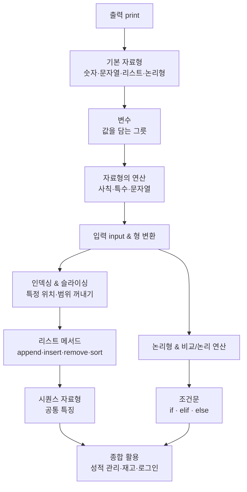

# 파이썬 첫걸음 — 자료형 · 연산 · 조건문 · 리스트

> "변수에 값을 담고, 자료형을 다루고, 조건에 따라 다른 일을 시키고, 여러 값을 리스트로 모은다."
> 프로그래밍의 가장 기본이 되는 네 가지 능력을 한 번에 익히는 시간입니다.

코딩을 처음 시작하면 "이걸 왜 배우지?"라는 생각이 들기 쉽습니다. 이 강의의 목표는 문법 암기가 아니라 **"컴퓨터에게 일을 시키는 사고방식"** 을 몸에 붙이는 것입니다. 값을 출력하고, 사용자에게 입력을 받고, 받은 값을 가공하고, 조건에 따라 분기하고, 여러 값을 한 묶음으로 관리하는 흐름을 따라가다 보면 "프로그램이 어떻게 돌아가는지"가 자연스럽게 그려집니다.

## 학습 로드맵

## 글 목차

| 글 | 한 줄 소개 | 활용도 |
| --- | --- | --- |
| [출력 — print()](posts/01-print-output.md) | 컴퓨터가 결과를 보여주게 만드는 첫 번째 명령 | ★★★★★ |
| [기본 자료형](posts/02-basic-datatypes.md) | 숫자·문자열·리스트·논리형, 그리고 type()과 주석 | ★★★★★ |
| [변수](posts/03-variables.md) | 값을 담는 그릇, 이름 짓는 규칙과 표기법 | ★★★★★ |
| [자료형의 연산](posts/04-operators.md) | 사칙연산, 몫·나머지·제곱, 문자열 이어붙이기·반복 | ★★★★☆ |
| [입력과 형 변환](posts/05-input-typecasting.md) | input()으로 값을 받고 int()·str()로 모양 바꾸기 | ★★★★★ |
| [인덱싱과 슬라이싱](posts/06-indexing-slicing.md) | 0부터 시작하는 위치 번호로 원소·범위 꺼내기 | ★★★★★ |
| [리스트 메서드](posts/07-list-methods.md) | append·insert·remove·sort로 리스트 다루기 | ★★★★★ |
| [시퀀스 자료형](posts/08-sequence-types.md) | 문자열과 리스트의 공통 능력 in·len·+·* | ★★★★☆ |
| [논리형과 비교·논리 연산](posts/09-boolean-comparison.md) | True/False, 비교 연산자, and·or·not | ★★★★★ |
| [조건문](posts/10-conditionals.md) | if·elif·else로 상황에 따라 다른 일 시키기 | ★★★★★ |

## 다루는 핵심 개념

- **출력과 입력**: `print()`, `input()` — 컴퓨터와 값을 주고받는 두 통로
- **자료형**: 정수 `int`, 실수 `float`, 문자열 `str`, 리스트 `list`, 논리형 `bool`
- **형 변환(Type Casting)**: `int()` · `float()` · `str()` · `list()`
- **변수**: 값을 담는 그릇과 이름 규칙
- **연산**: 사칙연산, 특수연산(`//` `%` `**`), 문자열 연산(`+` `*`)
- **인덱싱·슬라이싱**: 위치 기반 원소·범위 접근, 음수 인덱스, 중첩 리스트
- **리스트 메서드**: `append`, `insert`, `remove`, `sort`
- **시퀀스 공통 특징**: `in`, `len()`, `+`, `*`
- **비교·논리 연산**: `==` `!=` `<` `>` `<=` `>=`, `and` `or` `not`
- **조건문**: `if` / `if-else` / `if-elif-else`, 들여쓰기 블록

## 이 강의 한눈에 보기

| 주제 | 핵심 포인트 |
| --- | --- |
| 기초 자료형 | `int` `float` `str` `list` `bool` · `type()` · 형 변환 |
| 변수 | `변수 = 값` · 스네이크 표기법 권장 · 덮어쓰기 가능 |
| 연산 | 숫자: `//` `%` `**` · 문자열: `+` 이어붙이기, `*` 반복 |
| 인덱싱·슬라이싱 | 0부터 시작 · 음수 인덱스 · `[시작:끝]` |
| 조건문 | `if` - `elif` - `else` · 들여쓰기 필수 · `and` `or` `not` |
| 리스트 메서드 | `append` · `insert` · `remove` · `sort(reverse=True)` |
| 시퀀스 공통 | `in` · `len()` · `+` · `*` |

> **다음 단계 예고**: 반복문(`for`, `while`) → 함수(`def`) → 딕셔너리(`dict`)
