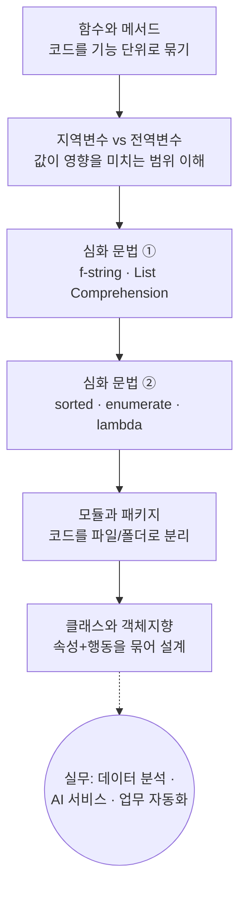

# 파이썬 중급 문법 한 번에 잡기 — 함수·변수·심화문법·모듈·클래스

> "코드가 길어지기 시작하면, 더 이상 '돌아가게 만들기'가 아니라 '잘 정리하기'가 실력이 됩니다."
> 이 강의는 흩어진 코드를 함수로 묶고, 변수의 영향 범위를 통제하고, 반복을 한 줄로 줄이고, 파일을 모듈로 쪼개고, 마지막으로 클래스로 구조를 세우는 과정을 한 흐름으로 다룹니다.

비전공자도 따라올 수 있도록, 문법 암기보다 **"왜 이걸 쓰는가 / 무엇을 처리하는 과정인가 / 결과를 어떻게 읽는가"** 중심으로 정리했습니다.

---

## 이 강의가 답하는 질문들

- 반복되는 코드를 어떻게 한 덩어리로 묶어 재사용할까? → **함수**
- 함수 안에서 만든 값은 왜 밖에서 안 보일까? → **지역/전역 변수(scope)**
- `for`문 여러 줄을 어떻게 한 줄로 줄일까? → **List Comprehension**
- 정렬·순번 매기기·간단한 함수를 깔끔하게 쓰려면? → **sorted / enumerate / lambda**
- 코드가 한 파일에 다 안 들어갈 때는? → **모듈과 패키지**
- 데이터(속성)와 행동(메서드)을 하나로 묶어 설계하려면? → **클래스**

---

## 학습 로드맵

큰 그림은 **"묶기 → 통제하기 → 줄이기 → 나누기 → 설계하기"** 입니다. 함수로 기능을 묶고, 변수 범위를 이해해 부작용을 통제하고, 심화 문법으로 코드를 줄이고, 모듈로 파일을 나누고, 클래스로 전체 구조를 설계하는 순서로 점점 규모가 커집니다.

---

## 목차

| 글 | 한 줄 소개 | 활용도 |
| --- | --- | --- |
| [01. 함수와 메서드](posts/01-functions-and-methods.md) | 특정 기능을 묶는 함수, 자료에 붙여 쓰는 메서드, `return`의 진짜 의미 | ★★★★★ |
| [02. 지역변수 vs 전역변수](posts/02-local-global-variables.md) | 변수가 보이는 범위(scope), Shadowing, `global`의 위험과 쓰임 | ★★★★☆ |
| [03. 심화 문법 ① f-string · List Comprehension](posts/03-fstring-and-list-comprehension.md) | 문자열을 깔끔하게 끼워 넣고, 리스트 생성을 한 줄로 압축 | ★★★★★ |
| [04. 심화 문법 ② sorted · enumerate · lambda](posts/04-sorted-enumerate-lambda.md) | 정렬·순번 매기기·익명 함수와 `map`을 활용한 데이터 처리 | ★★★★☆ |
| [05. 모듈과 패키지](posts/05-modules-and-packages.md) | `import`로 남이 만든 코드 활용, 파일/폴더로 나누기, 실행 시작점 지정 | ★★★★☆ |
| [06. 클래스와 객체지향](posts/06-class-and-oop.md) | 설계도(클래스)로 객체 찍어내기, 상속·오버라이딩·다형성까지 | ★★★★★ |

---

## 다루는 핵심 개념 한눈에

- **함수 / 메서드**: 기능을 묶어 재사용, `def`, 매개변수, `return`, 내장함수 vs 사용자정의함수
- **변수 범위(scope)**: 지역변수, 전역변수, Shadowing, `global`
- **심화 표현식**: f-string, List Comprehension(if / if-else), `sorted`/`sort`, `enumerate`, `lambda`, `map`
- **모듈·패키지**: `import`, `from ~ import`, 표준 모듈(`math`, `random`), 패키지(폴더 구조), `if __name__ == "__main__"`
- **클래스**: 클래스/인스턴스, 속성/메서드, `__init__`, 클래스변수 vs 인스턴스변수, 매직 메서드(`__str__`/`__repr__`), `@classmethod`/`@staticmethod`, 상속/오버라이딩/다형성

> 용어가 낯설면 먼저 [용어집(GLOSSARY)](GLOSSARY.md)을 훑어보고 와도 좋습니다.
