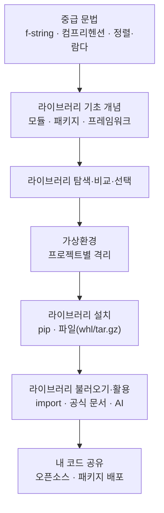

# 실전 파이썬 라이브러리 활용 — 코드를 "가져다 쓰는" 단계로

> 기본 문법을 떼고 나면 누구나 같은 질문에 부딪힙니다. "별 찍기나 자판기 프로그램은 만들 수 있는데, 데이터 분석이나 웹 앱은 어떻게 만들지?" 이 강의는 그 간극을 메우는 한 단어, **라이브러리**에서 출발합니다. 남이 잘 만들어 둔 코드를 내 프로그램에 끌어와 쓰는 방법을 처음부터 끝까지 다룹니다.

이번 정리는 크게 두 덩어리입니다. 앞쪽은 라이브러리를 다루기 전에 손에 익혀 두면 좋은 **중급 문법**(f-string, 컴프리헨션, 정렬과 람다)이고, 뒤쪽은 라이브러리를 **탐색 → 설치 → 사용 → 공유**하는 전체 흐름입니다. 비전공자도 따라올 수 있도록, "왜 쓰는가 / 무엇을 처리하는 과정인가 / 결과를 어떻게 해석하는가"를 중심으로 풀었습니다.

## 학습 로드맵

## 글 목차

| 글 | 한 줄 소개 | 활용도 |
| --- | --- | --- |
| [01. f-string으로 문자열 예쁘게 만들기](posts/01-f-string-formatting.md) | 변수와 숫자를 깔끔하게 끼워 넣는 문자열 포맷 | ★★★★★ |
| [02. 컴프리헨션과 데이터 전처리](posts/02-comprehension-and-preprocessing.md) | 반복문 한 줄 압축 + 지저분한 데이터 청소 | ★★★★★ |
| [03. 정렬·람다·enumerate (그리고 map·filter)](posts/03-sort-lambda-enumerate.md) | 원하는 기준으로 줄 세우고, 일회용 함수 쓰기 | ★★★★☆ |
| [04. 라이브러리·모듈·패키지·프레임워크 기초](posts/04-library-module-package-basics.md) | 헷갈리는 네 단어를 도서관 비유로 정리 | ★★★★☆ |
| [05. 라이브러리 탐색·비교·선택하기](posts/05-library-search-and-selection.md) | 수많은 후보 중 믿을 만한 것을 고르는 절차 | ★★★★☆ |
| [06. 가상환경 — 프로젝트별 작업실 만들기](posts/06-virtual-environment.md) | 버전·의존성 충돌을 막는 격리 공간 | ★★★☆☆ |
| [07. 라이브러리 설치하기 — pip와 파일](posts/07-library-installation.md) | pip, requirements.txt, whl/tar.gz 설치법 | ★★★★☆ |
| [08. 라이브러리 불러오기와 200% 활용하기](posts/08-import-and-using-libraries.md) | import, 별칭, 공식 문서·AI로 사용법 익히기 | ★★★★★ |
| [09. 내 코드를 세상과 공유하기 — 패키지 배포](posts/09-open-source-and-packaging.md) | 오픈소스의 의미와 PyPI 배포 흐름 | ★★★☆☆ |

## 이번 강의에서 다루는 핵심 개념

- **중급 문법:** f-string 포맷팅, 리스트/딕셔너리 컴프리헨션, `sort`/`sorted`/`key`/`lambda`, `enumerate`, `map`/`filter`
- **라이브러리 생태계:** 모듈·패키지·라이브러리·프레임워크의 차이, 표준 라이브러리 vs 외부 라이브러리, PyPI
- **탐색과 평가:** 필요 기능 정의 → 키워드 선정 → 검색/GitHub/PyPI 탐색 → 비교·평가 → 선택
- **환경 관리:** 가상환경(venv·conda)의 필요성, 의존성과 버전 문제
- **설치:** pip 명령어, `requirements.txt`, wheel(`.whl`)과 `.tar.gz`
- **사용:** `import`, 네임스페이스와 LEGB, 별칭(`as`), `dir()`/`help()`, 공식 문서·커뮤니티·생성형 AI 활용법
- **공유:** 오픈소스 문화, 패키징 구조(`pyproject.toml`, 빌드 백엔드, 라이선스), PyPI 업로드 흐름
