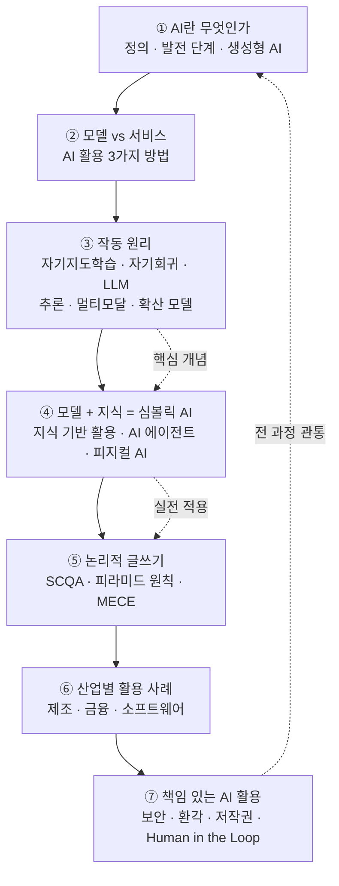

# 생성형 AI 개론 — 원리부터 책임 있는 활용까지

> "AI가 글을 쓰고 그림을 그린다"는 말은 익숙하지만, **그 안에서 무슨 일이 일어나는지**, 그리고 **그걸 어떻게 책임 있게 쓰는지**는 의외로 잘 모릅니다. 이 강의는 그 둘을 한 번에 잡습니다. 코드를 배우는 시간이 아니라, 비전공자가 생성형 AI를 "도구로서 제대로 다루는 법"을 익히는 시간입니다.

이 강의 묶음은 다음 질문에 답합니다.

- 생성형 AI는 기존 AI와 무엇이 다른가?
- 모델과 서비스는 왜 구분해야 하나? AI를 쓰는 방법에는 어떤 것들이 있나?
- AI는 도대체 어떤 원리로 글·이미지·음성을 "만들어내나"?
- 똑같은 AI인데 왜 누구는 답변 품질이 좋고 누구는 나쁜가?
- 논리적인 보고서·기획서를 AI와 함께 쓰려면 어떤 사고 틀이 필요한가?
- 실제 기업들은 AI를 어디에 쓰고 있나?
- 잘못 쓰면 어떤 사고가 나고, 그걸 막으려면 무엇을 지켜야 하나?

## 학습 로드맵

## 목차

| 글 | 한 줄 소개 | 활용도 |
| --- | --- | --- |
| [① AI란 무엇이고, 생성형 AI는 무엇이 다른가](posts/01-what-is-ai-and-generative-ai.md) | AI의 정의와 발전 단계, 전통적 AI와 생성형 AI의 차이 | ★★★★★ |
| [② 모델과 서비스, 그리고 AI를 쓰는 3가지 방법](posts/02-models-services-and-how-to-use-ai.md) | "모델 vs 서비스"의 구분, 서비스 접속·API·로컬 방식 비교 | ★★★★★ |
| [③ 생성형 AI는 어떻게 글과 그림을 만들까](posts/03-how-generative-ai-works.md) | 자기지도학습·자기회귀, LLM·추론 모델, 멀티모달·확산 모델 | ★★★★☆ |
| [④ 모델 + 지식 = 심볼릭 AI](posts/04-symbolic-ai-and-knowledge-based-usage.md) | 답변 품질을 좌우하는 "지식 업로드" 구조, AI 에이전트·피지컬 AI | ★★★★★ |
| [⑤ 논리적으로 설득하기 — SCQA와 피라미드 원칙](posts/05-logical-writing-scqa-pyramid.md) | AI에게 좋은 보고서를 시키는 사고 틀(SCQA·피라미드·MECE) | ★★★★★ |
| [⑥ 현장에서 쓰이는 AI — 산업별 활용 사례](posts/06-ai-in-industries.md) | 제조·금융·소프트웨어 산업의 실제 도입 배경·전략·성과 | ★★★☆☆ |
| [⑦ 책임 있는 AI 활용 가이드](posts/07-ethical-ai-usage-guide.md) | 보안·환각·아첨·저작권·딥페이크와 Human in the Loop | ★★★★★ |

## 다루는 핵심 개념

- **생성형 AI의 정체** — 패턴을 학습해 "새로운 콘텐츠"를 만드는 AI. 예측 중심의 전통적 AI와의 차이
- **모델 vs 서비스** — 같은 모델이라도 어떤 서비스로 쓰느냐에 따라 비용·기능·연동이 달라진다
- **작동 원리** — 자기지도학습, 자기회귀(예측 기반 생성), LLM, 추론 모델(Chain of Thought), 멀티모달, 확산 모델
- **심볼릭 AI 아키텍처** — "모델 + 지식" 구조. 사용자가 바꿀 수 있는 건 모델(선택)과 지식(업로드)뿐
- **논리 구조** — SCQA, 피라미드 원칙, MECE. 결론부터 말하고 의사결정을 요청하는 보고
- **책임 있는 활용** — 보안, 환각(Hallucination), 아첨(Sycophancy), 저작권, 딥페이크, Human in the Loop

> 용어가 낯설다면 먼저 [용어집(GLOSSARY)](GLOSSARY.md)을 펼쳐 두고 읽는 것을 추천합니다.
