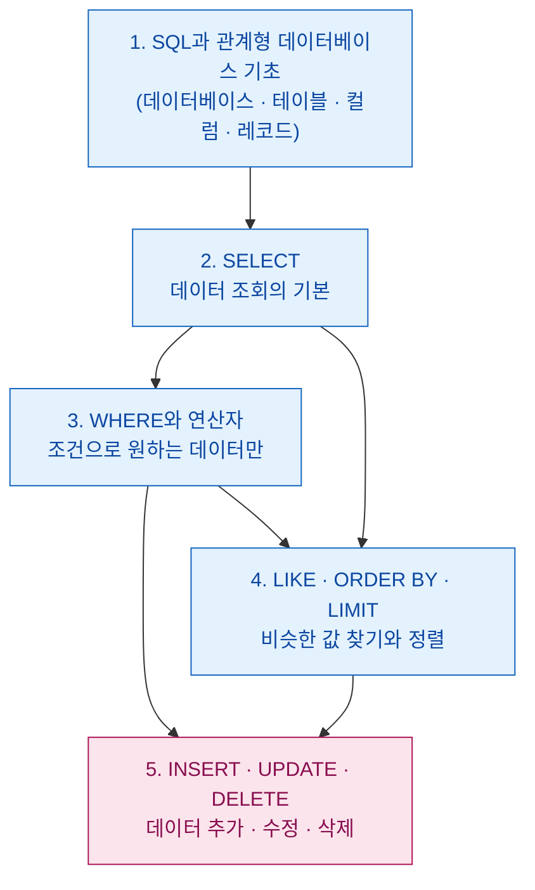

# SQL로 데이터 다루기 — 첫걸음부터 데이터 조작까지

> "엑셀 표를 다루듯, 컴퓨터에게 '이 조건에 맞는 데이터만 보여줘'라고 말로 시킬 수 있다면 어떨까요?"
> SQL은 바로 그 '말'을 컴퓨터가 알아듣게 정리한 언어입니다. 이 글 묶음은 SQL을 한 번도 써본 적 없는 사람도
> 데이터를 **조회 → 조건 검색 → 정렬 → 추가/수정/삭제**까지 직접 다룰 수 있도록 단계별로 안내합니다.

데이터는 어딘가에 쌓여만 있으면 쓸모가 없습니다. 필요한 순간에 원하는 데이터를 꺼내 보고, 새 데이터를 넣고, 잘못된 값을 고치고, 필요 없는 값을 지우는 일 — 이 네 가지가 데이터를 '다룬다'는 말의 거의 전부입니다. SQL은 데이터베이스 종류(MariaDB, Oracle, SQLite 등)가 달라도 **검색과 분석의 기본 사용법은 거의 동일**하기 때문에, 한 번 익혀두면 어디서든 통합니다.

## 학습 로드맵

파란색은 데이터를 **읽는(조회)** 단계, 분홍색은 데이터를 **바꾸는(쓰기)** 단계입니다. 1~4단계로 '꺼내 보는 법'을 충분히 익힌 뒤 5단계에서 '직접 넣고 고치는 법'으로 넘어갑니다.

## 목차

| 글 | 한 줄 소개 | 활용도 |
| --- | --- | --- |
| [1. SQL과 관계형 데이터베이스 기초](posts/01-sql-and-relational-database-basics.md) | SQL이 무엇이고, 데이터가 어떤 '표' 구조로 저장되는지 | ★★★★★ 모든 SQL의 출발점 |
| [2. SELECT — 데이터 조회의 기본](posts/02-select-querying-basics.md) | 테이블에서 원하는 컬럼을 꺼내 보고 중복을 없애기 | ★★★★★ 가장 많이 쓰는 명령 |
| [3. WHERE와 연산자 — 조건 검색](posts/03-where-and-operators.md) | 조건을 걸어 원하는 행만 골라내기 (비교·논리·범위·포함) | ★★★★★ 실무 검색의 핵심 |
| [4. LIKE · ORDER BY · LIMIT — 유사 검색과 정렬](posts/04-like-orderby-limit.md) | 비슷한 값 찾기, 큰 값 순 정렬, 상위 N개만 보기 | ★★★★☆ 리포트·랭킹에 필수 |
| [5. INSERT · UPDATE · DELETE — 데이터 변경](posts/05-insert-update-delete.md) | 데이터를 새로 넣고, 고치고, 지우기 (CRUD의 쓰기) | ★★★★☆ 데이터 관리·개발에 필수 |

## 다루는 핵심 개념

- **데이터베이스 / 관계형 데이터베이스**: 여러 사람이 공유하기 위해 통합 관리하는 데이터의 모음, 그리고 서로 연결된 표들의 집합
- **테이블 구조**: 컬럼(세로, 항목)과 레코드(가로, 한 줄의 데이터)
- **조회**: `SELECT`, `FROM`, `*`(전체), `DISTINCT`(중복 제거), `LIMIT`(상위 N개)
- **조건 검색**: `WHERE` + 비교 연산자(`>`, `<`, `=`, `!=` 등), 논리 연산자(`AND`/`OR`/`NOT`), 범위·포함(`BETWEEN`, `IN`, `NOT IN`)
- **유사 검색·정렬**: `LIKE`와 와일드카드 `%`, `ORDER BY`와 `ASC`/`DESC`
- **데이터 조작어(DML)**: `INSERT`(추가), `UPDATE`(수정), `DELETE`(삭제)
- **CRUD**: Create / Read / Update / Delete — 데이터 다루기의 4대 기본 동작

## 함께 보면 좋은 자료

- 용어가 헷갈릴 땐 [GLOSSARY.md](GLOSSARY.md)에서 빠르게 찾아보세요.
