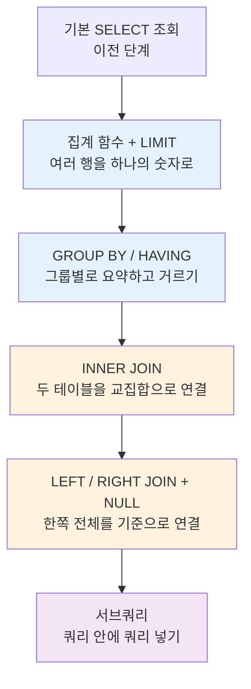

# SQL 함수와 쿼리 — 여러 테이블을 다루는 법

> "데이터 한 줄을 꺼내는 건 쉽다. 진짜 어려운 건 '전체에서 무엇을 말할 수 있는가'를 뽑아내는 일이다."

기본적인 `SELECT` 조회를 익혔다면, 그다음 단계는 두 가지다. 하나는 **여러 행을 하나의 숫자로 요약하는 것**(집계 함수), 다른 하나는 **여러 테이블을 이어 붙여 한눈에 보는 것**(JOIN)이다. 이 강의는 그 두 축을 따라가며, 마지막에는 "쿼리 안에 쿼리를 넣는" 서브쿼리까지 다룬다.

비전공자 입장에서 이 단계가 어렵게 느껴지는 이유는 문법이 복잡해서가 아니라, **"데이터를 왜 이렇게 쪼개고 합치는가"** 라는 사고방식이 낯설기 때문이다. 그래서 이 정리본은 문법 암기보다 "어떤 상황에서 무엇을 얻기 위해 쓰는가"를 중심으로 설명한다.

## 학습 로드맵

크게 보면 **요약(파란색) → 연결(주황색) → 응용(보라색)** 의 흐름이다. 앞 단계가 뒤 단계의 재료가 되므로 순서대로 읽는 것을 권한다. 예를 들어 서브쿼리는 집계 함수와 JOIN을 모두 활용하므로 마지막에 배치했다.

## 목차

| 글 | 한 줄 소개 | 활용도 |
| --- | --- | --- |
| [01. 집계 함수와 LIMIT](posts/01-aggregate-functions.md) | COUNT·SUM·AVG·MAX·MIN으로 데이터를 요약하고, LIMIT으로 일부만 잘라 보기 | ★★★★★ |
| [02. GROUP BY와 HAVING](posts/02-group-by-having.md) | 데이터를 그룹으로 묶어 집계하고, 그룹 단위로 조건을 거는 법 | ★★★★★ |
| [03. INNER JOIN](posts/03-inner-join.md) | 나뉜 두 테이블을 키로 이어 붙여 교집합만 조회하기 | ★★★★★ |
| [04. LEFT / RIGHT JOIN과 NULL](posts/04-outer-join-and-null.md) | 한쪽 테이블 전체를 기준으로 연결하고, 빈 값(NULL)을 골라내기 | ★★★★☆ |
| [05. 서브쿼리](posts/05-subquery.md) | 쿼리 안에 또 다른 쿼리를 넣어, 모르는 기준으로도 검색하기 | ★★★★☆ |

## 다루는 핵심 개념

- **집계 함수**: `COUNT`, `SUM`, `AVG`, `MAX`, `MIN` — 여러 행을 하나의 대표값으로 압축
- **출력 제어**: `LIMIT` — 결과 개수 제한과 시작 위치 지정
- **그룹 집계**: `GROUP BY`(기준별 묶기)와 `HAVING`(그룹에 거는 조건)
- **테이블 연결**: `INNER JOIN`(교집합), `LEFT JOIN` / `RIGHT JOIN`(한쪽 전체 기준), `ON`(연결 조건)
- **모호성 해결**: `테이블명.컬럼명` 명시, 별칭(alias)
- **빈 값 처리**: `IS NULL`, `IS NOT NULL`
- **서브쿼리**: 단일 행 / 다중 행 분류, `IN`·`ANY`·`ALL` 연산자, 위치에 따른 분류(WHERE 서브쿼리, 스칼라 서브쿼리)

> 용어가 헷갈릴 때는 [용어집(GLOSSARY.md)](GLOSSARY.md)을 함께 펼쳐 두고 읽으면 좋다.
