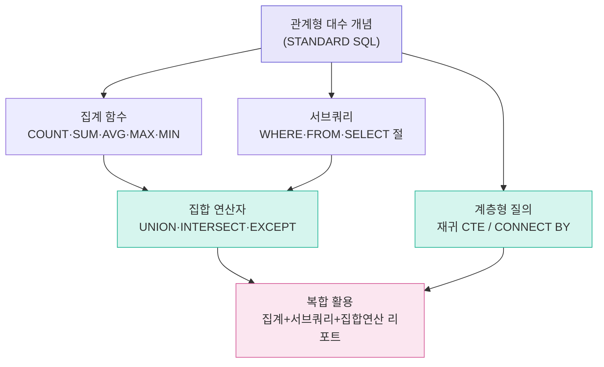

# SQL로 데이터 다루기 2 — 집합 연산자 · 계층형 질의

> "두 개의 표를 위아래로 합치고, 부모-자식으로 얽힌 데이터를 계단처럼 펼치는 법"
> 이번 강의는 *여러 테이블의 결과를 하나로 묶는 방법*(집합 연산자)과
> *한 테이블 안에 숨어 있는 위·아래 관계를 풀어내는 방법*(계층형 질의)을 다룹니다.

SQL을 처음 배울 때는 "한 테이블에서 원하는 행을 골라내는 것"까지가 익숙합니다.
하지만 실무 데이터는 **여러 테이블에 흩어져 있거나**, **같은 테이블 안에 상하 관계로 얽혀 있는** 경우가 많습니다.
이번 정리본은 그런 데이터를 다루기 위한 도구를, *왜 쓰는지 → 어떻게 동작하는지 → 결과를 어떻게 읽는지* 순서로 풀어 설명합니다.

실습은 **음악 스토어 샘플 데이터베이스(Chinook, SQLite)** 를 사용합니다.
직원(employees)·고객(customers)·앨범(albums)·트랙(tracks)·청구서(invoices)처럼 서로 연결된 11개 테이블이 있어, 집계·조인·집합 연산을 한 흐름으로 연습하기 좋습니다.

---

## 학습 로드맵

집계 함수와 서브쿼리는 집합 연산자·계층형 질의를 풀기 위한 **재료**입니다.
먼저 재료를 익힌 뒤, 두 핵심 주제(초록색)를 거쳐 마지막에 모두 합친 리포트(분홍색)를 만드는 흐름입니다.

---

## 목차

| 글 | 한 줄 소개 | 활용도 |
| --- | --- | --- |
| [01. 관계형 대수와 STANDARD SQL](posts/01-relational-algebra.md) | SQL이 표를 다루는 8가지 기본 연산의 큰 그림 | ★★★☆☆ |
| [02. 집계 함수와 GROUP BY / HAVING](posts/02-aggregate-functions.md) | 여러 행을 하나의 숫자로 요약하는 도구 | ★★★★★ |
| [03. 서브쿼리 — 쿼리 속의 쿼리](posts/03-subquery.md) | 복잡한 문제를 작은 조각으로 나눠 푸는 법 | ★★★★★ |
| [04. 집합 연산자 — 결과를 위아래로 합치기](posts/04-set-operators.md) | UNION·INTERSECT·EXCEPT로 여러 결과를 묶기 | ★★★★☆ |
| [05. 계층형 질의 — 부모와 자식 풀어내기](posts/05-hierarchical-query.md) | 조직도처럼 얽힌 데이터를 계단으로 펼치기 | ★★★★☆ |
| [06. 복합 활용 — 통계 리포트 만들기](posts/06-composite-report.md) | 앞의 도구를 모아 실무형 리포트 완성 | ★★★★☆ |

---

## 이번 강의에서 다루는 핵심 개념

- **관계형 대수**: 일반 집합 연산(합·교·차집합, 카티션 곱)과 순수 관계 연산(셀렉션·프로젝션·조인·디비전)
- **집계 함수**: `COUNT` · `SUM` · `AVG` · `MAX` · `MIN` · `GROUP_CONCAT`, 그리고 `GROUP BY` / `HAVING`
- **서브쿼리**: 위치별(WHERE · FROM · SELECT 절), 연관/비연관, `IN` · `EXISTS`
- **집합 연산자**: `UNION` · `UNION ALL` · `INTERSECT` · `EXCEPT`(MINUS)
- **계층형 질의**: 재귀 CTE(`WITH RECURSIVE`), Oracle의 `CONNECT BY`, 레벨·경로·리프 표현
- **DBMS별 차이**: 같은 기능도 Oracle·SQL Server·MySQL·MariaDB·SQLite에서 문법이 다를 수 있음

용어가 낯설다면 [GLOSSARY](GLOSSARY.md)를 함께 펼쳐 두고 읽기를 권합니다.
