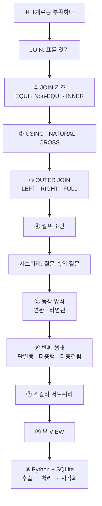

# SQL로 데이터 다루기 2 — JOIN 심화 · 서브쿼리 심화 · Python 연동

> 표 하나로는 답이 안 나올 때가 있습니다. "고객 표"와 "주문 표"를 **이어 붙이고**, 그 안에서 다시 **질문을 한 번 더 던지는** 방법, 그리고 그렇게 뽑은 데이터를 **Python으로 가져와 그림으로 만드는** 흐름까지 한 번에 정리한 학습 노트입니다.

`SQL` `JOIN` `서브쿼리` `VIEW` `SQLite` `Python연동` `데이터분석`

---

## 이 강의가 답하는 질문들

데이터는 보통 여러 개의 표(테이블)에 나뉘어 저장됩니다. 고객 정보는 `customers`, 주문 정보는 `orders`, 상품 정보는 `products` 식으로요. 현실의 질문("**주문을 한 번도 안 한 고객은 누구지?**", "**각 부서에서 제일 월급 높은 사람은?**")은 이 표들을 합쳐야 답할 수 있습니다.

이번 노트는 세 단계로 그 능력을 쌓습니다. 먼저 표를 **잇는** JOIN, 다음으로 질문 안에 질문을 넣는 **서브쿼리**, 마지막으로 SQL 결과를 **Python으로 가져와 분석·시각화**하는 연동까지 이어집니다.

---

## 학습 로드맵

---

## 글 목차

| 글 | 한 줄 소개 | 활용도 |
| --- | --- | --- |
| [① JOIN 기초 — 두 표를 잇는 원리](posts/01-join-basics-inner.md) | EQUI/Non‑EQUI 개념과 INNER JOIN(ON절)으로 표를 합치기 | ★★★★★ |
| [② USING · NATURAL · CROSS JOIN](posts/02-using-natural-cross-join.md) | 같은 컬럼으로 잇는 간편 문법과 모든 조합을 만드는 조인 | ★★★☆☆ |
| [③ OUTER JOIN — 한쪽을 다 남기기](posts/03-outer-join.md) | LEFT/RIGHT/FULL과 "없는 데이터" 찾기(IS NULL) | ★★★★★ |
| [④ 셀프 조인 — 한 표를 둘로 나눠 비교](posts/04-self-join.md) | 상사‑부하 계층, 같은 그룹 쌍 비교 | ★★★★☆ |
| [⑤ 서브쿼리 ① 동작 방식 — 연관 vs 비연관](posts/05-subquery-correlated.md) | 메인쿼리 컬럼을 참조하느냐로 갈리는 두 종류 | ★★★★☆ |
| [⑥ 서브쿼리 ② 반환 형태 — 단일/다중행/다중컬럼](posts/06-subquery-return-shape.md) | 결과 모양에 맞는 연산자(=, IN, EXISTS, 다중컬럼) | ★★★★★ |
| [⑦ 스칼라 서브쿼리 — 값 하나를 끼워넣기](posts/07-scalar-subquery.md) | SELECT·WHERE·HAVING에 값 하나를 계산해 넣기 | ★★★★☆ |
| [⑧ 뷰(VIEW) — 복잡한 쿼리를 표처럼](posts/08-view.md) | 자주 쓰는 조인/집계를 이름 붙여 재사용 | ★★★★☆ |
| [⑨ Python + SQLite 연동과 시각화](posts/09-python-sqlite.md) | DB에서 뽑아 Python으로 처리하고 그래프로 | ★★★★★ |

---

## 다루는 핵심 개념

- **JOIN 종류**: EQUI / Non‑EQUI, INNER, USING, NATURAL, CROSS, OUTER(LEFT·RIGHT·FULL), SELF
- **ON vs WHERE**: 조인 조건과 조인 후 필터링의 차이 (OUTER JOIN에서 결정적)
- **"없는 데이터" 찾기**: LEFT JOIN + `IS NULL`, `NOT IN`, `NOT EXISTS`
- **서브쿼리 분류**: 동작 방식(연관/비연관) × 반환 형태(단일행/다중행/다중컬럼)
- **다중 행 연산자**: `IN`, `EXISTS`, `ALL`, `ANY` (그리고 SQLite에서의 대체법)
- **스칼라 서브쿼리**: 한 행·한 컬럼만 반환하는 서브쿼리의 자리
- **VIEW**: 논리적으로만 존재하는 가상 테이블 — 편리성·독립성·보안성
- **Python 연동**: `connect → execute → fetchall` 패턴과 CRUD, matplotlib 시각화

---

## 참고 환경 메모

실습은 SQLite 기반 샘플 데이터베이스로 진행됩니다. SQLite는 표준 SQL과 조금 다른 부분이 있어, 글 곳곳에 **"SQLite에서는 이렇게 대체한다"**는 메모를 넣어 두었습니다. 대표적으로 `ALL`/`ANY` 미지원(→ `MAX`/`MIN`으로 대체), `CREATE OR REPLACE VIEW` 미지원(→ `DROP VIEW IF EXISTS` 후 생성), `RIGHT`/`FULL OUTER JOIN`은 3.39.0 이상에서만 지원되는 점 등입니다.
