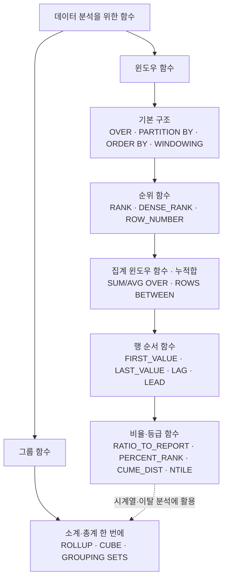

# SQL로 데이터 다루기 ② — 윈도우 함수 & 그룹 함수

> "합계를 구하면 원본 행이 사라진다"는 게 SQL의 상식이었습니다. 그런데 **행은 그대로 두고 옆에 통계만 붙이는** 방법이 있다면 어떨까요? 이번 강의는 바로 그 마법, 윈도우 함수에서 시작합니다.

## 이 강의를 한 줄로 말하면

데이터를 "압축하지 않고" 분석하는 도구(윈도우 함수)와, "여러 단계의 소계·총계를 한 번에" 만드는 도구(그룹 함수)를 익히는 시간입니다. 순위 매기기, 전월 대비 증감, 누적 매출, 등급 분류, 부서별 소계처럼 실무 대시보드에서 매일 쓰이는 분석을 SQL 한 문장으로 끝내는 법을 다룹니다.

## 학습 로드맵

## 글 목차

| # | 글 | 한 줄 소개 | 활용도 |
| - | -- | -------- | ----- |
| 01 | [윈도우 함수 첫걸음 — 행을 지우지 않는 집계](posts/01-window-function-basics.md) | GROUP BY와 무엇이 다른지, OVER 구문은 어떻게 생겼는지 | ★★★★★ |
| 02 | [순위 함수 3형제 — RANK · DENSE_RANK · ROW_NUMBER](posts/02-ranking-functions.md) | 동점자를 어떻게 처리하느냐로 갈리는 세 가지 순위 | ★★★★★ |
| 03 | [집계 윈도우 함수와 누적합 — SUM/AVG OVER & 러닝 토탈](posts/03-aggregate-window-functions.md) | 부서 평균을 옆에 붙이고, 달이 쌓일수록 커지는 누적 매출 만들기 | ★★★★☆ |
| 04 | [행 순서 함수 — 이전·다음 행을 끌어오기 (LAG · LEAD)](posts/04-order-functions.md) | 전월 대비 증감, 주문 간격, 결제 패턴 같은 '시간 분석'의 핵심 | ★★★★★ |
| 05 | [비율과 등급 — RATIO_TO_REPORT · PERCENT_RANK · CUME_DIST · NTILE](posts/05-ratio-ntile-functions.md) | 전체에서 차지하는 비중과 상·중·하 등급 자동 분류 | ★★★★☆ |
| 06 | [그룹 함수 — 소계·총계를 한 번에 (ROLLUP · CUBE · GROUPING SETS)](posts/06-group-functions.md) | 부서별·직무별 평균에 소계와 전체 합계까지 한 쿼리로 | ★★★☆☆ |

> 용어가 헷갈릴 땐 [GLOSSARY.md](GLOSSARY.md)를 함께 펼쳐 보세요.

## 다루는 핵심 개념

- **윈도우 함수**: 결과의 행 수를 유지하면서 순위·집계·비교를 계산하는 함수. `OVER` 구문이 필수.
- **PARTITION BY / ORDER BY / WINDOWING**: "어떻게 그룹을 나누고, 어떻게 정렬하고, 어디까지를 한 묶음으로 볼지"를 지정하는 세 가지 손잡이.
- **순위 함수 / 행 순서 함수 / 비율·등급 함수**: 분석 목적에 따라 골라 쓰는 윈도우 함수의 세 갈래.
- **그룹 함수**: GROUP BY 결과에 소계·중계·총계를 자동으로 덧붙이는 ROLLUP·CUBE·GROUPING SETS.
- **DBMS 차이**: 일부 함수는 데이터베이스 종류에 따라 지원 여부가 다르며, 없을 땐 `UNION ALL`·서브쿼리로 대체할 수 있다.

## 예제 데이터에 대하여

이 강의의 코드는 두 종류의 공개 학습용 데이터베이스를 사용합니다.

- **음악 판매 DB(chinook)**: 고객·청구서·트랙·장르 테이블. 매출/순위/누적 분석 예제에 사용.
- **비즈니스 판매 DB(classicmodels)**: 고객·직원·사무실·주문·결제 테이블. 지역별 실적, 이탈 분석 같은 실무형 시나리오에 사용.

일부 개념 설명 예제에는 작은 `EMPLOYEE` 가상 표(이름·급여·부서)가 함께 쓰입니다. 모두 학습용 가상 데이터입니다.
