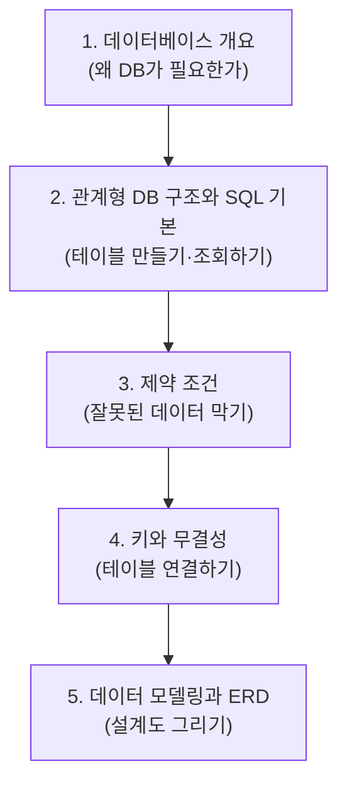

# 데이터베이스 기초 & ERD — 강의 개요

> "엑셀로도 충분한데 왜 굳이 데이터베이스를 배울까?" 이 질문에서 출발해, 데이터를 안전하게 모으고(개요), 표로 만들고(SQL), 규칙으로 지키고(제약 조건·키), 그림으로 설계하는(ERD) 흐름까지 한 번에 정리합니다.

이번 학습은 **"데이터를 어떻게 안전하게 저장하고 관계로 연결할 것인가"** 라는 하나의 큰 질문을 다섯 단계로 나눠 풀어갑니다. 데이터베이스가 왜 필요한지부터 시작해, 실제로 테이블을 만들고(`CREATE TABLE`), 잘못된 데이터가 들어오지 못하게 막고(제약 조건), 테이블끼리 연결하고(키), 마지막으로 설계도를 그리는(ERD) 데까지 이어집니다. 비전공자도 "암기"가 아니라 "왜 이렇게 하는가"를 이해하는 데 초점을 맞췄습니다.

## 학습 로드맵

## 목차

| 글 | 한 줄 소개 | 활용도 |
| --- | --- | --- |
| [01. 데이터베이스 개요](posts/01-database-basics.md) | 데이터와 정보의 차이, DB가 필요한 이유, RDB와 NoSQL의 구분 | ★★★ 모든 데이터 직무의 출발점 |
| [02. 관계형 DB 구조와 SQL 기본](posts/02-relational-db-and-sql.md) | 테이블의 구성 요소와 `CREATE`/`INSERT`/`SELECT`, 데이터 타입, DDL·DML·DCL | ★★★ 실무 쿼리의 기본기 |
| [03. 제약 조건](posts/03-constraints.md) | `NOT NULL`·`UNIQUE`·`DEFAULT`·`CHECK`로 데이터 무결성 지키기 | ★★☆ 데이터 품질 관리의 핵심 |
| [04. 키와 무결성](posts/04-keys-and-integrity.md) | 기본키·외래키로 테이블을 연결하고 무결성을 보장하는 법 | ★★★ 관계형 DB의 심장 |
| [05. 데이터 모델링과 ERD](posts/05-data-modeling-and-erd.md) | 현실을 데이터로 옮기는 모델링과 Peter Chen·IE 표기법 | ★★☆ 설계·기획 단계 필수 |

## 다루는 핵심 개념

- **데이터베이스의 본질**: 여러 사용자가 공동으로 사용하는 데이터의 통합 저장소, 그리고 파일 처리 방식의 한계(종속·중복·무결성)
- **관계형 모델**: 행과 열로 이루어진 테이블, 속성·튜플·도메인, 그리고 테이블 사이의 관계
- **SQL의 세 갈래**: 구조를 정의하는 DDL, 데이터를 다루는 DML, 권한을 관리하는 DCL
- **제약 조건**: 데이터가 들어오는 입구에서 규칙을 강제하는 "마지막 방어선"
- **키**: 행을 유일하게 식별하고(기본키) 테이블을 연결하는(외래키) 기준 속성
- **데이터 모델링과 ERD**: 현실 세계를 개체·속성·관계로 추상화하고, 그림으로 설계도를 그리는 과정
