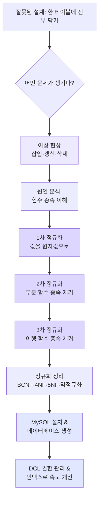

# 데이터 모델링과 데이터베이스 구현 — 정규화부터 MySQL 실전까지

> "테이블 하나에 다 넣으면 편하지 않을까?"라는 생각이 왜 결국 데이터를 망가뜨리는지,
> 그리고 잘 설계된 데이터베이스를 직접 만들어 운영하는 법까지 한 번에 정리합니다.

이 강의는 크게 두 흐름으로 이어집니다. 앞부분에서는 **데이터 모델링**, 즉 "데이터를 어떤 모양의 테이블로 쪼개야 안전한가"를 다룹니다. 잘못된 설계가 일으키는 **이상 현상(Anomaly)** 을 직접 눈으로 확인하고, 이를 없애기 위한 **정규화(Normalization)** 를 비정규화 → 1NF → 2NF → 3NF 순서로 공유 킥보드 대여 서비스 예제에 적용합니다. 뒷부분에서는 설계한 데이터베이스를 **MySQL** 위에 실제로 구현합니다. 설치부터 데이터베이스 생성, 사용자·권한 관리(DCL), 그리고 조회 속도를 끌어올리는 인덱스까지 다룹니다.

비전공자 입장에서 가장 중요한 한 가지는 이것입니다. **정규화는 "문법"이 아니라 "데이터가 깨지지 않게 하는 사고방식"** 이라는 점입니다. 규칙을 외우기보다, 각 단계가 어떤 사고를 막아주는지를 따라가면 됩니다.

## 학습 로드맵

## 글 목차

| 글 | 한 줄 소개 | 활용도 |
| --- | --- | --- |
| [01. 이상 현상과 함수 종속 — 왜 정규화가 필요한가](posts/01-anomalies-and-functional-dependency.md) | 잘못된 설계가 일으키는 세 가지 사고와 그 원인(함수 종속)을 코드로 확인 | ★★★★★ |
| [02. 단계별 정규화 — 1NF·2NF·3NF 실습](posts/02-normalization-1nf-2nf-3nf.md) | 공유 킥보드 테이블을 단계별로 쪼개며 정규화를 직접 적용 | ★★★★★ |
| [03. 정규화 한눈에 정리 — BCNF·4NF·5NF와 역정규화](posts/03-normalization-summary-denormalization.md) | 전체 단계 정리와 고급 정규형, 그리고 일부러 되돌리는 역정규화 | ★★★★☆ |
| [04. MySQL 설치와 데이터베이스 만들기](posts/04-mysql-setup-and-database.md) | 설계한 DB를 실제 MySQL 위에 올리는 첫걸음 | ★★★★☆ |
| [05. DCL과 인덱스 — 권한 관리와 조회 속도](posts/05-dcl-and-index.md) | 누가 무엇을 할 수 있게 할지, 검색을 어떻게 빠르게 할지 | ★★★★☆ |

## 다루는 핵심 개념

- **이상 현상**: 삽입 이상, 갱신 이상, 삭제 이상
- **함수 종속**: 결정자와 종속자, 완전 함수 종속, 부분 함수 종속, 이행 함수 종속
- **정규화 단계**: 비정규화, 1NF(원자값), 2NF(부분 종속 제거), 3NF(이행 종속 제거), BCNF, 4NF, 5NF
- **역정규화**: 성능을 위해 의도적으로 통합하는 트레이드오프
- **MySQL 구현**: 데이터베이스 생성·사용·삭제, 사용자 생성, GRANT/REVOKE 권한 관리, TCL(COMMIT/ROLLBACK)
- **인덱스**: 검색 속도 향상 자료구조, 장단점, 사용 전략

용어가 처음이라면 [GLOSSARY.md](GLOSSARY.md)를 옆에 두고 읽기를 권합니다.
