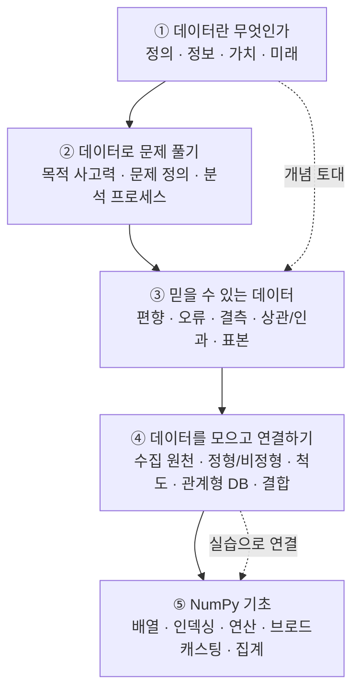

# 데이터 리터러시 & NumPy 기초 — 데이터 분석의 첫걸음

> "데이터가 많으면 무조건 좋은 분석이 될까?" 이 질문에 자신 있게 답할 수 없다면, 이 시리즈가 도움이 됩니다.

데이터 분석을 처음 배우면 코드와 도구부터 떠올리기 쉽습니다. 하지만 정작 실무에서 분석의 성패를 가르는 건 "무엇을 풀 것인가(문제 정의)", "이 데이터를 믿어도 되는가(신뢰도)", "데이터를 어떻게 다룰 것인가(처리 도구)"입니다. 이번 시리즈는 데이터 분석을 비전공자의 눈높이에서 다섯 편으로 나눠, 개념 → 사고력 → 신뢰도 → 데이터 구조 → 도구(NumPy)의 흐름으로 정리했습니다.

## 학습 로드맵

## 목차

| 글 | 한 줄 소개 | 활용도 |
| --- | --- | --- |
| [① 데이터, 세상을 보는 새로운 눈](posts/01-what-is-data.md) | 데이터의 정의부터 정보·지혜로 이어지는 흐름(DIKW)과 데이터의 가치·미래까지 | ★★★ 모든 분석의 출발점 |
| [② 데이터로 문제를 푸는 법](posts/02-data-problem-solving.md) | 데이터는 목적이 아닌 수단 — 문제 정의(SCQA)와 8단계 분석 프로세스 | ★★★ 프로젝트·포트폴리오 설계 |
| [③ 믿을 수 있는 데이터](posts/03-trustworthy-data.md) | 편향·오류·결측, 상관 vs 인과, 표본의 대표성으로 데이터를 비판적으로 검증 | ★★★ 분석 신뢰도 확보 |
| [④ 데이터를 모으고 연결하기](posts/04-organizing-connecting-data.md) | 수집 원천, 정형/비정형, 변수 척도, 관계형 DB, 데이터 결합(Join/Concat/Merge) | ★★☆ 데이터 다루기 실무 |
| [⑤ NumPy 기초](posts/05-numpy-basics.md) | 배열 생성·인덱싱·reshape·브로드캐스팅·집계·마스킹을 코드로 익히기 | ★★★ 분석 라이브러리 토대 |

## 다루는 핵심 개념

- **데이터 리터러시**: 데이터를 읽고, 의심하고, 목적에 맞게 활용하는 능력
- **DIKW 피라미드**: 데이터 → 정보 → 지식 → 지혜로 이어지는 가치 사슬
- **문제 정의 / SCQA**: 분석의 방향을 정하는 첫 단추
- **데이터 신뢰도**: 편향, 오류, 결측치, 상관관계와 인과관계의 구분
- **표본과 대표성**: 모집단을 제대로 대표하는 데이터인가
- **데이터 구조**: 정형 / 비정형 / 반정형, 변수의 척도(명목·서열·등간·비율)
- **관계형 데이터베이스**: 키(Key), 유일성, 무결성, 데이터 결합
- **NumPy**: 배열 생성, 인덱싱/슬라이싱, view와 copy, reshape, 브로드캐스팅, 집계·마스킹

> 용어가 낯설다면 [GLOSSARY.md](GLOSSARY.md)를 함께 펼쳐 두고 읽어 보세요.
