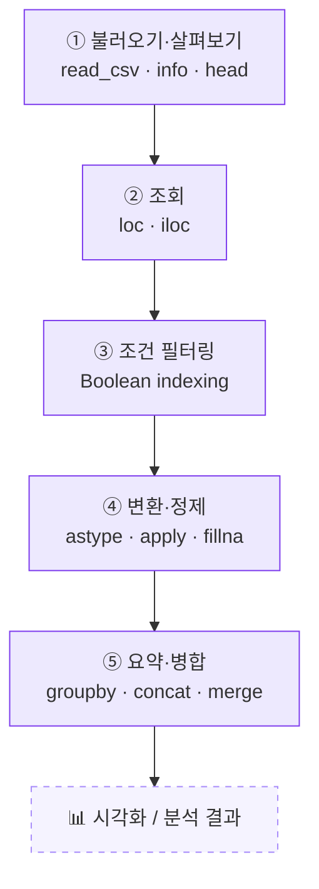

# 📘 파이썬으로 시작하는 데이터 분석 — Pandas 한눈에 보기

> SQL로 데이터를 "꺼내 왔다"면, 이제 Pandas로 데이터를 "주무를" 차례입니다.
> 표 한 장을 불러와서 보고 → 고르고 → 거르고 → 바꾸고 → 묶고 → 합치는 전체 흐름을 한 번에 정리했습니다.

Pandas는 "엑셀의 파이썬 버전"이라고 부를 만큼, 표 형태(행과 열) 데이터를 다루는 데이터 분석의 기본 도구입니다. 이 강의는 데이터를 처음 만났을 때부터(불러오기·살펴보기), 원하는 부분만 골라내고(조회·필터링), 형태를 다듬고(변환·정제), 마지막에 요약하고 합치는(집계·병합) 한 사이클을 다룹니다. 문법을 외우기보다 **"이 단계에서 나는 데이터를 어떻게 처리하고 있는가"** 를 흐름으로 이해하는 것이 목표입니다.

---

## 🗺️ 학습 로드맵

데이터 분석은 한 방향으로만 흐르지 않습니다. ④에서 결측치를 발견하면 ②③으로 돌아가 다시 확인하고, ⑤에서 이상한 집계가 나오면 다시 정제 단계로 돌아갑니다. 위 순서는 "보통 이런 흐름"일 뿐, 실제로는 앞뒤를 오가며 다듬습니다.

---

## 📚 목차

| 글 | 한 줄 소개 | 활용도 |
| --- | --- | --- |
| [① Pandas 시작하기 — 데이터프레임·시리즈와 데이터 살펴보기](posts/01-pandas-basics-and-inspecting-data.md) | 표를 불러와 구조와 상태를 한눈에 점검하는 첫 단계 | ⭐⭐⭐⭐⭐ |
| [② loc와 iloc — 라벨로 뽑을까, 위치로 뽑을까](posts/02-loc-and-iloc.md) | 원하는 행·열을 정확히 집어내는 두 가지 방법 | ⭐⭐⭐⭐⭐ |
| [③ 조건 필터링(Boolean indexing) — 원하는 행만 골라내기](posts/03-boolean-indexing-filtering.md) | 조건에 맞는 데이터만 남기는, 분석에서 가장 많이 쓰는 기술 | ⭐⭐⭐⭐⭐ |
| [④ 데이터 변환·정제 — 타입 바꾸고 결측치 다루기](posts/04-transforming-and-cleaning-data.md) | 분석이 가능한 깨끗한 데이터로 다듬는 과정 | ⭐⭐⭐⭐ |
| [⑤ 데이터 요약·병합 — groupby·concat·merge](posts/05-grouping-and-merging-data.md) | 그룹별로 묶어 요약하고 여러 표를 합치는 마무리 단계 | ⭐⭐⭐⭐ |

---

## 🎯 다루는 핵심 개념

- **자료구조**: DataFrame(2차원 표), Series(1차원 열)
- **불러오기·살펴보기**: `read_csv`, `head`/`tail`, `info`, `describe`, `shape`, `columns`, `dtypes`, `value_counts`
- **조회**: `loc`(라벨 기반), `iloc`(위치 기반), 슬라이싱 끝값 규칙
- **필터링**: Boolean indexing, `&`/`|`/`~`, `isin`, `between`, 컬럼끼리 비교
- **표준 패턴**: `reset_index(drop=True)` + `.copy()`
- **변환·정제**: `astype`, `to_numeric`, `to_datetime`, `dt`, `map`, `apply`, `lambda`, `sort_values`, `drop`, `rename`, `isnull`, `fillna`, `dropna`
- **요약·병합**: `groupby`(Split-Apply-Combine), `agg`, `unstack`, `concat`, `merge`

> 💡 함께 보면 좋은 점: Pandas와 SQL은 표현은 다르지만 **데이터를 다루는 사고방식이 거의 같습니다.** 각 글에서 대응되는 SQL 문장을 함께 적어 두었으니, SQL을 먼저 배운 분은 "이게 그 SQL이구나" 하고 연결해 보세요.
