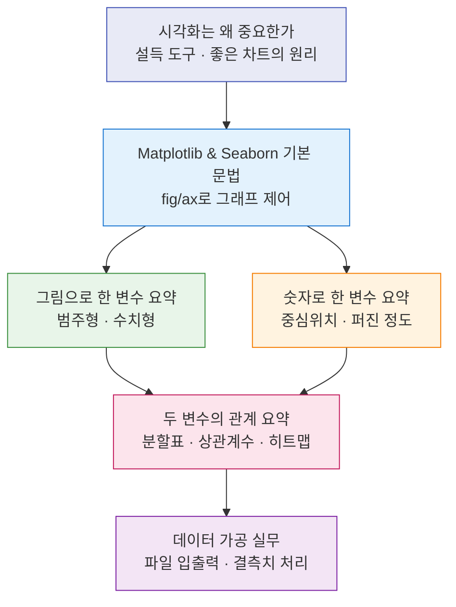

# 데이터 시각화와 통계 자료 요약 — 강의 한눈에 보기

> "분석은 `groupby`나 평균을 구하는 데서 끝나지 않는다. **그래서 무엇을 해야 하는가?**에 답할 수 있어야 비로소 분석이다."

이번 강의는 **데이터를 어떻게 요약하고, 어떻게 보여줄 것인가**를 다룹니다. 같은 데이터라도 숫자 하나로 압축하는 방법(통계 요약)과 그림으로 펼쳐 보이는 방법(시각화)은 서로의 빈틈을 메워 줍니다. 평균·분산만 보면 놓치는 분포의 모양이 있고, 그래프만 보면 빠지기 쉬운 주관적 판단이 있습니다. 그래서 **숫자와 그림을 함께** 보는 습관이 이 강의의 핵심 메시지입니다.

또한 차트는 "예쁜 그림"이 아니라 **의사결정을 설득하는 도구**라는 관점에서 출발합니다. 마지막에는 분석 결과를 파일로 내보내고 다시 불러오는 실무 흐름과, 분석을 막는 가장 흔한 장애물인 **결측치 처리**까지 이어집니다.

---

## 학습 로드맵

핵심 흐름은 **시각화의 철학 → 그래프 도구 사용법 → 한 변수 요약(그림·숫자) → 두 변수 관계 요약 → 데이터 가공 실무**입니다.

---

## 목차

| # | 글 제목 | 한 줄 소개 | 활용도 |
|---|---------|-----------|--------|
| 01 | [시각화는 왜 중요한가 — 설득의 도구와 좋은 차트의 4원리](posts/01-why-visualization-matters.md) | 나이팅게일·앤스컴 콰르텟으로 배우는 "왜 차트인가"와 삭제·분리·강조·배열 원리 | ★★★★★ |
| 02 | [Matplotlib & Seaborn 기본 문법 — fig/ax로 그래프 제어하기](posts/02-matplotlib-seaborn-basics.md) | 선·막대 그래프부터 제목·축·범례·서브플롯까지, 객체지향 방식의 기초 | ★★★★★ |
| 03 | [그림으로 한 변수 요약하기 — 범주형과 수치형 자료](posts/03-summarize-one-variable-graphs.md) | 도수분포표·원형·막대·히스토그램·상자그림으로 분포를 보여주기 | ★★★★☆ |
| 04 | [숫자로 한 변수 요약하기 — 중심위치와 퍼진 정도](posts/04-summarize-one-variable-numbers.md) | 평균·중앙값·최빈값과 분산·표준편차·IQR로 자료를 수치로 압축하기 | ★★★★★ |
| 05 | [두 변수의 관계 요약하기 — 분할표·상관계수·히트맵](posts/05-summarize-two-variables.md) | 분할표·산점도·공분산·상관계수, 그리고 "상관 ≠ 인과"의 함정 | ★★★★☆ |
| 06 | [데이터 가공 실무 — 파일 입출력과 결측치 처리](posts/06-data-wrangling-io-missing.md) | CSV·Excel 저장/불러오기와 결측치 탐색·채우기, 타입 이슈 다루기 | ★★★★★ |

---

## 다루는 핵심 개념

- **시각화 철학**: 의사결정 설득, "그래서 무엇을?", 앤스컴 콰르텟, 삭제·분리·강조·배열, 독자 중심 보고, 색상 접근성
- **그래프 도구**: Matplotlib 계층 구조(Script/Artist Layer), `fig`/`ax` 객체지향 방식, Seaborn 테마, 서브플롯
- **한 변수 요약(그림)**: 자료의 형태(수치형/범주형), 도수분포표, `value_counts`, 원형·막대그래프, 히스토그램, 도수다각형, 줄기-잎 그림, 상자그림
- **한 변수 요약(숫자)**: 평균·중앙값·최빈값, 분산·표준편차·범위·IQR·변동계수, 백분위수·사분위수
- **두 변수 요약**: 분할표(`crosstab`), 산점도, 공분산, 상관계수, 히트맵, 인과관계의 오해
- **데이터 가공**: `to_csv`/`to_excel`, `read_csv`/`read_excel`, 결측치(`isna`/`notnull`/`fillna`), `category` 타입, 파생변수, 문자열 처리

용어가 처음이라면 [용어집(GLOSSARY)](GLOSSARY.md)을 함께 펼쳐 두고 읽어 보세요.
