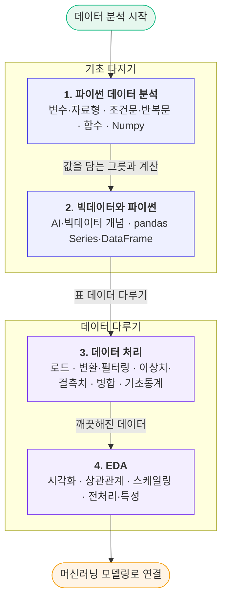

# 파이썬으로 시작하는 데이터 분석 — 자료형부터 EDA까지

> "데이터 분석을 해보고 싶다"는 마음 하나로 출발해도, 막상 어디서부터 손대야 할지 막막하다. 이 시리즈는 **파이썬 기본 문법 → 빅데이터 개념과 pandas → 데이터 처리(전처리) → EDA(탐색적 데이터 분석)**의 순서로, 비전공자가 데이터 분석의 한 사이클을 처음부터 끝까지 따라갈 수 있도록 정리한 학습 노트다. 네 편의 글을 차례로 읽으면 "값을 담고 → 표로 다루고 → 깨끗하게 손질하고 → 그림으로 탐색하는" 흐름이 자연스럽게 이어진다.

---

## 학습 로드맵

큰 그림은 단순하다. 앞의 두 편(1·2)에서 **데이터를 담고 다루는 도구**(파이썬 자료형·Numpy·pandas)를 익히고, 뒤의 두 편(3·4)에서 그 도구로 **실제 데이터를 정리하고 탐색**한다. 이 4단계를 마치면 머신러닝 모델링으로 넘어갈 준비가 된다.

---

## 목차

| # | 글 | 한 줄 소개 | 활용도 |
| --- | --- | --- | --- |
| 01 | [파이썬 데이터 분석의 기초 — 자료형부터 Numpy까지](posts/01-python-data-analysis.md) | 변수·자료형·조건문·반복문·함수, 그리고 숫자 데이터를 빠르게 계산하는 Numpy까지 — 모든 분석 코드의 토대 | ⭐⭐⭐⭐⭐ |
| 02 | [빅데이터와 파이썬 — 개념부터 pandas 실전까지](posts/02-bigdata-and-pandas.md) | AI·빅데이터가 무엇인지부터, 표 데이터를 다루는 pandas(Series·DataFrame)의 기본기까지 | ⭐⭐⭐⭐⭐ |
| 03 | [데이터 처리 — pandas로 불러오고, 고치고, 다듬기](posts/03-data-processing.md) | 실제 데이터셋으로 불러오기·변환·이상치/결측치 처리·병합·기초 통계를 한 번에 돌려보는 전처리 실전 | ⭐⭐⭐⭐⭐ |
| 04 | [EDA — 데이터를 그림으로 들여다보고, 관계를 읽고, 모델에 맞게 다듬기](posts/04-eda.md) | 시각화(Matplotlib·Seaborn)·상관관계·스케일링·특성 엔지니어링으로 데이터를 탐색하고 모델링을 준비 | ⭐⭐⭐⭐ |

> 용어가 헷갈릴 때는 [용어집(GLOSSARY)](GLOSSARY.md)을 함께 펼쳐 두면 좋다.

---

## 다루는 핵심 개념

**1. 파이썬 데이터 분석** — 데이터를 담는 그릇과 계산
값을 담는 변수와 그 종류인 자료형(정수·실수·문자열·리스트·튜플·딕셔너리·집합), 상황에 따라 갈라지는 조건문, 같은 일을 반복하는 반복문, 코드를 재사용하는 함수. 그리고 숫자 데이터를 행렬 한 덩어리로 빠르게 계산하는 Numpy(필터링·통계·브로드캐스팅).

**2. 빅데이터와 파이썬** — 개념과 표 데이터의 시작
AI·머신러닝·딥러닝의 포함 관계, 빅데이터의 특징(3V~5V)과 데이터의 종류(정형·반정형·비정형), 데이터 분석의 과정. 그리고 1차원 Series와 2차원 DataFrame으로 표 데이터를 다루는 pandas의 기본기.

**3. 데이터 처리** — 지저분한 데이터를 다듬기
CSV 불러오기, 새 열 만들기와 형 변환, 조건 필터링, 이상치(IQR)와 결측치(`fillna`·`dropna`) 처리, 표 병합(`concat`·`merge`), 그리고 기술 통계·추론 통계와 변수의 종류.

**4. EDA** — 그림으로 탐색하고 모델에 맞게 다듬기
목적에 맞는 그래프 고르기(히스토그램·박스플롯·산점도·막대·히트맵), Matplotlib·Seaborn 사용법, 공분산과 상관계수, 상관관계 시각화, 데이터 스케일링(Min-Max·표준화·로버스트), 전처리와 특성 엔지니어링.

---

## 이렇게 읽으면 좋아요

- **순서대로 읽기**: 1편의 자료형·Numpy가 2편 pandas의 토대가 되고, 2편 pandas가 3편 전처리의 도구가 되며, 3편에서 깨끗해진 데이터를 4편에서 탐색한다. 앞 글을 알면 뒤 글이 훨씬 쉬워진다.
- **필요한 곳만 찾아보기**: 각 글은 독립적으로도 읽히도록 구성했고, 겹치는 개념은 서로 링크로 연결해 두었다.
- **직접 따라 해보기**: 모든 글에 "직접 해보기"와 "셀프 체크"가 있다. 눈으로만 읽지 말고 한 번씩 코드를 돌려 보면 훨씬 오래 남는다.

> 다음 단계가 궁금하다면: 이 네 편으로 다진 기초 위에서, 회귀·분류 같은 **머신러닝 모델링**으로 자연스럽게 나아갈 수 있다.
