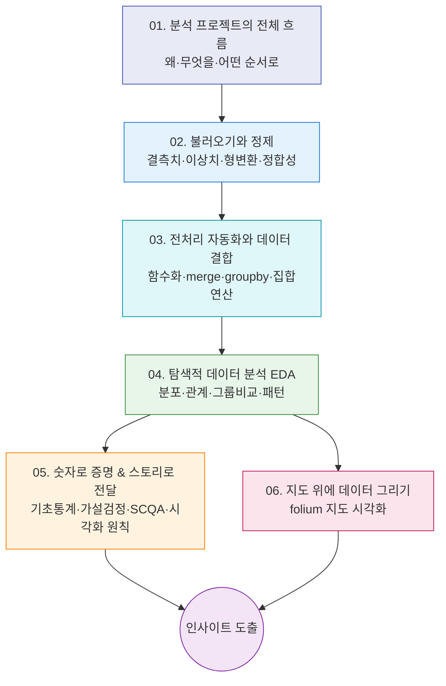

# 현실 데이터로 끝까지 가보는 데이터 분석 프로젝트

> "강의에서 배운 평균·그래프·표가 실제 사회 문제 앞에서는 어떻게 쓰일까?" 이 질문에 답하기 위해, 뉴스에 나왔던 진짜 데이터를 직접 열어 분석해 봅니다.

데이터 분석은 멋진 그래프 한 장으로 끝나는 일이 아닙니다. **엉망인 원본 데이터를 받아서, 쓸 수 있게 다듬고, 질문을 던지고, 숫자로 답하고, 남이 이해하게 보여주는** 한 편의 과정입니다. 이 시리즈에서는 세 가지 현실 프로젝트 — 2021년 "요소수 대란" 때의 주유소 재고, 4개년 전국 휘발유 가격, 서울 지하철 혼잡도 — 를 같은 흐름으로 다루면서 그 과정 전체를 몸에 익힙니다.

세 프로젝트는 주제는 다르지만 모두 아래 한 줄로 요약됩니다.

> **불러오기 → 전처리(정제) → 분석 → 시각화**

그래서 이 글들은 "프로젝트별"이 아니라 **"단계·기법별"**로 묶었습니다. 한 번 익힌 기술이 여러 데이터에서 어떻게 반복해서 쓰이는지 보이도록 하기 위해서입니다.

---

## 학습 로드맵

흐름을 한 문장으로: **02에서 데이터를 쓸 수 있게 만들고 → 03에서 여러 해 데이터를 하나로 합치고 → 04에서 눈으로 살펴보고 → 05에서 숫자로 검증하거나 06에서 지도로 보여줍니다.**

---

## 목차

| 글 | 한 줄 소개 | 활용도 |
|----|-----------|--------|
| [01. 데이터 분석 프로젝트는 어떻게 흘러가는가](posts/01-data-analysis-workflow.md) | 분석의 4단계와 라이브러리들의 역할, 그리고 "왜 현실 데이터인가" | ⭐⭐⭐⭐⭐ 모든 분석의 지도 |
| [02. 데이터 불러오기와 정제](posts/02-load-and-clean-data.md) | `read_csv`로 불러와 결측치·이상치·형 오류를 잡아내는 법 | ⭐⭐⭐⭐⭐ 실무 시간의 절반 |
| [03. 전처리를 함수로, 데이터를 하나로](posts/03-transform-and-combine.md) | 반복 작업을 함수로 묶고, 여러 해 데이터를 `merge`로 합치기 | ⭐⭐⭐⭐ 데이터가 여러 개일 때 |
| [04. 탐색적 데이터 분석(EDA) 시각화](posts/04-eda-visualization.md) | 분포·관계·그룹 비교를 그래프로 살펴보며 질문 만들기 | ⭐⭐⭐⭐⭐ 분석의 심장 |
| [05. 숫자로 증명하기 & 분석을 스토리로](posts/05-statistics-and-storytelling.md) | 기술통계·가설검정으로 "정말 차이 나는가"를 따지고, SCQA로 전달하기 | ⭐⭐⭐⭐ 설득력 있는 보고서 |
| [06. 지도 위에 데이터 그리기](posts/06-map-visualization-folium.md) | `folium`으로 위치 데이터를 인터랙티브 지도에 올리기 | ⭐⭐⭐ 위치가 있는 데이터 |

용어가 헷갈릴 때는 [용어집(GLOSSARY)](GLOSSARY.md)을 참고하세요.

---

## 이번 강의의 핵심 개념

- **데이터 분석 워크플로우**: 불러오기 → 전처리 → 분석 → 시각화의 4단계
- **데이터 정제**: 결측치(missing) 처리, 이상치(outlier) 점검, 형 변환, 데이터 정합성 확인
- **Feature Engineering**: 원본에서 분석에 쓸 새 컬럼 만들기(예: 주소에서 시·도 추출)
- **데이터 결합**: `merge`(outer join)로 여러 표를 하나로, `groupby`로 요약
- **집합 연산**: `set`의 차집합으로 "사라진 것/새로 생긴 것" 찾기(개폐업 분석)
- **EDA 그래프**: 히스토그램, 박스플롯, 산점도, 막대그래프, 히트맵
- **기초 통계·가설검정**: 평균·중앙값·표준편차·IQR, 상관계수, ANOVA, t검정, 효과 크기, 변동계수(CV)
- **분석 커뮤니케이션**: SCQA·피라미드 구조, 시각화의 정직성 원칙
- **지도 시각화**: `folium`의 `CircleMarker`와 색상 인코딩
