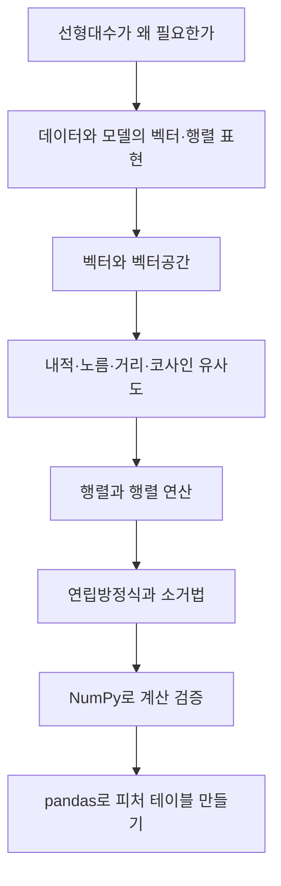

# 머신러닝을 위한 수학 1 — 선형대수학과 데이터 결합

> 머신러닝 모델이 데이터를 이해한다는 말은, 결국 데이터를 벡터·행렬로 바꾸고 그 위에서 계산한다는 뜻이다.

이번 강의는 머신러닝을 위한 수학 중에서도 **선형대수학의 기초**를 다룬다. 텍스트를 벡터로, 이미지를 행렬로, 신경망 한 층을 `Wx + b`로 표현하는 방식부터 시작해 벡터공간, 내적, 노름, 코사인 유사도, 행렬 곱셈, 전치, 역행렬, 행렬식, 연립방정식까지 이어진다.

마지막에는 머신러닝 모델에 들어갈 입력 행렬을 만들기 전 단계로, 여러 테이블을 결합해 피처 테이블을 구성하는 pandas 병합 실습을 함께 정리했다. 즉, 이번 자료는 “수학 개념을 이해하는 파트”와 “그 개념이 실제 데이터 준비로 이어지는 파트”를 함께 묶은 학습 노트다.

## 학습 로드맵

## 목차

| # | 글 | 한 줄 소개 | 활용도 |
|---|----|-----------|--------|
| 1 | [선형대수학, 머신러닝의 언어](01-linear-algebra-for-ml.md) | 데이터 표현, 모델 표현, 추천 시스템, 차원 축소까지 선형대수가 왜 필요한지 큰 그림으로 이해 | ★★★★★ |
| 2 | [벡터와 벡터공간](02-vectors-and-vector-space.md) | 벡터, $R^n$, 내적, 노름, 거리, 직교, 코사인 유사도를 학습 | ★★★★★ |
| 3 | [행렬과 행렬 연산](03-matrix-operations.md) | 행렬 정의, 덧셈·뺄셈, 행렬 곱, 전치, 대칭, 단위행렬, 역행렬, 행렬식 정리 | ★★★★★ |
| 4 | [연립방정식과 가우스 소거법](04-linear-equations-gauss.md) | $Ax=b$, 첨가행렬, Gauss/Gauss-Jordan 소거법, 자원 배분 문제로 해석 | ★★★★☆ |
| 5 | [Python으로 푸는 선형대수 기초 문제](05-linear-algebra-practice-python.md) | 내적, 노름, 행렬 곱셈, 연립방정식을 NumPy로 계산하고 검증 | ★★★★★ |
| 6 | [데이터 결합으로 피처 테이블 만들기](06-pandas-merging-feature-table.md) | concat, merge, join, merge_asof로 흩어진 데이터를 모델 입력 테이블로 정리 | ★★★★☆ |

## 다루는 핵심 개념

### 선형대수 큰 그림

- 데이터는 벡터와 행렬로 표현할 수 있다.
- 텍스트는 Bag-of-Words 벡터, 이미지는 픽셀 행렬 또는 텐서로 바꿀 수 있다.
- 신경망 한 층은 `u = Wx + b`, `y = f(u)`로 표현할 수 있다.
- 추천 시스템은 사용자 성향 행렬과 콘텐츠 성분 행렬의 곱으로 예상 선호도를 계산할 수 있다.
- PCA와 SVD는 고차원 데이터를 압축하고 중요한 정보만 남기는 차원 축소 도구다.

### 벡터

- 벡터는 크기와 방향을 함께 가진다.
- $R^n$은 숫자 n개짜리 벡터들이 모인 공간이다.
- 내적은 두 벡터가 얼마나 같은 방향을 향하는지 숫자로 보여준다.
- 노름은 벡터의 크기, 거리는 두 벡터 사이의 떨어짐이다.
- 코사인 유사도는 크기를 무시하고 방향의 유사성을 비교한다.

### 행렬

- 행렬은 숫자를 행과 열로 배열한 표다.
- 행렬 곱셈은 왼쪽 행과 오른쪽 열의 내적으로 계산한다.
- 행렬 곱은 일반적으로 순서가 중요하며 $AB \neq BA$다.
- 전치행렬은 행과 열을 바꾸고, 대칭행렬은 전치해도 자기 자신과 같다.
- 단위행렬은 곱셈의 1, 역행렬은 되돌리기 버튼 같은 역할을 한다.
- 행렬식이 0이면 역행렬이 존재하지 않는다.

### 연립방정식과 실습

- 연립방정식은 $Ax=b$로 표현할 수 있다.
- Gauss 소거법은 상삼각행렬을 만든 뒤 후진대입으로 푼다.
- Gauss-Jordan 소거법은 단위행렬까지 만들어 해를 직접 읽는다.
- `np.linalg.solve(A, b)`는 연립방정식의 해를 빠르게 구한다.
- `A @ x == b` 검증은 해가 맞는지 확인하는 중요한 습관이다.

### 데이터 결합

- 실무 데이터는 처음부터 하나의 행렬로 주어지지 않는다.
- 여러 테이블을 결합해 “한 행 = 하나의 관측치, 한 열 = 하나의 변수” 형태의 피처 테이블을 만들어야 한다.
- `concat`은 단순히 쌓기, `merge`는 공통 키로 조인, `join`은 인덱스 기반 결합이다.
- `merge_asof`는 시계열에서 가장 가까운 이전/이후 값을 매칭할 때 유용하다.

## 학습 포인트

- 수식을 외우기보다 “이 수식이 어떤 계산을 하는지” 말로 해석한다.
- 벡터와 행렬은 추상적인 수학이 아니라 데이터의 저장 방식이자 모델의 계산 방식이다.
- `np.dot`, `@`, `np.linalg.norm`, `np.linalg.solve`의 차이를 코드로 직접 확인한다.
- 행렬 곱셈은 항상 크기 조건을 먼저 본다.
- 모델링 전 데이터 결합 단계에서 행이 줄거나 결측이 생기는 이유를 반드시 확인한다.

## 함께 보면 좋은 자료

- [용어집](GLOSSARY.md)
- [Python으로 푸는 선형대수 기초 문제](05-linear-algebra-practice-python.md)
- [데이터 결합으로 피처 테이블 만들기](06-pandas-merging-feature-table.md)
