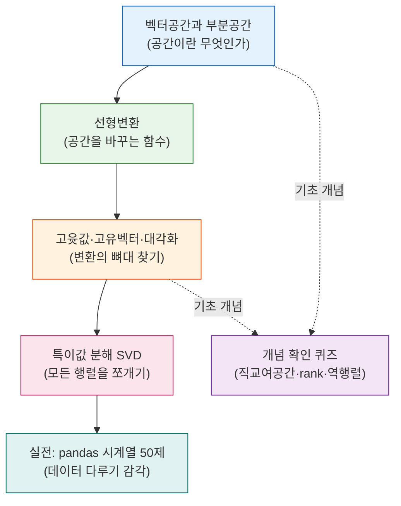

# 머신러닝을 위한 수학 — 선형대수학 핵심 정리

> "행렬은 그냥 숫자를 네모나게 늘어놓은 표일까?" 라고 생각했다면, 이 시리즈가 그 생각을 바꿔줄 것입니다. 선형대수학은 **데이터를 공간 위의 화살표로 바라보는 언어**이고, PCA·추천 시스템·이미지 압축·신경망까지 오늘날 머신러닝의 거의 모든 알고리즘이 이 언어로 쓰여 있습니다.

이 시리즈는 벡터가 사는 공간(벡터공간)에서 출발해, 그 공간을 변형하는 도구(선형변환), 변형의 뼈대를 찾는 방법(고윳값·고유벡터), 그리고 모든 행렬을 쪼개는 만능 열쇠(특이값 분해)까지 한 흐름으로 이어집니다. 마지막에는 실제 데이터를 다루는 감각을 기르기 위해 pandas 시계열 처리 50문제를 함께 정리했습니다.

수식을 외우는 것이 목표가 아닙니다. **"이 개념은 왜 필요한가, 데이터에서 무엇을 처리하는가, 결과를 어떻게 읽는가"** 를 이해하는 것이 목표입니다.

## 학습 로드맵

핵심 아이디어는 하나로 이어집니다. **벡터가 사는 공간을 정의하고 → 그 공간을 변환하며 → 변환의 핵심 방향(고유벡터)을 찾고 → 이를 일반화해 모든 행렬을 분해(SVD)** 하는 흐름입니다. 앞 글의 개념이 뒤 글의 재료가 되므로 순서대로 읽는 것을 권합니다.

## 글 목차

| 글 | 한 줄 소개 | 머신러닝 활용도 |
| --- | --- | --- |
| [01. 벡터공간과 부분공간](posts/01-vector-space-and-subspace.md) | 벡터가 사는 공간, 그 안의 작은 공간, 기저와 차원, 직교화까지 | ★★★★☆ — PCA·QR분해의 기초 |
| [02. 선형변환과 행렬](posts/02-linear-transformation.md) | 행렬을 "공간을 잇는 함수"로 보는 관점, rank·행렬식·역행렬 | ★★★★★ — 신경망 레이어의 본질 |
| [03. 고윳값·고유벡터·행렬의 대각화](posts/03-eigenvalue-eigenvector-diagonalization.md) | 변환해도 방향이 안 변하는 특별한 벡터, 대각화, 스펙트럴 클러스터링 | ★★★★★ — PCA·클러스터링 핵심 |
| [04. 특이값 분해 (SVD)](posts/04-singular-value-decomposition.md) | 모든 행렬을 세 조각으로 쪼개는 만능 도구, 저차원 근사와 이미지 압축 | ★★★★★ — 추천·압축·LSA |
| [05. pandas 시계열 처리 50제](posts/05-pandas-timeseries.md) | 날짜·시간 데이터를 자유자재로 다루는 실전 패턴 모음 | ★★★★☆ — 모든 데이터 분석 전처리 |

## 이 시리즈에서 다루는 핵심 개념

**공간과 기저 (1편)** — 부분공간, 일차결합과 Span, 일차독립/종속, 기저와 차원, 직교기저·정규직교기저, Gram-Schmidt 직교화, 직교여공간

**변환과 구조 (2편)** — 행렬을 보는 3가지 관점, Frobenius Norm, 전치·대각·대칭·직교행렬, 역행렬, 선형변환, rank, 행렬식(determinant)

**분해와 응용 (3·4편)** — 고윳값·고유벡터, 특성다항식, 대각화, 대칭행렬의 고유분해, 양의 정부호 행렬(PDM), 행렬의 제곱근, 스펙트럴 클러스터링, 특이값 분해(SVD), rank-k 근사, 이미지 압축

**실전 데이터 처리 (5편)** — Timestamp 생성, `.dt` 접근자, Timedelta, DateOffset, 시간 인덱싱/슬라이싱, resample 집계, shift·rolling·expanding, 타임존 변환

각 글은 정의 → 왜 필요한가 → 코드 예시 → 헷갈리기 쉬운 점 → 직접 해보기 순서로 구성되어 있습니다. 용어가 낯설다면 [용어집(GLOSSARY.md)](GLOSSARY.md)을 함께 펼쳐 두고 읽어 보세요.
