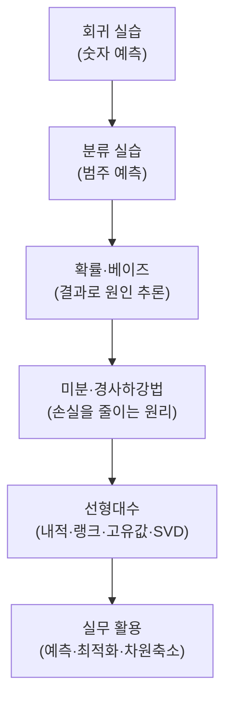

# 머신러닝을 위한 수학 3 — 회귀·분류 실습부터 확률·미분·선형대수까지

> 머신러닝을 "어떻게 쓰는가"(회귀·분류 실습)에서 시작해, "왜 작동하는가"(확률·미분·선형대수)로 내려가며 개념을 코드로 확인하는 학습 기록입니다.

이 노트는 예측 모델을 직접 만들어 본 뒤, 그 밑에 깔린 수학을 하나씩 코드로 검증하는 순서로 구성했습니다. 사이킷런 파이프라인으로 회귀·분류 모델을 만들고, 확률·베이즈로 판단을 갱신하는 사고를 익히며, 미분·경사하강법으로 모델이 스스로 학습하는 원리를 이해하고, 선형대수로 데이터를 요약하는 도구를 정리합니다. 모든 예제는 공개 데이터와 직접 재작성한 최소 코드로 구성했고, 개념을 자기 언어로 다시 설명하는 데 초점을 뒀습니다.

## 학습 로드맵

## 목차

| # | 글 | 한 줄 소개 | 활용도 |
|---|----|-----------|--------|
| 1 | [머신러닝 회귀 실습](01-regression-pipeline.md) | 파이프라인으로 숫자를 예측하고 MAE·R²로 평가 | ★★★★★ |
| 2 | [머신러닝 분류 실습](02-classification-pipeline.md) | 같은 뼈대로 범주를 예측하고 정밀도·재현율 이해 | ★★★★★ |
| 3 | [조건부 확률과 베이즈 정리](03-probability-and-bayes.md) | 증거로 원인의 믿음을 갱신하는 확률 사고 | ★★★★☆ |
| 4 | [미분과 경사하강법](04-derivatives-and-gradient-descent.md) | 기계가 스스로 손실을 줄여 가는 원리 | ★★★★★ |
| 5 | [선형대수 핵심 연산 실습](05-linear-algebra-practice.md) | 내적·랭크·고유값·SVD를 코드로 계산 | ★★★★☆ |

## 다루는 핵심 개념

- 지도학습(회귀·분류)의 공통 흐름과 파이프라인
- 회귀 평가지표(MAE·MSE·R²)와 분류 평가지표(정확도·정밀도·재현율·F1)
- 조건부 확률, 베이즈 정리, 사후확률의 순차 갱신
- 정규분포와 조건부 독립
- 미분·연쇄법칙·테일러 근사, 경사하강법과 학습률
- 임계점과 2차 미분
- 벡터 내적·랭크·고유값/고유벡터·특이값 분해(SVD)

## 학습 포인트

- 꼭 이해할 것: 회귀와 분류가 같은 코드 골격을 공유한다는 점, 베이즈 정리가 "증거로 원인 추론"이라는 점, 경사하강법이 "기울기 반대로 이동"이라는 점.
- 자주 헷갈리는 것: P(A|B)와 P(B|A)의 차이, 정밀도와 재현율의 분모 차이, 학습률이 크고 작을 때의 효과, 고유값 분해와 SVD의 적용 범위.
- 실무 연결: 예측 모델링, 위양성 해석, 학습률 튜닝을 통한 최적화, 차원 축소와 추천 시스템.

## 함께 보면 좋은 자료

- [GLOSSARY.md](GLOSSARY.md) — 이번 강의 용어집
