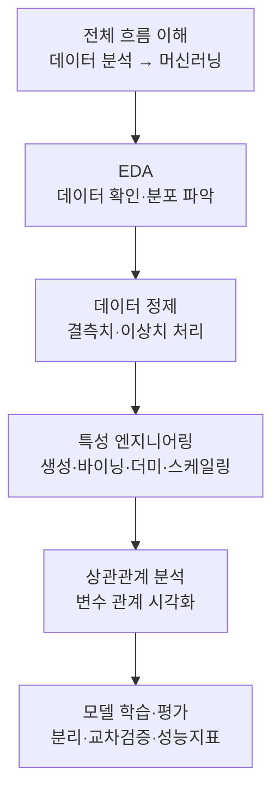

# 머신러닝 프로젝트 진행 과정

> 데이터를 받아서 예측 모델을 만들기까지, 실제 프로젝트는 어떤 순서로 흘러갈까?

머신러닝은 "좋은 모델 하나 고르기"가 전부가 아닙니다. 실무에서 시간의 대부분은 **데이터를 이해하고 다듬는 과정**에 쓰입니다. 이번 노트는 데이터를 처음 열어보는 순간부터 예측 성능을 평가하는 순간까지, 하나의 프로젝트가 흘러가는 전체 흐름을 따라갑니다.

두 개의 익숙한 예제 데이터를 나란히 놓고 진행합니다. 하나는 식당 팁 금액을 예측하는 **회귀 문제**, 다른 하나는 승객의 생존 여부를 예측하는 **분류 문제**입니다. 같은 흐름이 문제 유형에 따라 어떻게 달라지는지 비교하면서 보면 이해가 훨씬 쉽습니다.

## 학습 로드맵

## 목차

| # | 글 | 한 줄 소개 | 활용도 |
|---|----|-----------|--------|
| 1 | [전체 흐름과 탐색적 데이터 분석(EDA)](01-ml-workflow-and-eda.md) | 프로젝트 6단계 흐름과 데이터를 처음 이해하는 방법 | ★★★★★ |
| 2 | [데이터 정제 — 결측치와 이상치 처리](02-missing-and-outliers.md) | 비어 있는 값과 튀는 값을 다루는 판단 기준 | ★★★★★ |
| 3 | [특성 엔지니어링](03-feature-engineering.md) | 기존 데이터를 모델이 쓰기 좋게 가공하기 | ★★★★☆ |
| 4 | [상관관계 분석](04-correlation-analysis.md) | 변수 사이 관계를 읽고 모델 전략 세우기 | ★★★★☆ |
| 5 | [모델 학습과 평가](05-model-training-and-evaluation.md) | 데이터 분리, 교차검증, 회귀·분류 성능 해석 | ★★★★★ |

## 다루는 핵심 개념

- 머신러닝 프로젝트의 두 축: 데이터 분석 단계와 머신러닝 단계
- EDA로 데이터의 분포와 패턴을 읽고 모델 전략을 세우는 사고방식
- 결측치·이상치를 "무조건 삭제"가 아니라 상황에 맞게 처리하는 판단
- 특성 엔지니어링: 특성 생성, 바이닝, 더미 변환, 스케일링
- 피어슨 상관계수와 heatmap, pairplot으로 변수 관계 파악하기
- 훈련/테스트 분리, K-fold 교차검증, 데이터 누수(leakage) 방지
- 회귀 지표(R², RMSE)와 분류 지표(정확도, 정밀도, 재현율, F1) 해석

## 학습 포인트

- **왜 하는지를 먼저 이해하기**: 각 전처리 단계는 "모델을 왜곡하지 않기 위해" 존재합니다. 기법 이름보다 목적을 잡으면 응용이 쉬워집니다.
- **정답이 하나가 아님**: 결측치를 삭제할지 대체할지, 이상치를 지울지 살릴지는 데이터 양과 도메인 지식에 따라 달라집니다.
- **자주 헷갈리는 지점**: `fit`은 훈련 데이터에만, 테스트에는 `transform`만 적용해야 데이터 누수를 막습니다. 정확도만 보고 분류 성능을 판단하면 안 됩니다.
- **실무 연결**: 이 흐름은 추천 시스템, 이탈 예측, 수요 예측 등 대부분의 데이터 프로젝트에서 그대로 반복됩니다.

## 함께 보면 좋은 자료

- [용어집](GLOSSARY.md) — 이번 노트에 등장한 핵심 용어를 쉬운 말로 정리했습니다.
