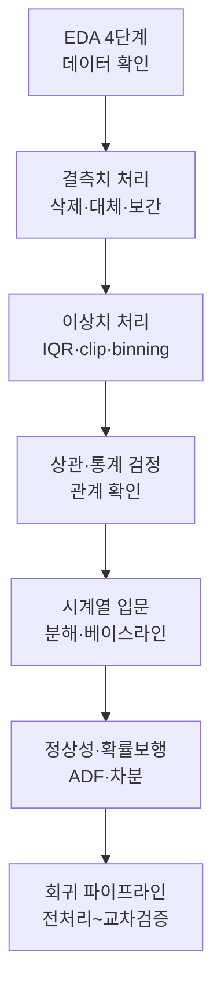

# 머신러닝 적용을 위한 데이터 처리 I

> 모델을 돌리기 전, 데이터를 이해하고 다듬는 전 과정을 한 번에 정리한 학습노트입니다.

머신러닝의 성능은 화려한 모델보다 **데이터를 얼마나 잘 이해하고 다듬었는가**에서 갈립니다. 이번 노트는 데이터를 살펴보는 EDA에서 시작해, 결측치와 이상치를 다루고, 변수 간 관계를 검정으로 확인하는 정제 과정을 거칩니다. 이어서 시간 순서가 중요한 시계열 데이터의 기초를 익히고, 마지막으로 이 모든 전처리를 하나의 회귀 파이프라인으로 묶어 실전 흐름을 완성합니다.

"확인 → 정제 → 관계 파악 → (시계열) → 모델링 파이프라인"이라는 큰 줄기를 따라가면, 각 글이 어떻게 이어지는지 자연스럽게 보입니다.

## 학습 로드맵

## 목차

| # | 글 | 한 줄 소개 | 활용도 |
|---|----|-----------|--------|
| 1 | [EDA 4단계 워크플로우](01-eda-workflow.md) | 데이터를 모델에 넣기 전 살펴보는 표준 흐름과 Pandas 핵심 동작 | ★★★★★ |
| 2 | [결측치 처리](02-missing-values.md) | 비어 있는 값을 삭제·대체·보간으로 다루는 판단 기준 | ★★★★★ |
| 3 | [이상치 처리](03-outliers.md) | IQR로 튀는 값을 찾고 clip·binning으로 다루기 | ★★★★☆ |
| 4 | [상관관계와 통계 검정](04-correlation-and-tests.md) | heatmap으로 본 관계를 t-test·카이제곱으로 확인 | ★★★★☆ |
| 5 | [시계열 분석 입문](05-timeseries-baseline.md) | STL 분해와 베이스라인 모델, MAPE로 예측 기준선 세우기 | ★★★★☆ |
| 6 | [정상성과 확률보행](06-stationarity-random-walk.md) | ADF 검정과 차분으로 예측 가능한 시계열 만들기 | ★★★★☆ |
| 7 | [회귀 파이프라인 실전](07-regression-pipeline.md) | 전처리 함수화·Pipeline·교차검증으로 누수 없는 모델 만들기 | ★★★★★ |

## 다루는 핵심 개념

- EDA 4단계: 데이터 확인 → 정제 → 특성 엔지니어링 → 상관관계 분석
- 결측치 전략: 삭제, 통계값 대체, 그룹별 대체, 시계열 보간
- 이상치 처리: IQR 경계, Winsorizing(clip), 구간화(binning)
- 관계 확인: 피어슨 상관, heatmap, t-test, 상관 검정, 카이제곱
- 시계열: STL 성분 분해, 베이스라인 모델, MAPE, 정상성, ADF 검정, 차분
- 회귀 파이프라인: 파생변수·바이닝, ColumnTransformer, Pipeline, 교차검증, 데이터 누수 방지

## 학습 포인트

- **반드시 이해할 것**: 데이터 누수의 개념과, 그것을 막기 위해 "분리를 먼저 하고 전처리를 Pipeline 안에 넣는" 순서.
- **자주 헷갈리는 것**: ADF 검정의 p-value 방향(0.05보다 크면 비정상), 상관과 인과의 차이, RMSE와 MAE의 성격 차이.
- **실무 연결**: 이 노트의 전처리·검증 절차는 캐글 대회부터 실서비스 모델까지 그대로 쓰이는 표준 흐름입니다.

## 함께 보면 좋은 자료

- [용어집](GLOSSARY.md) — 이번 노트에 등장한 핵심 용어를 쉬운 말로 정리했습니다.
