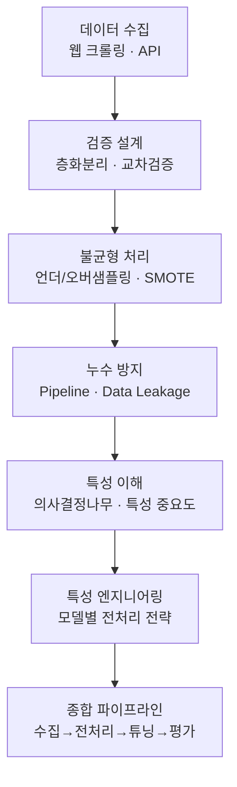

# 머신러닝 적용을 위한 데이터 처리 II

> 데이터를 "어디서 가져와서(수집) → 어떻게 다듬고(불균형·누수) → 무엇으로 판단할지(특성 중요도)"까지, 모델에 넣기 전 단계를 한 흐름으로 연결한 학습 기록입니다.

이번 회차는 모델 알고리즘 자체보다 **모델에 들어가기 전후의 데이터 파이프라인**에 초점을 둡니다. 웹·API로 데이터를 수집하는 방법에서 시작해, 클래스 불균형을 다루는 리샘플링, 평가를 망치는 데이터 누수(Data Leakage), 그리고 어떤 특성이 중요한지 판단하는 특성 중요도와 특성 엔지니어링까지 이어집니다. 각 주제는 "왜 필요한가 → 어떻게 구현하는가 → 결과를 어떻게 읽는가 → 실무에서 어디에 쓰는가" 순서로 풀어냈습니다.

## 학습 로드맵

## 목차

| # | 글 | 한 줄 소개 | 활용도 |
|---|----|-----------|--------|
| 1 | [웹사이트 크롤링 기초](01-web-crawling.md) | requests와 BeautifulSoup로 HTML에서 데이터를 뽑는 과정 | ★★★★☆ |
| 2 | [API로 데이터 수집하기](02-api-crawling.md) | JSON/XML API, 그리고 멀티스레드 병렬 수집 | ★★★★☆ |
| 3 | [불균형 데이터 처리](03-imbalanced-data.md) | 언더/오버샘플링과 SMOTE, 정확도의 함정 | ★★★★★ |
| 4 | [데이터 누수와 파이프라인](04-data-leakage.md) | 평가 점수를 부풀리는 누수와 Pipeline 차단법 | ★★★★★ |
| 5 | [의사결정나무와 특성 중요도](05-decision-tree-feature-importance.md) | Gini/Entropy 분할과 feature importance 원리 | ★★★★★ |
| 6 | [모델별 특성 엔지니어링](06-feature-engineering.md) | 왜 모델마다 전처리 전략이 다른가 | ★★★★☆ |
| 7 | [분류 종합 파이프라인](07-classification-pipeline.md) | 층화분리→CV→GridSearch→평가 전 과정 연결 | ★★★★★ |

## 다루는 핵심 개념

- 웹 크롤링의 클라이언트-서버 구조와 정적/동적 데이터 차이
- API 통신, JSON/XML 파싱, 멀티스레드 병렬 수집
- 불균형 비율(IR)과 언더/오버샘플링, SMOTE 계열 기법
- 정확도 함정과 재현율(Recall)·F1-score 중심 평가
- 데이터 누수의 유형과 Pipeline을 통한 근본 차단
- 불순도(Gini/Entropy)와 정보 이득(Gain), max_depth의 과소/과적합
- 모델별 feature importance의 서로 다른 의미
- 층화 K겹 교차검증과 GridSearchCV 하이퍼파라미터 튜닝

## 학습 포인트

- **정확도만 믿지 않기**: 불균형 데이터에서 accuracy는 착시를 만듭니다. 관심 클래스의 recall과 f1을 함께 봐야 합니다.
- **전처리 순서가 성능보다 먼저**: 분리(split)를 가장 먼저 하지 않으면 누수로 평가 자체를 믿을 수 없게 됩니다.
- **feature importance는 만능이 아니다**: 모델마다 "중요도"의 정의가 달라, 숫자를 같은 기준으로 비교하면 안 됩니다.

## 함께 보면 좋은 자료

- [용어집](GLOSSARY.md)
