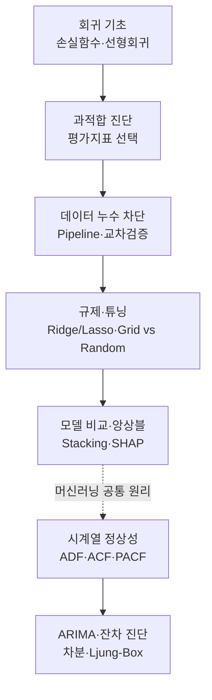

# 머신러닝 적용을 위한 데이터 처리 2 — 회귀 파이프라인과 시계열 예측

> 회귀 모델을 "제대로" 만들고 평가하는 전 과정, 그리고 시간을 따라 흐르는 데이터를 예측하는 시계열 기초까지 한 번에 정리한 학습노트입니다.

이번 회차는 크게 두 갈래로 나뉩니다. 앞쪽은 **회귀 모델링의 전체 파이프라인**입니다. 손실 함수로 학습의 목표를 정의하는 것에서 출발해, 과적합을 진단하고, 데이터 누수 없이 전처리를 안전하게 묶고, 하이퍼파라미터를 튜닝하고, 여러 모델을 비교해 앙상블로 합치고, 마지막으로 SHAP으로 모델의 판단 근거를 열어 봅니다. 뒤쪽은 **시계열 예측의 기초**입니다. 정상성이라는 개념에서 출발해 ACF·PACF로 모델 차수를 읽고, ARIMA로 추세가 있는 데이터를 예측하며, 잔차 진단으로 모델이 믿을 만한지 검증합니다.

두 주제를 관통하는 하나의 메시지는 이것입니다. **"좋은 예측값을 뽑는 것보다, 그 예측이 실제 환경에서도 통할지를 정직하게 검증하는 것이 더 중요하다."** 데이터 누수를 막는 파이프라인, 교차검증, 잔차 진단은 모두 이 정직함을 위한 장치입니다.

## 학습 로드맵

## 목차

| # | 글 | 한 줄 소개 | 활용도 |
|---|----|-----------|--------|
| 1 | [회귀 기초와 손실 함수](01-regression-basics-and-loss.md) | 회귀가 무엇을 최소화하며 학습하는지, 선형·다중 회귀의 원리 | ★★★★★ |
| 2 | [과적합과 회귀 평가지표](02-overfitting-and-metrics.md) | 다항 회귀 과적합, RMSE·MSE·MAE 선택 가이드, 이상치 민감도 | ★★★★★ |
| 3 | [데이터 누수와 파이프라인·교차검증](03-data-leakage-and-pipeline.md) | 누수를 원천 차단하는 Pipeline, KFold vs Stratified, paired t-test | ★★★★★ |
| 4 | [규제와 하이퍼파라미터 튜닝](04-regularization-and-hyperparameter-tuning.md) | Ridge·Lasso·ElasticNet 규제, Grid vs Random Search | ★★★★☆ |
| 5 | [모델 비교·스태킹·SHAP](05-ensemble-stacking-and-shap.md) | 여러 모델 리더보드, Stacking 앙상블, SHAP 해석 | ★★★★☆ |
| 6 | [시계열 정상성과 ACF·PACF](06-time-series-stationarity-and-acf-pacf.md) | 정상성, ADF 검정, ACF·PACF로 차수 읽기, AIC 모델 선택 | ★★★★★ |
| 7 | [ARIMA와 잔차 진단](07-arima-and-residual-diagnostics.md) | 차분, ARIMA, Box-Jenkins, Ljung-Box 잔차 검정 | ★★★★☆ |

## 다루는 핵심 개념

- 손실 함수(MSE)와 회귀 계수의 의미, 선형·다중 회귀
- 과적합·과소적합, RMSE·MSE·MAE의 차이와 선택 기준
- 데이터 누수(Data Leakage)와 이를 막는 `Pipeline`
- 교차검증(KFold vs StratifiedKFold), paired t-test로 방식 비교
- 규제(L1·L2·ElasticNet)와 하이퍼파라미터 탐색(Grid vs Random)
- 모델 비교 리더보드, Stacking 앙상블, SHAP 기여도 해석
- 시계열 정상성, ADF 검정, ACF·PACF, AIC, ARIMA, Ljung-Box 잔차 진단

## 학습 포인트

- **꼭 이해할 것**: 전처리는 반드시 train에만 fit해야 하며, 이를 자동으로 보장하는 것이 파이프라인입니다. 시계열에서는 정상성 확보(차분)가 모든 것의 출발점입니다.
- **자주 헷갈리는 것**: RMSE와 MAE 중 언제 무엇을 쓰는지, KFold와 StratifiedKFold의 적용 상황, ACF와 PACF 중 어느 것으로 AR·MA 차수를 읽는지.
- **실무 연결**: 파이프라인·교차검증은 실제 서비스에 배포할 모델의 성능을 과장 없이 추정하는 데 필수이고, 시계열 예측은 트래픽·수요·매출 예측의 기반이 됩니다.

## 함께 보면 좋은 자료

- [용어집](GLOSSARY.md) — 이번 회차에 등장한 핵심 용어를 쉬운 말로 정리했습니다.
