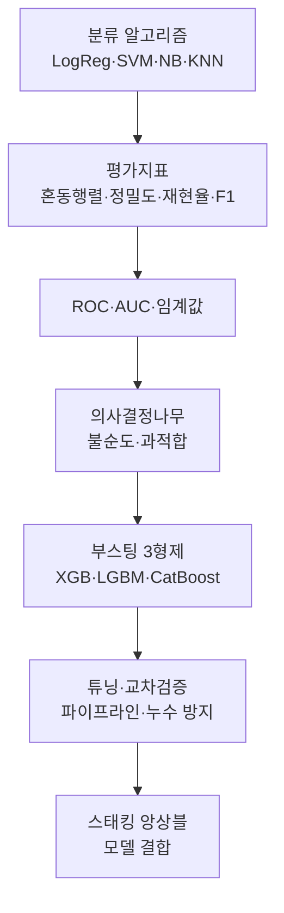

# 머신러닝 심화 II — 분류·부스팅·앙상블

> 예/아니오를 맞히는 분류 문제를, 기본 알고리즘부터 부스팅·튜닝·앙상블까지 한 줄기로 정리한 학습 기록입니다.

이번 묶음은 "분류"를 축으로 삼습니다. 먼저 대표 분류 알고리즘 네 가지를 비교하며 결정 경계라는 공통 관점을 잡고, 성능을 제대로 읽기 위한 평가지표(혼동행렬·정밀도·재현율·F1)와 ROC/AUC를 다룹니다. 이어서 해석 가능한 의사결정나무에서 출발해, 이를 강력하게 확장한 그래디언트 부스팅 3형제(XGBoost·LightGBM·CatBoost)를 비교합니다. 마지막으로 어떤 모델이든 제대로 쓰려면 필요한 하이퍼파라미터 튜닝·교차검증·데이터 누수 방지, 그리고 여러 모델을 결합하는 스태킹까지 이어집니다.

왜 이 순서가 중요한가: 모델을 아무리 잘 골라도 성능을 잘못 읽으면 소용없고(평가지표), 튜닝을 아무리 잘해도 데이터 누수가 있으면 숫자가 거짓말을 하기 때문입니다(누수 방지). 알고리즘 → 평가 → 확장 → 검증의 흐름을 몸에 익히는 것이 목표입니다.

## 학습 로드맵

## 목차

| # | 글 | 한 줄 소개 | 활용도 |
|---|----|-----------|--------|
| 1 | [분류 알고리즘 한눈에 보기](01-classification-algorithms.md) | 로지스틱 회귀·SVM·나이브 베이즈·KNN을 결정 경계 관점에서 비교 | ★★★★★ |
| 2 | [분류 평가지표](02-classification-metrics.md) | 혼동행렬에서 정밀도·재현율·F1까지, 정확도의 함정 | ★★★★★ |
| 3 | [ROC·AUC와 임계값](03-roc-auc-threshold.md) | 확률을 어디서 자를지 정하는 기술과 판별력 측정 | ★★★★☆ |
| 4 | [의사결정나무](04-decision-tree.md) | 분할·불순도(지니/엔트로피)·정보이득·과적합 | ★★★★★ |
| 5 | [부스팅 3형제 비교](05-gradient-boosting-comparison.md) | XGBoost·LightGBM·CatBoost의 공통점과 차이 | ★★★★★ |
| 6 | [튜닝·교차검증·누수 방지](06-hyperparameter-tuning-cv.md) | GridSearch·교차검증·파이프라인·데이터 누수 | ★★★★★ |
| 7 | [스태킹 앙상블](07-stacking-ensemble.md) | 여러 모델의 예측을 메타 모델로 결합하기 | ★★★★☆ |

## 다루는 핵심 개념

- 분류의 공통 관점: 결정 경계와 확률
- 성능을 정직하게 읽는 법: 혼동행렬, 정밀도·재현율·F1, ROC·AUC
- 트리 기반 학습: 불순도, 정보이득, 과적합 제어
- 부스팅 계열: 순차 앙상블과 조기 종료
- 모델 검증의 정도(正道): 교차검증, 파이프라인, 데이터 누수 방지
- 모델 결합: 스태킹과 앙상블의 이득 조건

## 학습 포인트

- 정확도 하나로 모델을 판단하지 않기 — 특히 불균형 데이터에서.
- 트리의 깊이(과적합)와 부스팅의 조기 종료를 항상 함께 생각하기.
- 튜닝과 검증은 반드시 교차검증으로, 최종 성능은 test로만.
- 데이터 누수는 조용히 성능을 부풀리므로 파이프라인을 습관화하기.
- 앙상블(스태킹)은 만능이 아니며, 단일 최고 모델과 늘 비교하기.

## 함께 보면 좋은 자료

- [용어집](GLOSSARY.md) — 이번 묶음에서 등장한 핵심 용어를 쉬운 말로 정리
