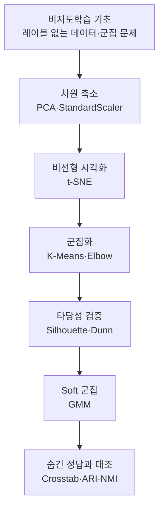

# 머신러닝 심화 3 — 비지도학습: 차원 축소와 클러스터링

> 정답표가 없는 데이터에서도 숨은 구조를 읽어내는 법. 차원을 줄여 눈으로 확인하고, 비슷한 것끼리 묶고, 그 묶음이 믿을 만한지 정량으로 검증하는 전 과정을 한 번에 정리한 학습노트입니다.

지금까지의 머신러닝은 대부분 "정답(레이블)을 주고, 그 정답을 맞히도록 학습시키는" 지도학습이었습니다. 하지만 현실의 데이터는 정답표가 붙어 있지 않은 경우가 훨씬 많습니다. 고객 수백만 명의 행동 로그, 상품 이미지, 텍스트 뭉치에는 "이 사람은 A그룹"이라는 라벨이 없습니다. 이번 회차는 그런 **레이블 없는 데이터에서 스스로 구조를 찾는** 비지도학습을 다룹니다.

전체 흐름은 세 단계로 이어집니다. 먼저 특성이 여러 개인 데이터를 사람이 볼 수 있는 2차원으로 **압축**합니다(PCA·t-SNE). 그다음 비슷한 데이터끼리 자동으로 **묶습니다**(K-Means·GMM). 마지막으로 그 묶음이 우연이 아니라 실제로 잘 나뉜 것인지 **점수로 검증**합니다(Silhouette·Dunn Index). 실습은 펭귄 데이터에서 종(Species) 정보를 일부러 숨긴 채 시작해, 맨 마지막에야 숨긴 정답을 꺼내 "정답 없이 찾은 구조가 실제 생물학적 종과 얼마나 맞는지"를 대조합니다.

이 모든 과정을 관통하는 하나의 메시지는 이것입니다. **"비지도학습에는 채점표가 없으므로, 결과를 믿기 전에 여러 각도의 검증 장치로 스스로 근거를 만들어야 한다."** 스케일링, 누적 설명분산, Silhouette, Dunn Index, 교차표는 모두 이 "정답 없는 확신"을 만들기 위한 도구입니다.

## 학습 로드맵

## 목차

| # | 글 | 한 줄 소개 | 활용도 |
|---|----|-----------|--------|
| 1 | [비지도학습의 기초](01-unsupervised-learning-basics.md) | 지도학습과의 차이, 왜 필요한가, 군집 문제 정의, Hard vs Soft, 정답을 숨기는 실습 설계 | ★★★★★ |
| 2 | [PCA와 스케일링](02-pca-and-scaling.md) | 차원의 저주, PCA 원리, StandardScaler가 필수인 이유, 누적 설명분산으로 차원 선택 | ★★★★★ |
| 3 | [t-SNE 시각화](03-tsne-visualization.md) | 이웃 유사도 보존 원리, PCA와의 차이, 시각화 전용이라는 한계 | ★★★★☆ |
| 4 | [K-Means와 Elbow Method](04-kmeans-and-elbow.md) | K-Means 알고리즘 4단계, Inertia와 Elbow로 K 찾기, 이상치·구형 가정의 약점 | ★★★★★ |
| 5 | [클러스터링 타당성 지표](05-clustering-validity.md) | Silhouette 점수 공식과 해석, Dunn Index, 레이블 없이 품질 평가하기 | ★★★★☆ |
| 6 | [GMM과 Soft Clustering](06-gmm-soft-clustering.md) | 가우시안 혼합·EM 알고리즘, 확률로 소속시키기, K-Means와의 비교 | ★★★★☆ |
| 7 | [전체 파이프라인과 평가](07-full-pipeline-and-evaluation.md) | 펭귄 전체 흐름, Crosstab·ARI·NMI로 숨긴 레이블 검증 | ★★★★★ |

## 다루는 핵심 개념

- 지도학습 vs 비지도학습의 차이, 레이블 없는 데이터에서의 군집 문제 정의
- Hard Clustering vs Soft Clustering
- 차원의 저주와 차원 축소의 필요성
- PCA(주성분 분석): 분산 최대 보존 축, 설명분산, 누적 설명분산으로 차원 선택
- StandardScaler가 PCA·거리 기반 알고리즘에서 필수인 이유
- t-SNE: 이웃 유사도 확률 보존, 비선형 시각화, 재현성·transform 한계
- K-Means: 중심 기반 군집, Inertia, Elbow Method, 이상치·구형 가정
- 클러스터링 타당성: Silhouette 점수, Dunn Index
- GMM: 가우시안 혼합, EM 알고리즘, 확률적(soft) 소속
- 검증: 교차표(Crosstab), ARI(Adjusted Rand Index), NMI(Normalized Mutual Information)

## 학습 포인트

- **꼭 이해할 것**: 거리·분산 기반 알고리즘(PCA·K-Means·GMM) 앞에는 반드시 `StandardScaler`로 특성 스케일을 맞춰야 합니다. 스케일이 큰 변수 하나가 결과를 통째로 지배하기 때문입니다. 그리고 비지도학습에는 정답 채점이 없으므로 Elbow·Silhouette·Dunn 등 **여러 지표를 교차 확인**해 K를 정합니다.
- **자주 헷갈리는 것**: PCA와 t-SNE의 용도 차이(축소·전처리 vs 시각화 전용), Hard와 Soft 군집의 차이, Silhouette은 샘플 단위·Dunn은 클러스터 단위라는 관점 차이, "차원 축소 Elbow"와 "클러스터링 Elbow"는 이름만 같고 목적이 다르다는 점.
- **실무 연결**: 고객 세분화, 이상치 탐지, 추천 시스템의 사용자 그룹핑, 고차원 데이터의 EDA와 전처리에 그대로 이어집니다.

## 함께 보면 좋은 자료

- [용어집](GLOSSARY.md) — 이번 회차에 등장한 핵심 용어를 쉬운 말로 정리했습니다.
