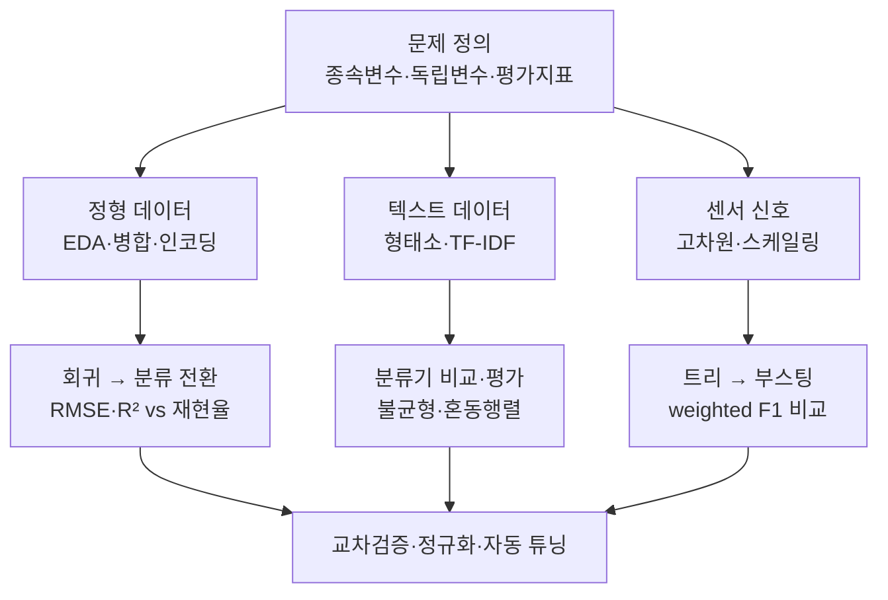

# 머신러닝 심화 5 — 미니프로젝트: 세 가지 실전 문제로 배우는 ML 파이프라인

> "여행 경비를 미리 알 수 있을까?", "이 민원은 어느 부서로 가야 할까?", "이 소리는 누수일까?" 생김새가 전혀 다른 세 질문을 각각 하나의 머신러닝 프로젝트로 끝까지 밀어붙인 학습노트입니다.

이번 회차는 이론을 따라가는 대신 **세 개의 프로젝트를 처음부터 끝까지 완주**합니다. 첫 번째는 여행 지출 금액을 맞히는 **정형 데이터 회귀**입니다. 흩어진 일곱 개의 표를 하나로 붙이고, 결측·이상치·다중 라벨 컬럼을 정리해 학습 데이터를 만든 뒤, 회귀 모델을 돌리고 다시 분류로 바꿔 봅니다. 두 번째는 민원 문장을 17개 유형으로 나누는 **한국어 텍스트 분류**입니다. 문장을 형태소로 자르고 TF-IDF로 벡터화한 다음, 여러 분류기를 비교하고 클래스 불균형과 씨름합니다. 세 번째는 배관 진동 센서에서 나온 533개 숫자로 소리의 종류를 가려내는 **고차원 센서 다중분류**입니다.

이 순서에는 이유가 있습니다. 정형 표는 컬럼 하나하나가 눈에 보이니 전처리의 판단 근거를 익히기 좋고, 텍스트는 "숫자가 아닌 것을 숫자로 바꾸는" 벡터화라는 새 관문이 추가되며, 센서 신호는 이미 숫자지만 차원이 너무 커서 사람이 하나씩 읽을 수 없는 상황을 다룹니다. 그리고 마지막 글에서 세 프로젝트가 공통으로 부딪힌 문제 — "이 성능 숫자를 믿어도 되나, 더 올릴 방법은 없나" — 를 교차검증과 하이퍼파라미터 튜닝으로 마무리합니다.

세 프로젝트를 관통하는 메시지는 이것입니다. **"데이터가 표든 문장이든 신호든 파이프라인의 뼈대는 똑같고, 진짜로 달라지는 것은 숫자로 바꾸는 방법과 잘했는지 재는 기준뿐이다."** 문제 정의 → 전처리 → 모델 비교 → 평가 → 튜닝이라는 뼈대는 세 번 모두 그대로였습니다.

## 학습 로드맵

## 목차

| # | 글 | 한 줄 소개 | 활용도 |
|---|----|-----------|--------|
| 1 | [미니프로젝트 문제 정의](01-miniproject-overview-and-problem-framing.md) | 실무 질문을 종속변수·독립변수·평가지표로 번역하는 절차 | ★★★★★ |
| 2 | [여행 지출 데이터 EDA와 전처리](02-travel-expense-data-preprocessing.md) | 일곱 개의 표 병합, 다중 라벨 인코딩, 결측·이상치 처리 | ★★★★★ |
| 3 | [여행 지출 회귀와 분류](03-travel-expense-regression-and-classification.md) | RMSE·MAPE·R²·Adjusted R², 변수 선택, 회귀의 분류 전환 | ★★★★☆ |
| 4 | [한국어 텍스트 전처리와 벡터화](04-korean-text-preprocessing.md) | 형태소 토큰화, BoW와 TF-IDF, 어휘 사전과 희소 행렬 | ★★★★★ |
| 5 | [텍스트 분류 모델과 평가](05-text-classification-and-evaluation.md) | 분류기 비교, 클래스 불균형, precision·recall·혼동행렬 | ★★★★★ |
| 6 | [센서 신호 다중분류](06-sensor-multiclass-classification.md) | 533개 고차원 피처, 스케일링, 트리에서 부스팅까지 | ★★★★☆ |
| 7 | [교차검증과 하이퍼파라미터 튜닝](07-cross-validation-and-hyperparameter-tuning.md) | K-Fold·Stratified, L1·L2 정규화, 자동 탐색으로 F1 0.80→0.93 | ★★★★★ |

## 다루는 핵심 개념

- 실무 질문을 머신러닝 문제로 번역하기 — 종속변수·독립변수·평가지표 확정
- 회귀와 분류의 경계, 구간화로 회귀를 분류로 바꿀 때 잃는 것
- 정형 데이터 전처리 — EDA 기반 판단, 다중 라벨 이진 인코딩, IQR 이상치, 행 단위를 맞추는 병합
- 회귀 평가지표 4종(RMSE·MAPE·R²·Adjusted R²)과 변수 수가 만드는 착시
- 한국어 텍스트 벡터화 — 형태소 토큰화, BoW vs TF-IDF, 어휘 사전과 희소 행렬
- 분류 평가 — accuracy의 한계, precision·recall·F1, macro vs weighted, 혼동행렬 읽기
- 클래스 불균형(약 400:1) 대응 — 언더샘플링, 가중치, 지표 선택
- 고차원 센서 피처를 라벨별 프로필로 압축해 읽기, 스케일링과 라벨 인코딩
- 트리 계열의 계단식 성능 향상 — 단일 트리 → 랜덤포레스트 → 부스팅
- K-Fold·StratifiedKFold 교차검증, L1·L2 정규화, 목적함수 기반 자동 탐색

## 학습 포인트

- **꼭 이해할 것**: 코드보다 먼저 정해야 하는 건 "무엇을 맞힐 것인가(종속변수)"와 "잘 맞혔는지 어떻게 잴 것인가(평가지표)"입니다. 이 둘이 정해지면 모델 선택과 전처리는 거의 따라옵니다. 그리고 성능 숫자는 반드시 교차검증 위에서 비교해야 흔들리지 않습니다.
- **자주 헷갈리는 것**: R²와 Adjusted R²의 차이(변수를 늘리면 R²는 무조건 오릅니다), macro 평균과 weighted 평균 중 언제 무엇을 보는지, 회귀를 분류로 바꿔 정확도가 올라간 것이 성능 향상이 아니라는 점, 그리고 전처리는 언제나 훈련 데이터에서만 배워야 한다는 원칙입니다.
- **실무 연결**: 이 세 문제 유형은 현업에서 만나는 대부분의 예측 과제를 대표합니다. 비용·수요 예측(정형 회귀), 문의·민원 자동 분류(텍스트), 설비 이상 감지(센서 신호)가 각각 그것이며, 어느 쪽이든 마지막에는 "이 성능이 실제 환경에서도 재현될까"라는 같은 질문 앞에 서게 됩니다.

## 함께 보면 좋은 자료

- [용어집](GLOSSARY.md) — 이번 회차에 등장한 핵심 용어를 쉬운 말로 정리했습니다.
