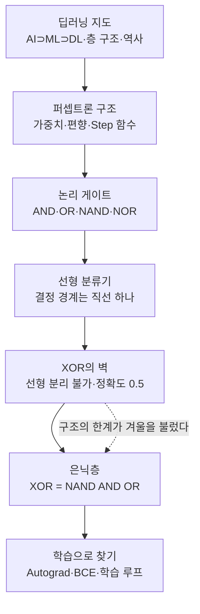

# 딥러닝 기초 1 — 퍼셉트론에서 다층 퍼셉트론까지

> 뉴런 하나를 숫자 몇 개로 옮긴 데서 시작해, 그것이 할 수 있는 일과 할 수 없는 일을 확인하고, 층을 쌓아 한계를 넘은 뒤, 마지막에는 가중치를 사람이 아닌 기계가 찾게 만드는 과정을 순서대로 정리한 학습노트입니다.

이번 회차는 딥러닝이라는 큰 땅의 입구입니다. 먼저 인공지능·머신러닝·딥러닝이 어떻게 겹쳐 있는지 지도를 펴고, 신경망이 왜 하필 "층"이라는 구조를 갖게 되었는지, 그리고 왜 이 분야가 두 번이나 겨울을 맞았는지를 살펴봅니다. 그다음 지도의 가장 작은 점, 즉 **뉴런 하나를 흉내 낸 퍼셉트론**으로 내려갑니다. 입력에 가중치를 곱해 더하고, 편향을 얹고, 임계값을 넘는지 보는 것. 계산은 이게 전부입니다.

놀라운 것은 이 짧은 계산이 실제로 "판단"을 해낸다는 점입니다. 가중치 두 개와 편향 하나만 바꾸면 같은 퍼셉트론이 AND가 되었다가 OR이 되었다가 NAND가 됩니다. 하지만 여기서 벽을 만납니다. 퍼셉트론이 긋는 것은 언제나 평면 위 **직선 하나**이고, XOR처럼 정답이 대각선으로 엇갈린 문제는 직선으로 나눌 수 없습니다. 2,000번을 학습시켜도 정확도는 0.5, 동전 던지기와 같습니다. 학습이 부족한 게 아니라 구조가 표현할 수 없는 것이었고, 이 사실이 증명되면서 연구는 겨울로 들어갑니다.

해법은 학습을 더 하는 것이 아니라 층을 하나 더 쌓는 것이었습니다. 입력과 출력 사이에 은닉층을 끼워 NAND와 OR을 만들고 그 둘을 AND로 합치면 XOR이 정확히 재현됩니다. 다만 이때까지는 가중치를 사람이 손으로 넣었습니다. 마지막 글에서 그 마지막 짐마저 기계에게 넘깁니다. 자동미분과 손실 함수, 그리고 네 줄짜리 학습 루프가 무작위 숫자를 XOR을 푸는 숫자로 바꿔 놓습니다.

이 회차를 관통하는 하나의 메시지는 이것입니다. **딥러닝의 역사는 "표현할 수 있는 범위를 넓혀 온 역사"이며, 층을 쌓아 표현력을 늘리는 것과 학습으로 그 층의 가중치를 스스로 찾게 하는 것이 그 두 축이다.**

## 학습 로드맵

## 목차

| # | 글 | 한 줄 소개 | 활용도 |
|---|----|-----------|--------|
| 1 | [딥러닝 개론](01-deep-learning-intro.md) | AI·머신러닝·딥러닝의 포함 관계, 신경망의 층 구조, 두 번의 겨울과 부흥 | ★★★★☆ |
| 2 | [퍼셉트론의 구조](02-perceptron-structure.md) | 입력·가중치·편향·가중합·활성화 함수·출력의 여섯 요소와 Step 함수 | ★★★★★ |
| 3 | [논리 게이트와 선형 분류기](03-logic-gates-and-linear-classifier.md) | 숫자 세 개로 AND·OR·NAND·NOR 만들기, 결정 경계는 직선 | ★★★★★ |
| 4 | [XOR 문제와 단층 퍼셉트론의 한계](04-xor-problem-and-single-layer-limits.md) | 선형 분리 불가 증명, 정확도 0.5의 의미, 첫 AI 겨울 | ★★★★★ |
| 5 | [다층 퍼셉트론과 은닉층](05-mlp-hidden-layer.md) | XOR = NAND AND OR, 은닉층 수와 결정 영역, '딥'의 기준 | ★★★★★ |
| 6 | [PyTorch로 MLP 학습시키기](06-pytorch-mlp-training.md) | Autograd, `nn.Module`, BCE, 학습 루프 4단계 | ★★★★★ |

## 다루는 핵심 개념

- 인공지능 ⊃ 머신러닝 ⊃ 딥러닝의 포함 관계와 특징 추출 자동화의 정도
- 인공신경망의 입력층·은닉층·출력층 구조, "깊다(deep)"의 의미
- 퍼셉트론의 여섯 구성 요소와 $y = f(\sum_i w_i x_i + b)$ 계산
- Step(계단) 활성화 함수, 가중치와 편향이 각각 담당하는 역할
- 논리 게이트(AND·OR·NAND·NOR) 설계와 결정 경계 직선
- 선형 분리 가능성, XOR 문제, 단층 퍼셉트론의 구조적 표현력 한계
- 은닉층과 다층 퍼셉트론(MLP), 은닉층 수에 따른 결정 영역의 확장
- PyTorch 텐서와 자동미분(Autograd), `nn.Module`, Sigmoid, BCE 손실
- 순전파 → 손실 → 역전파 → 갱신의 학습 루프와 `zero_grad()`

## 학습 포인트

- **꼭 이해할 것**: 퍼셉트론에서 "구조"와 "숫자"는 다른 것입니다. 구조를 그대로 두고 가중치·편향만 바꾸면 전혀 다른 판단이 되고, 그 숫자를 데이터에서 찾는 일이 곧 학습입니다. 그리고 단층 퍼셉트론의 결정 경계는 언제나 직선 하나라는 사실이 이후 모든 이야기의 출발점입니다.
- **자주 헷갈리는 것**: XOR 실패가 학습 부족이 아니라 구조적 한계라는 점, 은닉층이 하는 일이 "직선을 여러 개 그리는 것"이 아니라 "직선으로 나눌 수 있는 공간으로 옮기는 것"이라는 점, 그리고 학습 루프에서 `zero_grad()`를 빠뜨리면 기울기가 누적되어 학습이 망가진다는 점.
- **실무 연결**: 오늘날 쓰는 어떤 대형 모델도 여기서 본 계산 단위를 벗어나지 않습니다. 층을 얼마나 쌓을지, 어떤 활성화 함수를 쓸지, 어떤 손실 함수로 무엇을 최소화할지를 정하는 감각이 모델 설계의 기본기가 됩니다.

## 함께 보면 좋은 자료

- [용어집](GLOSSARY.md) — 이번 회차에 등장한 핵심 용어를 쉬운 말로 정리했습니다.
