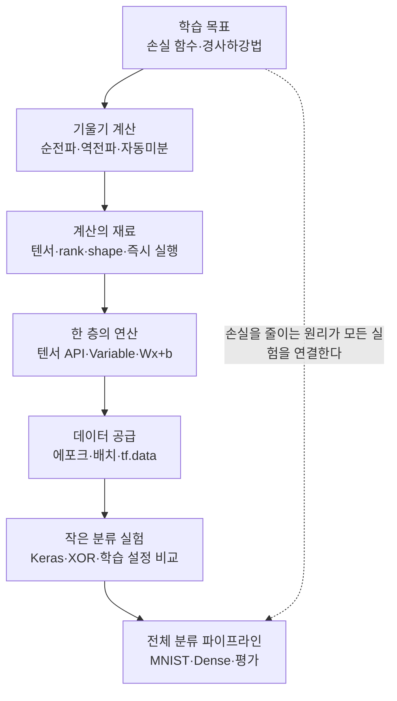

# 딥러닝 기초 2 — 텐서플로우와 딥러닝 학습 방법

> 모델이 틀린 정도를 재는 순간부터 이미지를 열 개의 확률로 분류하기까지, 딥러닝 학습의 계산과 데이터 흐름을 하나로 연결한 학습노트입니다.

이번 회차는 딥러닝 모델이 **어떻게 스스로 나아지는지**를 계산 순서대로 따라갑니다. 먼저 손실 함수로 예측의 틀린 정도를 숫자로 만들고, 경사하강법으로 그 숫자가 작아지는 방향을 찾습니다. 순전파가 현재 파라미터로 예측과 손실을 계산한다면, 역전파는 그 경로를 거꾸로 따라가며 각 파라미터의 책임을 기울기로 나눕니다. `GradientTape`는 이 미분 과정을 자동으로 계산해 줍니다.

그다음 학습의 재료가 되는 텐서로 내려갑니다. rank와 shape로 데이터의 구조를 읽고, 즉시 실행으로 중간값을 확인하며, 상수와 변수를 목적에 맞게 구분합니다. `tf.matmul`과 브로드캐스팅을 이용해 신경망 한 층의 중심 계산인 $Wx+b$를 직접 확인하면, Dense 층이 더 이상 막연한 상자가 아니라 입력을 가중치로 조합하는 연산으로 보이기 시작합니다.

계산 규칙을 익힌 뒤에는 데이터를 학습에 공급하는 흐름을 만듭니다. 에포크·배치·이터레이션의 관계로 실제 가중치 갱신 횟수를 계산하고, `tf.data`로 섞기·배치·미리 읽기를 연결합니다. 마지막 두 글에서는 이 요소를 Keras 모델로 묶습니다. XOR 실험은 손실 함수·최적화 방법·활성화 함수의 조합에 따라 결과가 얼마나 달라지는지 보여 주고, MNIST 실험은 이미지 정규화부터 Dense 신경망의 학습·검증·테스트까지 전체 분류 파이프라인을 완성합니다.

이 회차를 관통하는 하나의 메시지는 이것입니다. **딥러닝 학습은 손실을 정의하고, 자동미분으로 기울기를 구하고, 텐서와 배치 단위로 파라미터를 반복 갱신한 뒤, 보지 않은 데이터로 그 결과를 확인하는 하나의 연결된 과정이다.**

## 학습 로드맵

## 목차

| # | 글 | 한 줄 소개 | 활용도 |
|---|----|-----------|--------|
| 1 | [손실 함수와 경사하강법](01-loss-and-gradient-descent.md) | 틀린 정도를 수치로 만들고 기울기의 반대 방향으로 파라미터를 갱신하는 원리 | ★★★★★ |
| 2 | [순전파·역전파와 자동미분](02-forward-backprop-and-autodiff.md) | 예측의 계산 경로를 거꾸로 따라 기울기를 구하고 `GradientTape`로 확인하는 방법 | ★★★★★ |
| 3 | [텐서와 즉시 실행](03-tensors-and-eager-execution.md) | 텐서의 rank·shape를 읽고 즉시 실행과 행렬 연산으로 계산 구조를 확인하는 법 | ★★★★★ |
| 4 | [텐서 API와 선형 변환](04-tensor-apis-and-linear-transform.md) | 상수·변수·생성 API를 구분하고 신경망 한 층의 $Wx+b$를 계산하는 방법 | ★★★★★ |
| 5 | [에포크·배치·이터레이션과 데이터 파이프라인](05-epoch-batch-iteration-and-tfdata.md) | 실제 갱신 횟수를 계산하고 `tf.data`로 학습 입력 흐름을 구성하는 법 | ★★★★★ |
| 6 | [Keras로 XOR 학습 설정 비교](06-keras-xor-training-comparison.md) | 같은 XOR 문제에서 학습 설정에 따른 정확도와 예측 확률의 차이를 해석하는 실험 | ★★★★★ |
| 7 | [MNIST 완전연결 신경망](07-mnist-dense-network.md) | 28×28 이미지를 전처리해 Dense 신경망으로 학습·검증·테스트하는 전체 과정 | ★★★★★ |

## 다루는 핵심 개념

- 손실 함수(MSE·BCE), 경사하강법, 학습률과 수렴의 관계
- 순전파·역전파·연쇄법칙, 자동미분과 `GradientTape`
- 텐서의 rank·shape·dtype, 즉시 실행, 성분별 연산과 행렬 곱
- `tf.constant`와 `tf.Variable`, `assign`, 브로드캐스팅, 선형 변환 $Wx+b$
- 에포크·배치·이터레이션, 미니배치와 `tf.data` 입력 파이프라인
- XOR의 비선형성, Keras 학습 흐름, MSE+SGD와 BCE+Adam 설정 비교
- MNIST 정규화, Flatten·Dense·Dropout·Softmax, 학습·검증·테스트 결과 해석

## 학습 포인트

- **꼭 이해할 것**: 손실은 현재 예측의 틀린 정도이고 기울기는 파라미터를 어느 방향으로 바꿀지 알려 주는 정보입니다. 순전파로 손실을 만든 뒤 역전파와 자동미분으로 기울기를 구하고, 최적화 단계에서 실제 변수를 갱신하는 순서를 구분해야 합니다.
- **자주 헷갈리는 것**: rank와 shape, 성분별 곱과 행렬 곱, 에포크와 이터레이션, `evaluate`와 `predict`는 서로 다른 개념입니다. 또한 여러 학습 설정을 한꺼번에 바꾼 XOR 비교 결과를 특정 요소 하나의 효과라고 단정할 수 없습니다.
- **실무 연결**: 모델 코드를 작성하기 전에 입력과 레이블의 shape, 배치 개수, 손실 흐름을 확인하면 많은 오류를 학습 초기에 발견할 수 있습니다. 최종 성능은 훈련 정확도만이 아니라 검증·테스트 결과와 예측 확률까지 함께 해석해야 합니다.

## 함께 보면 좋은 자료

- [용어집](GLOSSARY.md) — 이번 회차의 손실·텐서·데이터 파이프라인·Keras 핵심 용어를 주제별로 정리했습니다.
