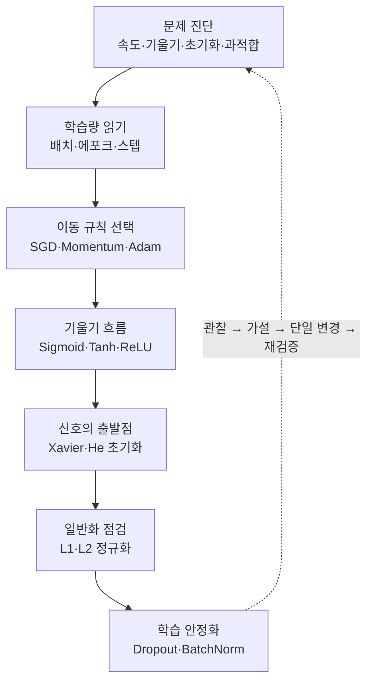

# 딥러닝 기초 3 — 딥러닝 학습의 문제점

> 손실이 줄지 않는 이유를 막연히 추측하지 않고, 학습 속도·기울기·초기화·일반화의 네 축으로 진단하고 해결하는 학습노트입니다.

딥러닝 모델이 기대만큼 학습되지 않을 때는 더 오래 돌리거나 기법을 한꺼번에 추가하기보다 **어디에서 학습이 막혔는지 먼저 구분**해야 합니다. 한 에포크가 오래 걸리는 문제와 앞쪽 층에 기울기가 전달되지 않는 문제, 시작 가중치 때문에 신호가 무너지는 문제, 훈련 데이터에만 지나치게 맞는 문제는 겉으로 비슷해 보여도 확인할 지표와 처방이 다릅니다.

이번 회차는 네 가지 실패 모드를 진단 지도로 정리한 뒤, 업데이트의 실제 단위인 미니배치와 스텝을 살펴봅니다. 이어서 SGD·Momentum·적응형 옵티마이저가 손실 지형을 이동하는 방식을 비교하고, 활성화 함수와 가중치 초기화가 깊은 층의 신호 전파에 미치는 영향을 연결합니다. 마지막에는 L1·L2, Dropout, Batch Normalization을 통해 훈련 성능과 일반화 성능을 구분합니다.

이 회차를 관통하는 메시지는 하나입니다. **좋은 딥러닝 학습은 특정 기법 하나를 외우는 일이 아니라, 증상에 맞는 지표를 관찰하고 한 번에 한 변수씩 바꾸며 검증하는 과정이다.** 저장된 한 번의 수치나 알고리즘 이름만으로 절대적인 우열을 정하지 않고, 학습률·초기값·업데이트 수·검증 절차가 같은 조건인지 함께 확인해야 합니다.

## 학습 로드맵

## 목차

| # | 글 | 한 줄 소개 | 활용도 |
|---|----|-----------|--------|
| 1 | [딥러닝 학습의 실패 모드](01-deep-learning-training-failure-modes.md) | 네 가지 대표 증상을 손실·기울기·활성값·일반화 지표로 구분하는 진단 지도 | ★★★★★ |
| 2 | [미니배치와 최적화 기초](02-mini-batch-and-optimization-basics.md) | 에포크보다 실제 업데이트 수와 벽시계 시간을 기준으로 학습량을 읽는 법 | ★★★★★ |
| 3 | [SGD·Momentum·적응형 옵티마이저](03-sgd-momentum-and-adaptive-optimizers.md) | 여러 옵티마이저의 이동 규칙과 공정한 비교 조건 | ★★★★★ |
| 4 | [기울기 소실과 활성화 함수](04-vanishing-gradient-and-activation-functions.md) | 역전파 신호가 약해지는 이유와 Sigmoid·Tanh·ReLU의 차이 | ★★★★★ |
| 5 | [가중치 초기화와 신호 전파](05-weight-initialization-and-signal-propagation.md) | 층별 활성값을 안정시키는 Xavier·He 초기화의 선택 기준 | ★★★★★ |
| 6 | [과적합과 L1·L2 정규화](06-overfitting-and-regularization.md) | 훈련-검증 격차를 읽고 가중치 패널티로 복잡도를 조절하는 법 | ★★★★★ |
| 7 | [드롭아웃과 배치 정규화](07-dropout-and-batch-normalization.md) | 학습·추론 모드에 따라 달라지는 두 기법의 역할과 한계 | ★★★★★ |

## 다루는 핵심 개념

- 학습 속도, 기울기 소실, 부적절한 초기화, 과적합의 증상과 진단 순서
- Full-batch와 Mini-batch, Epoch와 Step, 학습률과 벽시계 시간
- SGD, Momentum, AdaGrad, RMSProp, Adam의 갱신 원리와 조건부 비교
- 역전파, 활성화 함수의 포화, ReLU와 Dead ReLU
- `fan_in`·`fan_out`, Xavier·He 초기화와 층별 신호 전파
- 일반화 격차, 검증·테스트 데이터, L1·L2 정규화
- Inverted Dropout, Batch Normalization, 학습 모드와 추론 모드

## 학습 포인트

- **꼭 이해할 것**: 훈련 손실, 검증 손실, 층별 기울기, 활성값 분포, 업데이트 수는 서로 다른 실패 원인을 보여 줍니다. 해결책을 고르기 전에 어떤 지표가 비정상인지 먼저 확인해야 합니다.
- **자주 헷갈리는 것**: 같은 에포크는 같은 업데이트 예산이 아니며, 적응형 옵티마이저도 기본 학습률이 중요합니다. ReLU는 기울기 소실을 완전히 없애지 않고, BatchNorm과 Dropout도 모든 문제에서 성능 향상을 보장하지 않습니다.
- **실험 해석**: 한 번의 저장 결과는 해당 데이터·학습률·초기값에서의 관찰입니다. 절대 순위를 만들지 말고 여러 시드, 동일한 데이터 분할, 같은 평가 예산으로 재검증해야 합니다.
- **실무 연결**: 기준 모델을 먼저 만들고 한 번에 한 설정만 바꾸며, 선택에 사용한 검증 데이터와 마지막에 한 번 평가할 테스트 데이터를 구분해야 합니다.

## 함께 보면 좋은 자료

- [용어집](GLOSSARY.md) — 최적화, 기울기 흐름, 초기화, 정규화의 핵심 용어 36개를 주제별로 정리했습니다.
