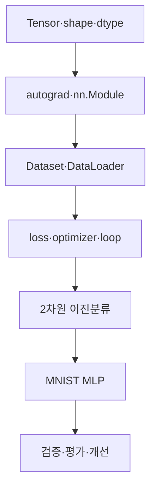

# PyTorch 딥러닝 학습 지도

> PyTorch 모델 구현은 텐서에서 시작해 데이터 배치, 순전파, 손실, 역전파, 평가로 이어지는 하나의 흐름입니다.

이 학습 묶음은 PyTorch 텐서와 자동미분의 기초부터 DataLoader, MLP 모델, 손실 함수와 Optimizer, 학습·평가 루프까지 연결합니다. 이후 2차원 이진분류와 MNIST 10개 클래스 분류를 구현하고 검증 지표를 바탕으로 성능을 개선합니다.

## 학습 로드맵

## 목차

| # | 글 | 핵심 질문 | 활용도 |
|---:|---|---|:---:|
| 1 | [텐서와 기본 연산](01-pytorch-tensors-and-operations.md) | 데이터의 모양·타입·장치를 어떻게 읽는가? | ★★★★★ |
| 2 | [자동미분과 신경망 모듈](02-autograd-modules-and-model-modes.md) | 순전파와 기울기는 어떻게 연결되는가? | ★★★★★ |
| 3 | [Dataset과 DataLoader](03-datasets-dataloaders-and-splits.md) | 데이터를 어떻게 나누고 배치로 공급하는가? | ★★★★★ |
| 4 | [손실·최적화·학습 루프](04-loss-optimizers-and-training-loop.md) | 한 배치의 학습 순서는 무엇인가? | ★★★★★ |
| 5 | [이진분류 워크숍](05-binary-classification-workshop.md) | 두 클래스 분류 파이프라인을 어떻게 완성하는가? | ★★★★★ |
| 6 | [MNIST MLP](06-mnist-mlp-classifier.md) | 이미지를 10개 숫자 클래스로 어떻게 분류하는가? | ★★★★★ |
| 7 | [평가와 성능 개선](07-evaluation-and-improvement.md) | 일반화 성능을 어떻게 측정하고 개선하는가? | ★★★★★ |

## 구현 순서

1. 입력과 라벨의 shape·dtype을 확인합니다.
2. Dataset을 역할별로 나누고 DataLoader를 만듭니다.
3. 모델 입력 차원과 출력 클래스 수를 맞춥니다.
4. 손실 함수와 Optimizer를 구성합니다.
5. 학습 루프의 다섯 단계를 반복합니다.
6. 평가 모드와 `no_grad()`로 검증합니다.
7. 검증 지표를 기준으로 한 조건씩 개선합니다.

## 필수 디버깅 체크

- [ ] 입력과 라벨의 첫 축 길이가 같은가?
- [ ] Linear 계층 사이의 입출력 차원이 연결되는가?
- [ ] 라벨 dtype이 손실 함수 요구사항과 맞는가?
- [ ] `zero_grad()`가 매 배치 갱신 전에 실행되는가?
- [ ] 평가 시 `eval()`과 `no_grad()`를 모두 사용하는가?
- [ ] 정확도의 분모가 전체 샘플 수인가?
- [ ] 테스트 데이터를 설정 선택에 반복 사용하지 않았는가?

## 함께 보면 좋은 자료

- [GLOSSARY](GLOSSARY.md) — 텐서, 자동미분, 데이터 파이프라인, 학습과 평가의 핵심 용어를 정리했습니다.
