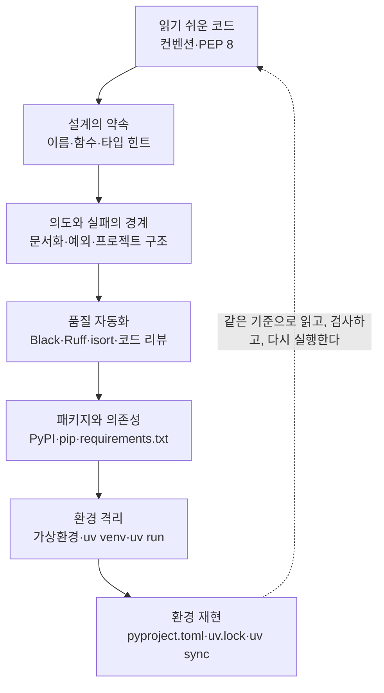

# 코드 컨벤션과 패키지 관리

> 읽기 쉬운 한 줄의 코드에서 시작해, 누구나 같은 환경에서 실행할 수 있는 프로젝트로 완성하는 과정을 연결한 학습노트입니다.

좋은 프로젝트는 코드가 실행되는 것만으로 완성되지 않습니다. 먼저 코드 컨벤션과 의미 있는 이름으로 의도를 드러내고, 한 가지 책임에 집중하는 함수와 타입 힌트로 입력과 반환의 약속을 분명히 해야 합니다. 여기에 주석과 docstring으로 코드만으로 알기 어려운 이유를 보완하고, 구체적인 예외 처리와 역할 중심의 프로젝트 구조로 실패와 변경의 경계를 나눕니다.

사람이 세운 기준은 반복 가능한 자동화로 이어집니다. Black은 코드의 표현 형식을 통일하고, Ruff는 정적으로 찾을 수 있는 문제를 진단하며, isort는 import 순서를 정리합니다. 그러나 자동 검사 통과가 기능의 정확성을 뜻하지는 않습니다. 특히 AI가 만든 코드는 요구사항, 경계 입력, 하드코딩, 전역 상태, 함수 책임을 사람이 다시 검토해야 합니다.

코드 품질을 정리한 뒤에는 실행 환경을 관리합니다. PyPI와 pip로 패키지를 찾고 설치하며, 직접 의존성과 전이 의존성의 관계를 이해하고 버전 조건을 기록합니다. 가상환경은 프로젝트마다 패키지 경계를 만들고, uv의 환경·설치·실행 명령은 같은 인터프리터를 일관되게 사용하도록 돕습니다. 마지막으로 `pyproject.toml`에 프로젝트의 의도를 선언하고 `uv.lock`에 해석된 정확한 조합을 기록한 뒤, 동기화와 테스트로 다른 환경에서도 같은 결과를 재현할 수 있는지 확인합니다.

이 회차를 관통하는 메시지는 하나입니다. **유지보수 가능한 프로젝트는 읽기 쉬운 코드, 자동화된 품질 검사, 명시적인 의존성 선언, 재현 가능한 실행 환경이 하나의 흐름으로 연결될 때 만들어진다.**

## 학습 로드맵

## 목차

| # | 글 | 한 줄 소개 | 활용도 |
|---|---|---|---|
| 1 | [코드 컨벤션과 읽기 쉬운 파이썬](01-code-conventions-and-readable-python.md) | PEP 8을 기준으로 들여쓰기·공백·줄 길이·코드 구획을 일관되게 만드는 방법 | ★★★★★ |
| 2 | [이름·함수 설계와 타입 힌트](02-naming-functions-and-type-hints.md) | 의미가 드러나는 이름, 단일 책임 함수, 예측 가능한 입력과 반환을 설계하는 법 | ★★★★★ |
| 3 | [주석·문서화·예외 처리와 프로젝트 구조](03-documentation-errors-and-project-structure.md) | 코드의 이유와 사용 계약을 기록하고 실패와 변경 책임을 구조화하는 방법 | ★★★★★ |
| 4 | [포매터·린터와 AI 코드 리뷰](04-formatters-linters-and-code-review.md) | Black·Ruff·isort의 역할을 구분하고 자동 검사와 사람 검토를 연결하는 흐름 | ★★★★★ |
| 5 | [PyPI, pip, requirements.txt로 의존성 관리하기](05-pypi-pip-and-requirements.md) | 패키지 설치와 직접·전이 의존성, 버전 제약, 요구사항 목록을 이해하는 법 | ★★★★★ |
| 6 | [가상환경과 uv로 프로젝트 격리하기](06-virtual-environments-and-uv.md) | 프로젝트별 환경을 만들고 올바른 인터프리터에서 설치·실행하는 방법 | ★★★★★ |
| 7 | [프로젝트 설정과 lockfile로 환경 재현하기](07-pyproject-lockfiles-and-reproducibility.md) | 의존성 선언과 잠금 결과를 구분하고 동기화·테스트로 환경을 재현하는 흐름 | ★★★★★ |

## 다루는 핵심 개념

- 코드 컨벤션, PEP 8, 가독성, 일관된 이름 규칙
- 단일 책임 함수, 반환값, 타입 힌트와 `Optional`
- 주석과 docstring, 구체적인 예외 처리, 역할 중심 프로젝트 구조
- 포매터와 린터, Black·Ruff·isort, AI 생성 코드 검토
- PyPI와 pip, 직접·전이 의존성, 버전 제약, `requirements.txt`
- 가상환경과 `.venv`, `uv venv`·`uv pip`·`uv run`
- `pyproject.toml`과 `uv.lock`, `uv add`·`uv tree`·`uv lock`·`uv sync`
- 의존성 재현과 기능 재현을 구분하는 테스트 흐름

## 학습 포인트

- **꼭 이해할 것**: 코드 컨벤션은 모양을 통일하고, 함수 설계와 문서화는 의도를 드러내며, 예외 처리와 프로젝트 구조는 실패와 변경의 경계를 나눕니다. 서로 다른 문제를 해결하는 기준을 하나로 섞지 않아야 합니다.
- **자주 헷갈리는 것**: 포매터와 린터, `return`과 `print`, 타입 힌트와 실행 검증, `uv pip install`과 `uv add`, `pyproject.toml`과 `uv.lock`, `uv lock`과 `uv sync`는 역할이 다릅니다.
- **검수 관점**: 자동화 도구가 통과해도 요구사항과 실행 결과가 맞는지는 별도 검토가 필요합니다. 설치 성공, 의존성 조건 충족, 테스트 성공도 각각 다른 품질 게이트입니다.
- **실무 연결**: 코드와 의존성 선언을 변경 이력으로 관리하고, 새 환경에서 동기화한 뒤 동일한 명령으로 테스트하면 팀원의 로컬 환경과 자동 검증 환경 사이의 차이를 줄일 수 있습니다.

## 함께 보면 좋은 자료

- [용어집](GLOSSARY.md) — 읽기 쉬운 코드부터 패키지·가상환경·lockfile 재현성까지 핵심 용어 36개를 주제별로 정리했습니다.
