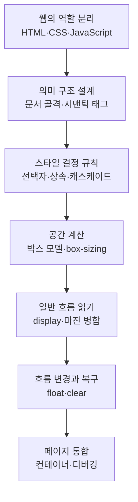

# HTML과 CSS 기초 — 정보 구조에서 레이아웃까지

> 웹페이지를 안정적으로 만드는 힘은 화려한 장식보다, 정보의 의미와 화면의 공간 규칙을 구분해 이해하는 데서 시작합니다.

웹은 하나의 화면처럼 보이지만 그 안에서는 HTML이 정보의 의미와 구조를 세우고, CSS가 선택한 요소의 모양과 배치를 결정하며, JavaScript가 사용자 반응과 상태 변화를 담당합니다. 첫 두 글에서는 이 역할 분담과 웹 품질의 기준을 익힌 뒤, 시맨틱 태그로 꾸미기 전에도 읽히는 문서 구조를 설계합니다.

이후에는 CSS가 어떤 요소를 선택하고 충돌한 선언 중 무엇을 적용하는지 살펴봅니다. 박스 모델로 실제 크기를 계산하고, `display`와 마진 병합으로 일반 흐름을 읽은 다음, `float`와 `clear`로 바뀐 흐름을 복구합니다. 마지막에는 앞선 원리를 한 페이지에 결합하며 문제가 생겼을 때 큰 구조부터 추적하는 디버깅 순서를 연습합니다.

**좋은 레이아웃은 위치를 억지로 맞춘 결과가 아니라, 의미 있는 구조와 예측 가능한 흐름이 만난 결과입니다.**

## 학습 로드맵

## 목차

| # | 글 | 한 줄 소개 | 활용도 |
|---|----|-----------|--------|
| 1 | [웹의 구성 요소와 품질 기준](01-web-foundations-and-standards.md) | HTML·CSS·JavaScript의 책임을 나누고 표준·접근성·환경 호환성을 이해합니다. | ★★★★★ |
| 2 | [시맨틱 HTML 구조](02-semantic-html-structure.md) | 문서 골격과 제목 계층, 역할이 드러나는 태그로 정보의 지도를 그립니다. | ★★★★★ |
| 3 | [CSS 선택자와 캐스케이드](03-css-selectors-and-cascade.md) | 스타일 적용 범위를 정하고 충돌한 선언의 최종값을 계산합니다. | ★★★★★ |
| 4 | [CSS 박스 모델](04-css-box-model.md) | 내용·패딩·테두리·마진을 구분해 요소가 차지하는 크기를 계산합니다. | ★★★★★ |
| 5 | [display와 마진 병합](05-display-and-margin-collapse.md) | 블록·인라인·인라인 블록의 자리 잡기와 세로 여백 규칙을 읽습니다. | ★★★★☆ |
| 6 | [float와 clear](06-float-clear-and-layout-flow.md) | 떠 있는 요소가 주변 흐름에 미치는 영향과 안전한 복구 방법을 익힙니다. | ★★★★☆ |
| 7 | [페이지 레이아웃 워크숍](07-page-layout-workshop.md) | 의미 구조부터 컨테이너와 카드 배치까지 한 페이지로 조립하고 점검합니다. | ★★★★★ |

## 다루는 핵심 개념

- HTML·CSS·JavaScript의 역할 분리와 웹 표준, 접근성, 크로스 브라우징
- 문서 골격, 제목 계층, 콘텐츠 태그, 시맨틱 영역과 `div`
- CSS 규칙, 타입·클래스·ID·후손 선택자, 상속과 캐스케이드
- `content`, `padding`, `border`, `margin`과 `box-sizing`
- 블록·인라인·인라인 블록, `display`, 세로 마진 병합
- 일반 흐름, `float`, `clear`, 부모 높이와 열 너비 계산
- 공통 컨테이너, 의미 기반 페이지 구성, 큰 구조부터 확인하는 디버깅

## 학습 순서

1~2편에서 정보의 역할과 HTML 계층을 설계하고, 3~4편에서 스타일의 적용 대상과 요소의 실제 크기를 계산합니다. 이어서 5~6편에서 일반 흐름이 유지되거나 바뀌는 조건을 비교한 뒤, 7편에서 모든 원리를 결합하고 HTML 계층부터 세부 장식까지 순서대로 점검합니다.

## 학습 포인트

- **꼭 이해할 것**: HTML 태그의 의미와 CSS의 표시 방식은 별개이며, `display`를 바꿔도 요소의 의미는 바뀌지 않습니다.
- **자주 헷갈리는 것**: 상속과 캐스케이드, 패딩과 마진, `content-box`와 `border-box`, `float`와 `clear`의 역할을 서로 구분합니다.
- **계산 습관**: 레이아웃이 넘치면 선언한 너비만 보지 말고 패딩·테두리·마진과 열 사이 간격까지 더합니다.
- **디버깅 순서**: HTML 계층 → 큰 상자 크기 → 일반 흐름과 float → 여백과 색상 같은 세부 장식 순서로 범위를 좁힙니다.
- **실무 연결**: 역할 중심 마크업과 예측 가능한 CSS는 화면 재사용, 접근성 개선, 반응형 확장, 협업 시 변경 비용 감소로 이어집니다.

## 함께 보면 좋은 자료

- [용어집](GLOSSARY.md) — HTML 구조, CSS 결정 규칙, 박스와 레이아웃 흐름의 핵심 용어를 주제별로 정리했습니다.
