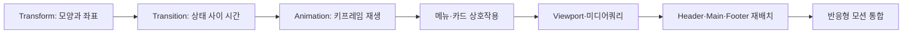

# 움직이는 웹사이트와 반응형 웹 — 학습 지도

> 좋은 화면은 움직이기만 하는 화면이 아니라, 사용자의 행동에 알맞게 반응하고 어떤 크기에서도 읽는 흐름을 지키는 화면입니다.

이 학습 묶음은 요소 하나의 회전·확대에서 출발해 상태 전환과 키프레임 애니메이션으로 움직임을 확장합니다. 이어서 메뉴와 카드에 피드백을 적용하며 여러 효과를 하나의 페이지 안에서 조합합니다.

후반부에서는 viewport와 미디어쿼리를 기준으로 넓은 화면의 열을 좁은 화면의 세로 흐름으로 바꿉니다. 마지막 워크숍에서는 반응형 배치와 모션의 강도를 함께 조절하고 경계값 앞뒤를 검증합니다.

## 먼저 기억할 핵심

| 질문 | 선택할 도구 | 확인할 결과 |
|---|---|---|
| 요소의 모양·위치만 바꿀 것인가? | `transform` | 주변 레이아웃의 자리는 유지되는가 |
| 두 상태 사이를 부드럽게 이을 것인가? | `transition` | 진입과 이탈이 모두 자연스러운가 |
| 시간표에 따라 여러 장면을 재생할 것인가? | `@keyframes`, `animation` | 반복 횟수·방향·종료 상태가 의도와 같은가 |
| 화면 너비에 따라 배치를 바꿀 것인가? | viewport, `@media` | 경계값 앞뒤에서 콘텐츠가 읽기 쉬운가 |
## 학습 로드맵

## 추천 학습 순서

| # | 문서 | 핵심 질문 | 활용도 |
|---:|---|---|:---:|
| 1 | [CSS Transform 기초](01-transform-basics.md) | 회전·확대·이동과 기준점은 어떻게 조합하는가? | ★★★★★ |
| 2 | [CSS Transition과 Hover](02-transition-and-hover-effects.md) | 상태 변화의 대상·시간·속도·대기는 어떻게 정하는가? | ★★★★★ |
| 3 | [CSS 키프레임 애니메이션](03-css-keyframe-animation.md) | 여러 장면을 몇 번, 어느 방향으로 재생하는가? | ★★★★★ |
| 4 | [인터랙티브 페이지 애니메이션](04-interactive-page-animation.md) | 메뉴와 카드의 피드백을 어떻게 역할별로 나누는가? | ★★★★★ |
| 5 | [반응형 웹과 viewport](05-responsive-web-and-viewport.md) | 화면 조건과 경계값을 CSS 규칙으로 어떻게 바꾸는가? | ★★★★★ |
| 6 | [반응형 레이아웃 패턴](06-responsive-layout-patterns.md) | 상단·본문·하단의 열을 어떻게 세로 흐름으로 전환하는가? | ★★★★★ |
| 7 | [반응형 모션 워크숍](07-responsive-motion-workshop.md) | 배치와 움직임을 화면 크기에 맞춰 어떻게 함께 검증하는가? | ★★★★★ |
## 세 가지 학습 루트

- **개념 루트:** 01 → 02 → 03에서 변형, 상태 변화, 시간표 재생의 차이를 비교합니다.
- **구현 루트:** 04 → 06에서 메뉴·카드 효과와 페이지 영역별 재배치를 직접 조립합니다.
- **통합 루트:** 05 → 07에서 viewport, breakpoint, 모션 강도를 넓은 화면·경계값·좁은 화면에서 검증합니다.

## 학습 포인트

- 같은 `transform` 함수도 기준점과 작성 순서가 바뀌면 최종 위치가 달라집니다.
- `transition`은 기본 상태에 두고, `:hover`에는 도착 상태를 적어야 복귀도 자연스럽습니다.
- 반응형 설계는 값을 작게 줄이는 일이 아니라 콘텐츠의 의미 순서와 읽는 방향을 다시 설계하는 일입니다.
- 통합 화면은 기본 배치 → 반응형 재배치 → 상태 전환 → 반복 애니메이션 순으로 확인하면 오류 원인을 좁히기 쉽습니다.

## 함께 보면 좋은 자료

- [핵심 용어집](GLOSSARY.md)
- 각 문서의 `직접 해보기`를 완료한 뒤 마지막 워크숍에서 같은 판단 기준을 한 화면에 적용해 보세요.
