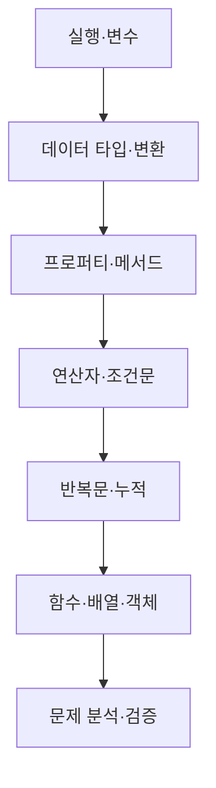

# JavaScript 문법 학습 지도

> JavaScript 문법은 낱개 기호의 암기가 아니라, 값을 저장하고 판단하고 반복하여 결과를 만드는 흐름입니다.

이 학습 묶음은 실행 환경과 변수에서 시작해 데이터 타입, 문자열·배열 메서드, 연산자와 조건문, 반복문, 함수와 객체 배열로 확장합니다. 마지막 워크숍에서는 문제의 입력과 출력을 분석하고 테스트하는 순서로 앞선 문법을 연결합니다.

## 학습 로드맵

## 목차

| # | 글 | 한 줄 소개 | 활용도 |
|---:|---|---|:---:|
| 1 | [JavaScript 실행 환경과 변수](01-javascript-runtime-variables.md) | 코드를 연결하고 값을 저장·변경·확인합니다. | ★★★★★ |
| 2 | [데이터 타입과 형 변환](02-data-types-and-conversion.md) | 값의 타입에 따른 연산 차이를 이해합니다. | ★★★★★ |
| 3 | [프로퍼티와 메서드](03-properties-and-methods.md) | 문자열과 배열의 정보와 기능을 사용합니다. | ★★★★★ |
| 4 | [연산자와 조건문](04-operators-and-conditionals.md) | 계산과 비교 결과를 실행 경로로 바꿉니다. | ★★★★★ |
| 5 | [반복문과 순차 탐색](05-loops-and-iteration.md) | 모든 요소를 순회하고 결과를 누적합니다. | ★★★★★ |
| 6 | [함수와 구조화된 데이터](06-functions-and-structured-data.md) | 입력·처리·반환을 분리하고 배열·객체를 다룹니다. | ★★★★★ |
| 7 | [문제 해결 워크숍](07-javascript-problem-solving-workshop.md) | 요구사항을 코드와 테스트로 번역합니다. | ★★★★★ |

## 학습 순서

1. 1~2편에서 실행 흐름과 값의 타입을 확인합니다.
2. 3~4편에서 데이터를 읽고 조건을 만드는 도구를 익힙니다.
3. 5~6편에서 여러 값을 순회하고 재사용 가능한 함수로 묶습니다.
4. 7편에서 입출력 분석, 단계 분해, 경계값 테스트를 연결합니다.

## 꼭 구분할 것

- `=`는 저장이고 `===`는 비교입니다.
- `length`는 프로퍼티이고 `push()`는 메서드입니다.
- 배열의 순번은 1부터 말해도 인덱스는 0부터 시작합니다.
- `console.log()`는 확인용이며 `return`은 함수의 결과입니다.
- 완성 예시를 보는 것보다 입력을 바꿔 중간값을 추적하는 연습이 중요합니다.

## 문제 해결 체크리스트

- [ ] 함수명과 입력, 출력을 한 문장으로 적었는가?
- [ ] 반복이 필요한지, 조건이 필요한지 구분했는가?
- [ ] 결과의 초기값을 올바른 위치에 만들었는가?
- [ ] 인덱스 범위가 `0`부터 `length - 1`까지인가?
- [ ] 정상값, 조건 불충족값, 빈 입력을 테스트했는가?

## 함께 보면 좋은 자료

- [GLOSSARY](GLOSSARY.md) — 변수, 타입, 연산자, 반복문, 함수, 배열과 객체의 핵심 용어를 정리했습니다.
