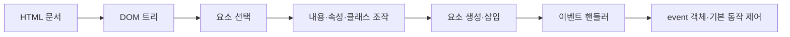

# DOM과 이벤트 1 학습 지도

> 정적인 HTML이 화면이 된 뒤, DOM과 이벤트는 그 화면을 사용자의 행동에 반응하는 인터페이스로 바꿉니다.

이 학습 묶음은 HTML 문서가 객체 트리로 표현되는 원리에서 시작합니다. 원하는 요소를 찾고, 내용과 속성·클래스를 바꾸고, 새 요소를 트리에 연결한 뒤 이벤트로 사용자 행동과 변경 로직을 이어 붙입니다.

## 학습 로드맵

## 목차

| # | 글 | 한 줄 소개 | 활용도 |
|---:|---|---|:---:|
| 1 | [DOM 트리와 요소 선택](01-dom-tree-and-selection.md) | 문서를 객체 트리로 이해하고 필요한 요소를 정확히 찾습니다. | ★★★★★ |
| 2 | [요소 조작과 동적 생성](02-dom-manipulation-and-creation.md) | 텍스트·속성·클래스를 바꾸고 새 요소를 화면에 추가합니다. | ★★★★★ |
| 3 | [이벤트와 핸들러 등록](03-events-and-handlers.md) | 사용자 행동을 함수와 연결하고 등록 방식의 차이를 구분합니다. | ★★★★★ |
| 4 | [event 객체와 상호작용 패턴](04-event-object-and-interactions.md) | 발생 대상과 입력 정보를 읽고 기본 동작을 제어합니다. | ★★★★★ |

## 다루는 핵심 개념

- `document`, node, 부모·자식 관계와 DOM 트리
- 단일 요소와 요소 모음을 반환하는 선택 메서드
- `textContent`, `innerHTML`, 속성, `classList`, 인라인 스타일
- `createElement()`, `appendChild()`, `insertBefore()`, `removeChild()`
- 이벤트, 이벤트 핸들러, `addEventListener()`와 함수 참조
- `event.target`, `event.key`, `preventDefault()`, `removeEventListener()`

## 학습 포인트

- DOM 코드는 대부분 **선택 → 변경 → 확인**의 순서로 읽습니다.
- 여러 요소를 선택했다면 컬렉션 자체가 아니라 각 요소를 반복해서 조작해야 합니다.
- 구조가 있는 콘텐츠는 DOM 메서드로 만들고, 상태 표현은 클래스를 토글하는 방식을 우선합니다.
- 이벤트 등록 시 `handler()`가 아니라 함수 참조인 `handler`를 전달합니다.
- `event.target`은 실제 발생 지점이고, 이벤트를 등록한 요소와 다를 수 있습니다.

## 함께 보면 좋은 자료

- [용어집](GLOSSARY.md)

