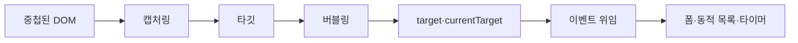

# DOM과 이벤트 2 학습 지도

> 이벤트는 한 요소에서 끝나지 않습니다. DOM 트리를 따라 이동하는 경로를 이해하면 복잡한 화면도 적은 코드로 제어할 수 있습니다.

이 학습 묶음은 이벤트가 캡처링·타깃·버블링 단계를 거치는 원리에서 출발합니다. `target`과 `currentTarget`을 구분하고 이벤트 위임으로 동적 목록을 다룬 뒤, 폼 입력·상태 클래스·스크롤·타이머를 결합해 실제 인터랙션을 설계합니다.

## 학습 로드맵

## 목차

| # | 글 | 한 줄 소개 | 활용도 |
|---:|---|---|:---:|
| 1 | [이벤트 전파의 세 단계](01-event-propagation-phases.md) | 하나의 이벤트가 DOM 경로를 이동하는 순서를 이해합니다. | ★★★★★ |
| 2 | [이벤트 대상과 위임](02-event-targets-and-delegation.md) | `target`과 `currentTarget`을 구분하고 부모에서 자식 이벤트를 처리합니다. | ★★★★★ |
| 3 | [폼과 UI 상태 관리](03-forms-and-ui-state.md) | 제출·입력·클릭 이벤트를 화면 상태와 안전하게 연결합니다. | ★★★★★ |
| 4 | [동적 목록과 타이머 인터랙션](04-dynamic-lists-and-timers.md) | 생성·삭제·필터와 반복 타이머의 수명주기를 설계합니다. | ★★★★★ |

## 다루는 핵심 개념

- 이벤트 경로와 캡처링·타깃·버블링 단계
- `event.eventPhase`, `event.target`, `event.currentTarget`
- `addEventListener()`의 캡처 옵션과 이벤트 위임
- `preventDefault()`, 폼 `submit`, 입력값 읽기와 초기화
- `classList`, `disabled`, `aria-*` 속성을 이용한 UI 상태 동기화
- 동적 요소 생성·삭제·필터링과 `setInterval()` 정리

## 학습 포인트

- 중첩 요소에서 같은 이벤트가 여러 번 감지되는 것은 오류가 아니라 전파의 결과입니다.
- `target`은 시작점, `currentTarget`은 현재 핸들러의 위치입니다.
- 동적 목록에는 자식마다 리스너를 붙이기보다 부모에서 위임하는 방식이 유리합니다.
- 폼은 버튼 클릭이 아니라 `submit` 이벤트를 기준으로 처리해야 Enter 제출도 포함됩니다.
- 타이머를 시작했다면 종료 조건에서 반드시 정리해야 중복 실행을 막을 수 있습니다.

## 함께 보면 좋은 자료

- [용어집](GLOSSARY.md)

