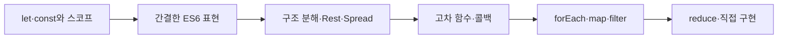

# ES6와 배열 메서드 학습 지도

> 현대 JavaScript는 값을 안전하게 다루는 문법과 데이터를 의도에 맞게 변환하는 배열 메서드에서 시작합니다.

이 학습 묶음은 `let`과 `const`의 스코프에서 출발해 화살표 함수, 구조 분해, Rest·Spread 문법으로 코드를 간결하게 만드는 방법을 익힙니다. 이어서 함수를 값처럼 전달하는 사고방식을 이해하고, `forEach()`, `map()`, `filter()`, `reduce()`를 결과 형태에 따라 선택하는 연습으로 연결합니다.

## 학습 로드맵

## 목차

| # | 글 | 한 줄 소개 | 활용도 |
|---:|---|---|:---:|
| 1 | [`let`·`const`와 스코프](01-let-const-and-scope.md) | 변수의 변경 가능성과 유효 범위를 설계합니다. | ★★★★★ |
| 2 | [화살표 함수와 간결한 표현](02-arrow-functions-and-modern-expressions.md) | 함수·문자열·객체 접근을 현대 문법으로 표현합니다. | ★★★★★ |
| 3 | [구조 분해와 Rest·Spread](03-destructuring-rest-and-spread.md) | 필요한 값은 꺼내고 나머지는 모으거나 펼칩니다. | ★★★★★ |
| 4 | [고차 함수와 콜백](04-higher-order-functions-and-callbacks.md) | 동작을 함수의 인자로 전달하는 사고방식을 익힙니다. | ★★★★★ |
| 5 | [`forEach`·`map`·`filter`](05-foreach-map-and-filter.md) | 반복·변환·선택을 결과 형태에 맞게 구분합니다. | ★★★★★ |
| 6 | [`reduce`와 배열 메서드의 원리](06-reduce-and-array-method-internals.md) | 여러 요소를 하나로 누적하고 메서드 내부 원리를 구현합니다. | ★★★★★ |

## 다루는 핵심 개념

- 블록 레벨 스코프, 렉시컬 스코프, 스코프 체인
- 화살표 함수, 템플릿 리터럴, 옵셔널 체이닝
- 객체·배열 구조 분해, 나머지 매개변수, 전개 구문
- 고차 함수와 콜백 함수
- 반복·변환·선택·누적을 구분하는 배열 메서드
- 콜백의 반환값, `reduce()` 초기값, 원본과 새 배열

## 학습 포인트

- 기본값은 `const`, 재할당이 필요할 때만 `let`을 선택합니다.
- 배열 메서드는 문법보다 “어떤 결과 형태가 필요한가?”로 선택합니다.
- `map()`과 `filter()`는 새 배열을 만들고, `reduce()`는 원하는 형태의 누적 결과를 만듭니다.
- 콜백에서 `return`을 빠뜨리면 변환·조건·누적 결과가 달라집니다.
- Rest와 Spread는 모두 `...`를 쓰지만 값을 모으는지 펼치는지로 구분합니다.

## 함께 보면 좋은 자료

- [용어집](GLOSSARY.md)
