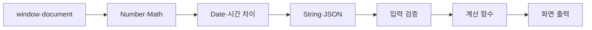

# JavaScript 내장 객체 학습 지도

> 내장 객체는 자주 필요한 계산과 변환을 처음부터 다시 만들지 않도록 JavaScript가 미리 제공하는 도구 상자입니다.

이 학습 묶음은 브라우저 환경의 `window`와 `document`, 숫자 계산을 위한 `Number`와 `Math`, 날짜·시간을 다루는 `Date`, 텍스트와 데이터 교환에 쓰이는 `String`과 `JSON`을 연결합니다. 마지막에는 거리·복리·수익률·손익분기점 계산으로 입력, 계산, 출력의 전체 흐름을 연습합니다.

## 학습 로드맵

## 목차

| # | 글 | 한 줄 소개 | 활용도 |
|---:|---|---|:---:|
| 1 | [브라우저 내장 객체](01-browser-built-in-objects.md) | `window`와 `document`의 역할과 사용 범위를 구분합니다. | ★★★★☆ |
| 2 | [Number와 Math](02-number-and-math.md) | 숫자 변환·검증·반올림과 수학 계산을 정확히 처리합니다. | ★★★★★ |
| 3 | [Date와 시간 계산](03-date-and-time.md) | 날짜 구성요소, 타임스탬프, 상대시간과 타이머를 다룹니다. | ★★★★★ |
| 4 | [String과 JSON](04-string-and-json.md) | 문자열 변환과 객체 직렬화·역직렬화를 구분합니다. | ★★★★★ |
| 5 | [계산기 설계 패턴](05-calculator-design-patterns.md) | 거리·복리·수익률·손익분기점 계산을 함수로 분리합니다. | ★★★★★ |

## 다루는 핵심 개념

- 전역 객체 `window`와 문서 진입점 `document`
- `Number()`, `Number.isNaN()`, `toFixed()`, `toLocaleString()`
- `Math.max()`, `Math.min()`, `Math.sqrt()`, `Math.pow()`, 난수 범위
- `Date`, 월 인덱스, 밀리초 타임스탬프, 날짜 유효성
- 문자열의 불변성, 검색·분리·치환·공백 정리
- `JSON.stringify()`와 `JSON.parse()`, 안전한 파싱
- 폼 입력 → 검증 → 순수 계산 → 포매팅 → 렌더링

## 학습 포인트

- `toFixed()`의 반환값은 숫자가 아니라 문자열입니다.
- `Date#getMonth()`는 0부터 시작하고 `getDate()`는 일, `getDay()`는 요일입니다.
- JSON 문자열을 직접 잘라 붙이지 말고 객체로 파싱해 수정한 뒤 다시 직렬화합니다.
- 표시용 반올림 값과 실제 계산용 원본 숫자를 분리합니다.
- 계산식은 DOM 코드와 분리해 작은 입력으로 테스트할 수 있게 만듭니다.

## 함께 보면 좋은 자료

- [용어집](GLOSSARY.md)

