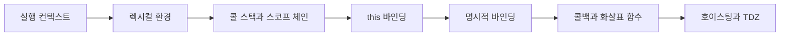

# 실행 컨텍스트와 `this`

> JavaScript 코드가 어떤 환경에서 실행되고, 변수와 `this`가 무엇을 가리키는지 내부 동작부터 호출 방식까지 연결해 봅니다.

JavaScript는 코드를 바로 실행하지 않습니다. 먼저 실행에 필요한 변수·함수·상위 환경·`this` 정보를 준비하고, 함수 호출 순서를 스택으로 관리합니다. 이 흐름을 이해하면 스코프, 콜백, 호이스팅처럼 따로 보이던 개념이 하나의 실행 모델로 연결됩니다.

## 학습 로드맵

## 목차

| # | 글 | 한 줄 소개 | 활용도 |
|---|---|---|---|
| 1 | [실행 컨텍스트와 렉시컬 환경](01-execution-context-and-lexical-environment.md) | 코드 실행 전에 만들어지는 환경과 두 실행 단계를 이해합니다. | ★★★★★ |
| 2 | [콜 스택과 스코프 체인](02-call-stack-scope-chain-and-closures.md) | 함수 호출 순서와 변수 검색 경로를 함께 추적합니다. | ★★★★★ |
| 3 | [`this`와 호출 방식](03-this-binding-and-method-calls.md) | `this`가 선언 위치보다 호출 방식에 따라 달라지는 원리를 익힙니다. | ★★★★★ |
| 4 | [`call`·`apply`·`bind`](04-call-apply-and-bind.md) | 함수의 `this`를 명시적으로 지정하고 재사용합니다. | ★★★★☆ |
| 5 | [콜백과 렉시컬 `this`](05-callbacks-arrow-functions-and-events.md) | 콜백에서 `this`를 잃는 이유와 화살표 함수의 역할을 구분합니다. | ★★★★★ |
| 6 | [호이스팅과 TDZ](06-hoisting-and-tdz.md) | 선언 등록과 초기화 시점의 차이로 실행 결과를 예측합니다. | ★★★★★ |

## 다루는 핵심 개념

- 실행 컨텍스트의 생성 단계와 실행 단계
- 환경 레코드와 외부 렉시컬 환경 참조
- 콜 스택의 LIFO 구조와 스코프 체인
- 일반 함수·메서드·콜백·이벤트에서의 `this`
- `call()`, `apply()`, `bind()`의 실행 시점과 인자 방식
- 화살표 함수의 렉시컬 `this`
- `var`, `let`, `const`의 호이스팅과 TDZ

## 학습 포인트

- 콜 스택의 위아래와 스코프 체인의 안팎을 같은 개념으로 혼동하지 않습니다.
- `this`는 “함수가 어디에 작성됐는가”보다 “어떻게 호출됐는가”를 먼저 확인합니다.
- 화살표 함수를 모든 메서드에 쓰는 것이 아니라, 바깥 `this`를 보존할 때 선택합니다.
- 호이스팅을 코드가 이동하는 현상이 아니라 평가 단계의 선언 등록으로 설명합니다.

## 함께 보면 좋은 자료

- [용어집](GLOSSARY.md)
