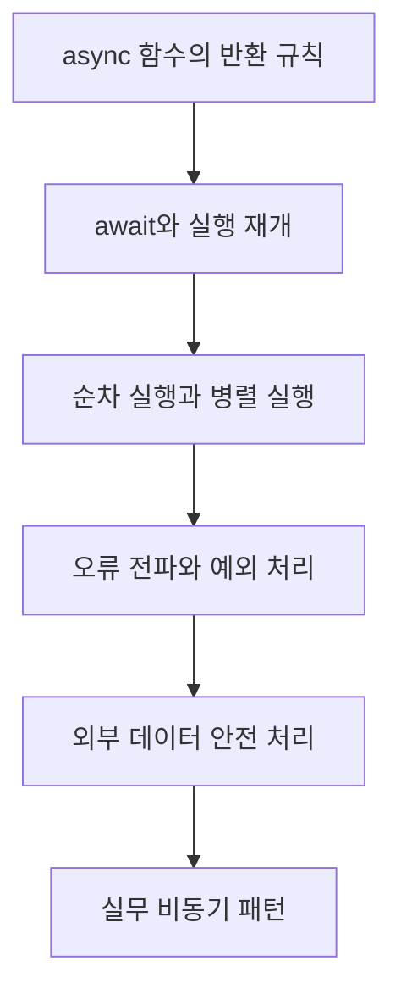

# 비동기 II: async/await와 예외 처리

Promise를 사용할 수 있게 되면 다음 과제는 여러 비동기 작업을 읽기 쉽고 안전하게 연결하는 것입니다. 이 학습노트는 `async`/`await`로 실행 순서를 표현하고, 실패를 예외로 다루며, 작업 사이의 의존 관계에 맞춰 순차·병렬 실행을 선택하는 방법을 정리합니다.

## 학습 목표

- `async` 함수가 항상 Promise를 반환하는 이유를 설명한다.
- `await`가 멈추는 범위와 성공값을 꺼내는 방식을 이해한다.
- 의존 작업은 순차 실행하고 독립 작업은 함께 시작한다.
- `try`, `catch`, `finally`로 비동기 오류와 정리 작업을 관리한다.
- 외부 JSON 데이터를 안전하게 역직렬화한다.
- 디바운싱·쓰로틀링과 비동기 반복의 흔한 실수를 피한다.

## 학습 로드맵

## 목차

1. [async 함수와 await의 기본](01-async-functions-and-await.md)
2. [순차 실행과 병렬 실행](02-sequential-and-parallel-workflows.md)
3. [비동기 오류 처리와 전파](03-async-error-handling.md)
4. [JSON 직렬화와 안전한 파싱](04-json-serialization-and-safe-parsing.md)
5. [디바운싱과 쓰로틀링](05-debounce-and-throttle.md)
6. [비동기 반복과 작업 흐름 설계](06-async-iteration-and-workflow-design.md)
7. [용어집](GLOSSARY.md)

## 이 강의의 핵심 개념

- `async` 함수의 반환값은 Promise로 정규화됩니다.
- `await`는 자바스크립트 전체가 아니라 현재 `async` 함수의 나머지 실행만 미룹니다.
- 앞 결과가 다음 입력이면 순차 실행, 서로 독립적이면 병렬 시작을 고려합니다.
- rejected Promise는 `await` 지점에서 예외처럼 동작합니다.
- `finally`는 성공 여부와 관계없는 정리 작업을 담당합니다.

## 학습 체크리스트

- [ ] `return 10`인 async 함수의 실제 반환형을 말할 수 있다.
- [ ] 순차 `await`와 `Promise.all`의 차이를 설명할 수 있다.
- [ ] `catch`가 처리하는 오류 범위를 코드에서 찾을 수 있다.
- [ ] `finally`에 반환 로직을 넣을 때의 위험을 안다.
- [ ] JSON 파싱 실패를 사용자 흐름 중단 없이 처리할 수 있다.
- [ ] `forEach(async ...)` 대신 상황에 맞는 반복 방식을 선택할 수 있다.

> 핵심 질문: “무엇을 기다려야 하는가?”, “서로 의존하는가?”, “실패하면 어디서 복구할 것인가?”를 순서대로 답하면 비동기 흐름이 선명해집니다.
